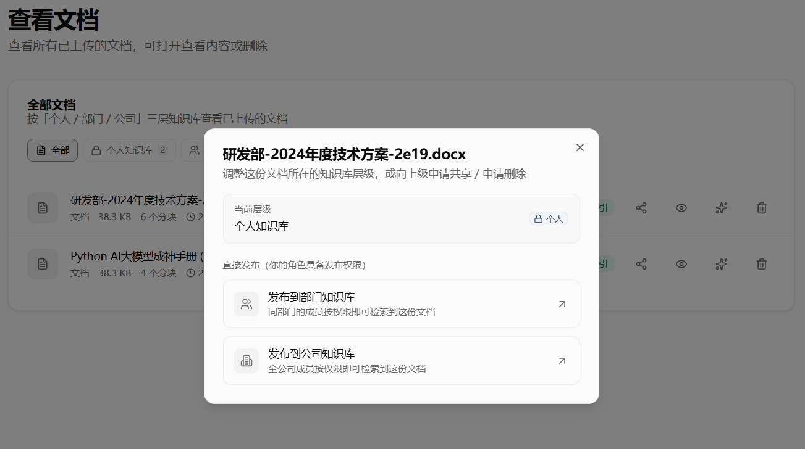
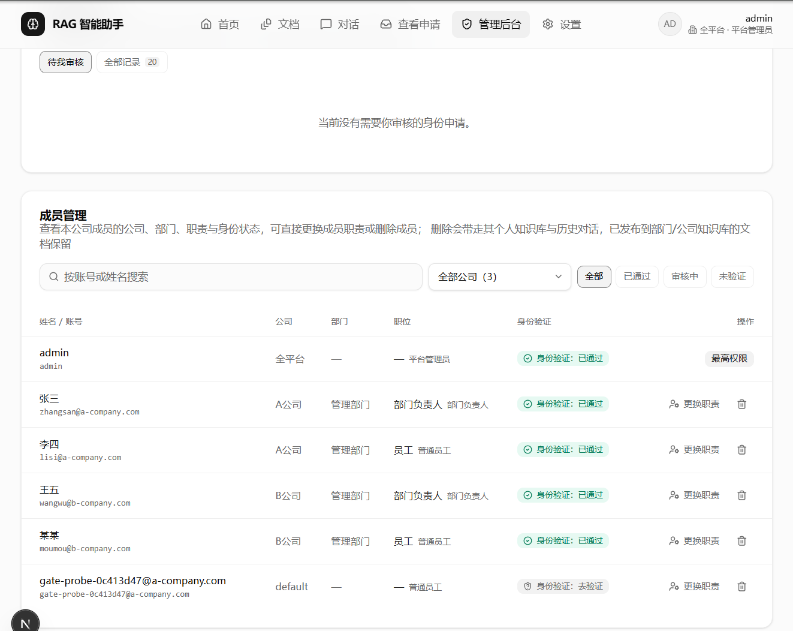
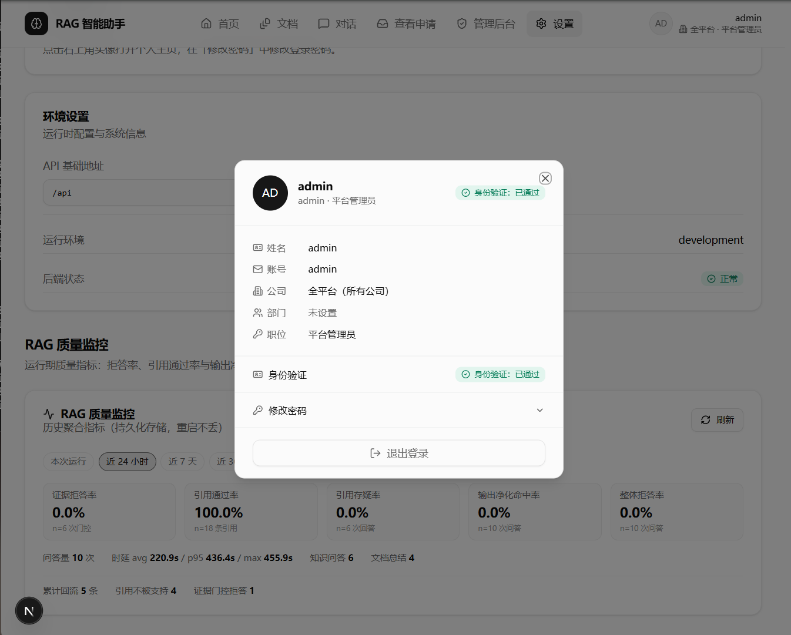
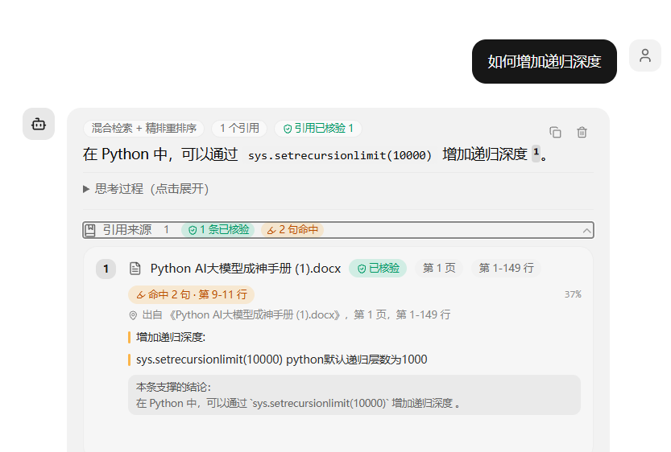

<div align="center">

# 企业LangGraphRAG 智能助手

### 企业私有知识库问答平台

面向生产环境的端到端 RAG 系统：多用户鉴权 · 多格式解析 · 混合召回 + 精排 + 证据评估 · 主图谱编排 · 全本地推理

  


</div>

---

## 一、简介

RAG 智能助手是一套面向企业内部使用的检索增强生成平台，将企业私有文档转化为可被自然语言检索的知识库。

全链路运行于本地：生成由 Ollama 承担，向量化由 BGE 本地模型承担，精排由 bge-reranker 承担，元数据落在 PostgreSQL，向量落在 Qdrant。系统不调用任何云端大模型接口，不需要申请任何 API Key，文档原文、向量与对话数据均不离开内网。

与"上传文档即问即答"的演示型 RAG 不同，本项目把生产环境中真正会出问题的环节逐一落到代码里：

- **意图路由** —— 识别问句属于知识检索、文档总结、闲聊还是跨文档关联，自动分流至对应支路
- **混合召回** —— BM25 关键词检索与向量语义检索互补，同时覆盖精确匹配与语义近似
- **证据评估** —— 由 LLM 判断检索内容能否真正回答问题，不足则自动改写重试
- **证据门控** —— 检索后追加一道**确定性** Evidence Gate，证据形态不达标直接拒答，不与 LLM 判断耦合
- **结构感知切分** —— 表格、代码块、Markdown 标题不会被粗暴截断
- **小到大检索** —— 以精确子块命中，回填更大父块为 LLM 提供完整上下文
- **注入防护** —— 规则引擎拦截越权指令，文档内容一律视为不可信数据并自动脱敏
- **原文定位** —— 每条引用可回看文档 chunk 原文，答案可逐条核验
- **行级溯源** —— 切片保留位置信息，引用可定位到"《年报.pdf》第 3 页，第 12-28 行"
- **引用校验** —— Citation Verifier 逐条核验五项（存在 / 位置 / 支持 / 数字 / 日期），不实引用当场移除
- **持续监控与回流** —— 运行期指标 + Bad Case 自动回流，人工审阅闭环
- **RBAC 权限** —— admin / manager / editor / viewer 四级角色，资源级权限校验
- **内嵌图片 OCR** —— PDF / DOCX / PPTX 内嵌图片自动提取文字，不遗漏图内信息

### 企业级亮点速览（为什么适合进企业内网）

| # | 企业痛点 | 本项目的答案 |
| :-: | :-- | :-- |
| 1 | 数据合规：文档不允许出内网 | **全链路本地推理**：Ollama 生成 + BGE 向量化/精排，零云端 API、零 API Key，文档/向量/对话全程不出内网 |
| 2 | 多部门多公司共用一套系统 | **多租户三层隔离**：租户边界 + 文档 ACL（个人/部门/公司）+ 用户会话隔离，检索前置过滤，跨公司不可见且不泄漏存在性 |
| 3 | 企业已有统一身份（SSO） | **Keycloak OIDC + PKCE** 标准接入，JWT 全链路验签，本地账号可并存，首次登录自动建档 |
| 4 | 谁能看什么、谁能删什么说不清 | **RBAC 权限矩阵**：四业务角色 + 平台管理员，权限名 `resource.action` 单点定义，个人知识库对任何人（含管理员）都不开放 |
| 5 | 敏感文档误共享 | **共享审批闭环**：上传默认个人库，发布需权限、无权限走申请→审核→自动发布，PG/向量载荷/审计一次同步 |
| 6 | AI 幻觉无法进生产 | **三道幻觉防线**：确定性 Evidence Gate（fail-closed）→ LLM 证据评估 → 改写重试后拒答 |
| 7 | 引用造假、答案无法核验 | **Citation Verifier** 逐句五项核验 + 行级溯源（页码 + 行号），不实引用当场移除 |
| 8 | 提示词注入、文档内容投毒 | **四层注入防护**：高危拦截、中危留痕审计、文档上下文脱敏、Unicode 隐形字符归一化 |
| 9 | RAG 效果是玄学、坏了没人知道 | **质量监控 + Badcase 回流**：拒答率/引用通过率/时延分位持久化聚合，四类坏例自动入队人工审阅 |
| 10 | 演示能跑、生产不能用 | **工程化底座**：异步入库（202 + 进度轮询）、分级限流、安全响应头、优雅启停、非 root 容器、healthcheck |

---

## 二、应用截图

<div align="center">

### 首页 —— 查看全局状态


文档数 / 对话数 / 分片数 / 存储用量实时统计；AI 检索问答直达入口；知识库分组卡片；底部**系统健康**实时显示云脑 API、Ollama、PostgreSQL、Qdrant 四个关键依赖的在线状态——故障一眼定位，不用翻日志。

<br/>

### 三层知识库 —— 文档一键发布到部门 / 公司



所有文档默认落在**个人知识库**（对任何人都不开放，包括平台管理员）。需要共享时在此弹窗一键发布：**发布到部门知识库**（同部门按权限可检索）/ **发布到公司知识库**（全公司按权限可检索）；无发布权限的普通员工走「申请共享」由上级审核——**共享永远显式发生**，杜绝"新同事一登录就看到全公司文档"。

<br/>

### 管理后台 —— 成员与身份治理



按公司 / 部门 / 职责 / 身份验证状态筛选与搜索全平台成员；直接更换成员职责或删除成员（删除会带走其个人知识库与历史对话，**已发布到部门/公司库的文档保留**）；身份申请（SSO 首登等）集中在此审核——企业身份治理的单一入口。

<br/>

### RAG 质量监控 —— 指标持久化，回答质量可度量



证据拒答率 / 引用通过率 / 引用命中率 / 输出净化命中率 / 整体拒答率，支持本次运行、近 24 小时、近 7 天等历史聚合（持久化存储，重启不丢）；同时展示问答量、时延分位（avg / p95 / max）与 Badcase 回流量——**RAG 的效果不再是玄学，而是可观测、可回归的指标**。

<br/>

### 对话 —— 引用逐条核验，答案可回溯



流式输出 + 思考过程；每条引用标注来源文档、页码、行号与命中率，经 **Citation Verifier** 校验后打上「已核验」标记；展开即可回看原文片段与本条支撑的结论——**答案的每一句话都能落到原文的某一行**。

</div>

---

## 三、核心特性

### 3.1 检索与生成

| 能力       | 说明                                                                                                          |
| :------- | :---------------------------------------------------------------------------------------------------------- |
| 混合检索     | 自研 BM25（字符 bigram，零第三方依赖）+ Qdrant 向量 ANN，多路查询**并发召回**，加权 RRF（Reciprocal Rank Fusion）融合；两腿候选取同深度（Vector TopN + BM25 TopN 对齐）                 |
| 三级精排降级   | Tier 1 FlagReranker → Tier 2 sentence-transformers CrossEncoder → Tier 3 纯 Python 启发式（查询词覆盖率 × 向量相似度），零依赖保底；精排前候选去重 + 截断省推理，精排后按 Relevance Threshold 逐条过滤擦边证据 |
| 上下文压缩     | Context Compression：按查询词覆盖率做句子级抽取式压缩，单源预算 + 总预算双重约束，控制父块回填后的上下文膨胀（确定性规则、零 LLM 调用）                           |
| LLM 证据评估 | 不看分数，由 LLM 判断"这段证据是否真能回答问题"，仅保留相关证据                                                                         |
| 重写—重试循环  | 指代消解 + 多查询扩展；证据不足时自动改写 query，最多重试 N 次后拒答                                                                    |
| 五意图路由    | document_summary / knowledge_qa / general_chat / doc_relations / list_documents 自动分流                        |
| 确定性前置路由  | 列表类问题走正则 + DB 直读，不经过 LLM，保证不漏不重                                                                             |
| 闲聊兜底     | 闲聊直接调用 LLM，不检索、不伪装查库                                                                                        |
| 跨文档关联与总结 | 总结支路按文档抽取主题—要点—总览；关联支路发现文档之间的关系与差异                                                                          |
| 幻觉守卫     | 三道防线：精排分数阈值 → LLM 证据评估 → 改写仍失败则礼貌拒答                                                                         |
| 行级细粒度引用  | 切片携带 1-based 行号（`line_start` / `line_end`），引用可写成 `[Source 2]（第 12-28 行）`；提示词要求"引用准确、克制"——常识与过渡句不挂引用、同段同源只标一次，引用强度由校验环节兜底 |
| Evidence Gate | 检索后的**确定性**证据门控：条数 / 最高精排分 / 问题关键词覆盖率 / 证据正文长度四信号，任一不达标即拒答。与 LLM Grader 互补，**fail-closed**（Grader 超时是 fail-open） |
| Citation Verifier | 生成后逐句核验五项：**引用存在？位置正确？原文支持结论？数字一致？日期一致？** 不实引用标记当场移除并追加校验脚注；净化后的全文随事件回传前端整段替换 |
| 双层拒答     | Evidence Gate 确定性拒答 + 模型主动拒答（提示词允许"我不知道"），两条路径共用同一段文案，用户体验一致 |
| 流式输出     | SSE 逐 token 输出，前端实时渲染思考流与正文，可随时中断生成                                                                         |

### 3.2 文档处理

| 能力       | 说明                                                                                                                |
| :------- | :---------------------------------------------------------------------------------------------------------------- |
| 多格式解析    | PDF · DOCX · PPTX · XLSX · CSV · TXT · Markdown · JSON · LOG · PNG · JPG · JPEG · TIFF · BMP · WEBP               |
| 结构感知切分   | 按 Markdown 标题分层；按 token 数而非字符数切分；句子边界滑窗重叠；代码块与表格整块保留                                                              |
| 小到大索引    | 子块建索引精确定位，命中后回填父块（默认 2.5 倍大小）提供完整上下文                                                                              |
| 图片结构化   | 内嵌图片不再折进正文：抽出为结构化对象、**落盘保存原图**，并以**独立检索对象**入库（payload 带 `content_type` / `image_type` / `image_path`）                    |
| 三层图片处理  | 图片进入文档后**先分类再分流**：Table → Table Parser（框线切网格 + 逐格 OCR → Markdown 表格）；Chart / Diagram / Screenshot → Vision（按类型选提示词）；Photo → OCR。分类器为纯规则实现，不依赖模型 |
| 图片溯源与原图返回 | 图片独立成块（`chunk_index` 紧接文本块之后，图文不撞号）；引用卡片直接回显原图（`GET /documents/{id}/images/{name}`），前端按类型显示徽标 |
| 表格检索     | Word / Markdown / CSV / XLSX 表格转 Markdown 整块保留；**图片里的表格经 Table Parser 还原后同样取 `content_type=table`**，表格问答稳定召回并带引用 |
| Document Agent | 识别"生成一份 Word 报告"类诉求 → 生成 `.docx` 交付物：正文写入段落、Markdown 表格还原为真正的 Word 表格、按 `image_path` **插入原始图片**             |
| Vision 图片理解 | `VISION_ENABLED` 时用 Ollama 多模态模型看图（图片问答 / 图表解读）；模型缺失时**优雅降级**为 OCR，启动仅告警不阻塞，原图仍正常索引与返回                                  |
| 上传安全     | 扩展名白名单 + 文件头魔数校验（防 MIME 伪装）+ 单文件 50 MB + 单次最多 10 个文件 + 空文件拒绝                                                      |
| 状态机与进度   | 文档具备 pending → parsing → chunking → embedding → indexing → completed 阶段状态（异常为 failed，重复文件为 already_exists），前端实时展示 |
| 异步入库     | `POST /upload` 只做「校验 + 判重 + 落 `pending` 行」就返回 **202**（毫秒级），解析 / 逐图 OCR / 向量化在服务端后台跑。一份 13 MB 文档要 7 分钟以上，为它挂住一条 HTTP 长连接意味着"关掉标签页 = 什么都没发生"，中间代理也容易在途中掐断。进度经 `GET /documents` 的 `current_stage` 与 `embedded_chunks / total_chunks` 驱动前端轮询（"正在解析内容与图片" / "正在生成向量 42%"），提交完即可离开页面 |
| 原文定位     | `GET /documents/{id}/chunks` 返回按阅读顺序排列的 chunk、页码与**行号**（`line_start` / `line_end`），引用可直接展开原文并精确定位到行                                          |
| 位置信息落库   | 切分时按字符偏移换算 1-based 行号并写入 chunk 与 Qdrant payload；检索、上下文组装、SSE、前端卡片全链路透传，旧索引缺行号时优雅降级为只显示页码                            |

### 3.3 多用户与安全

| 能力        | 说明                                                                                                     |
| :-------- | :----------------------------------------------------------------------------------------------------- |
| 账号体系      | 本地注册登录 **+ Keycloak 企业统一身份（OIDC + PKCE）** 双通路 · JWT 鉴权 · 每用户文档所有权 · 修改密码 · 首个注册者自动成为管理员                                                         |
| RBAC 权限模型 | 四业务角色（普通员工 / 部门负责人 / 知识库管理员 / 企业管理员）+ 跨租户平台管理员；细粒度资源权限（knowledge / document / conversation / feedback / audit / **share** / **document.publish.***） |
| 多租户隔离     | 三层隔离：租户（company_a / company_b）· 文档 ACL（个人 / 部门 / 公司）· 用户与会话；检索**前置过滤**，跨公司不可见且不泄漏存在性（详见 3.5）                        |
| 三层知识库     | 个人 / 部门 / 公司三层，文档带中文层级标注；有权限直接发布，无权限走「申请共享」由上级审核（详见 3.5）                                              |
| 用户管理      | 管理员可查看全部用户、调整角色、启停用账号                                                                                  |
| 知识库分组     | KB Collection 对文档分组，上传与检索均可限定作用域                                                                       |
| 注入防护      | 高危模式拦截、中危模式留痕审计、文档上下文脱敏、Unicode 隐形字符归一化                                                                |
| 边缘网关      | 统一注入 X-Request-ID / nosniff / X-Frame-Options / CSP / Referrer-Policy / Permissions-Policy             |
| 分级限流      | 按路由风险分级（登录注册、上传、管理端）叠加查询与登录滑动窗口限流                                                                      |
| 审计与反馈     | 用户对回答评级并附原因，管理员可审阅 badcase，为评测与迭代积累数据；四类信号（引用不被支持 / 证据门控拒答 / 输出净化 / 用户 👎）**自动回流**入队 |
| 前端路由守卫    | 未登录访问受保护页面直接跳转登录页，Token 失效自动登出                                                                         |

### 3.4 运维与可观测

| 能力     | 说明                                                        |
| :----- | :-------------------------------------------------------- |
| 健康监测   | `/health` 实测 Ollama / PostgreSQL / Qdrant 连通性，仪表盘与设置页实时展示 |
| 请求链路   | 每个请求分配 X-Request-ID 并回写响应头，贯穿日志                           |
| 优雅启停   | 启动时建表、确保向量集合、恢复卡死文档；关闭时释放连接池与向量客户端                        |
| 生产模式收敛 | `ENVIRONMENT=production` 时自动关闭 Swagger / ReDoc / OpenAPI  |
| 运行期指标   | 线程安全计数器（无外部依赖）记录意图分布、证据拒答率、引用校验通过率、输出净化命中率、拒答率与 P50/P95 时延；`GET /badcases/stats` 暴露快照 |
| Bad Case 回流 | 可疑问答自动写入 `bad_cases` 队列（问题 + 答案 + 证据快照 + 校验结论），状态机 open → triaged → resolved / wontfix，每轮最多回流一条避免刷屏 |
| 容器卫生   | 多阶段构建、非 root 用户、单 worker、healthcheck、模型权重与数据全部持久化         |

### 3.5 企业身份与三层知识库（Keycloak · 多租户 · 共享申请）

这一节对应企业落地的身份与权限改造：**身份来自 Keycloak，权限落到三层知识库，跨公司严格隔离**。

#### ① 身份链路 —— JWT 是全程的关键

```
用户 → 前端 Next.js → Keycloak 登录（Authorization Code + PKCE）
     → JWT（RS256）→ FastAPI
                        │
              Auth Middleware / Dependency   ← app/api/deps.py
                        │  按 JWT header.alg 分流：
                        │    HS*  → 本服务自签（本地账号登录）
                        │    RS*/PS*/ES* → Keycloak（JWKS 按 kid 缓存验签）
                        │  校验签名 / 过期 / 签发方
                        ▼
              用户身份信息
              user_id · tenant_id(company_a) · department · roles
                        │
                Permission Layer             ← app/services/permissions.py
                        │
                RAG Retrieval（租户 + ACL 前置过滤）
                        ▼
                       LLM
```

| 环节 | 实现 |
| :-- | :-- |
| 登录方式 | **Authorization Code + PKCE**（公共客户端不持有 secret）；前端把 access_token 存成与本地登录同一个 `rag_token`，两条通路对下游完全透明 |
| 令牌分流 | `deps._token_kind()` 读未验签的 header.alg 一次判定，而不是"先试本地再试 Keycloak"——失败原因清晰，也不会因本地验签异常误导排查 |
| 验签 | `keycloak_auth.verify_keycloak_token()`：JWKS 按 `kid` 缓存（可强制刷新以应对密钥轮换），支持 RS/PS/ES 系列；`iss` 同时接受容器内地址与浏览器地址（同一 realm 两种访问方式） |
| claim 容错 | 角色兼容 `roles` / `realm_access.roles` / `resource_access.<client>.roles`；租户兼容 `tenant_id` / `tenant` / `company` / `org`；部门兼容 `department` / `dept` |
| 身份落地 | 验签成功后按 `sub` 找本地 `users` 行，找不到则自动建档（`KEYCLOAK_AUTO_PROVISION`），也可把同名本地账号绑定到 Keycloak（`KEYCLOAK_LINK_EXISTING_USERS`）。**检索链路上的 tenant_id 只有一个来源（本地行）**，不会出现"token 说 A 公司、库里说 B 公司" |
| 平台管理员保护 | 同步 IdP 角色时**不把本地 `admin` 降级**，避免运维账号被 IdP 里的普通角色覆盖而丢失后台入口 |

#### ② 三层知识库 —— 个人 / 部门 / 公司

```
企业知识库
  ├─ 个人知识库  张三自己可访问           access_level=private（上传默认）
  ├─ 部门知识库  技术部所有人按权限访问    access_level=department + department_id
  └─ 公司知识库  全公司按权限访问          access_level=tenant
```

三层隔离落在三个层次上（`app/services/tenancy.py` 是唯一实现点）：

| 层次 | 隔离对象 | 落地方式 |
| :-- | :-- | :-- |
| 第一层 租户隔离 | 公司之间 | `users.tenant_id` / `documents.tenant_id` / `conversations.tenant_id`；**检索前置过滤**（Qdrant payload filter + BM25 语料 filter + PostgreSQL valid_docs 校验）全部带 tenant_id —— 跨租户向量在检索阶段就不可见，而不是 rerank 之后才剔除。**平台管理员是唯一没有公司边界的身份**（展示为「全平台」） |
| 第二层 文档 ACL | 公司内部 | `documents.access_level`：private（**仅上传者，任何人都不可绕过，包括平台管理员**）/ department（同部门；企业管理员、知识库管理员、平台管理员跨部门）/ tenant（全公司）。列表、检索、原文预览、图片回显、删除**共用同一份 ACL 条件**（`tenancy.document_acl_clause`） |
| 第三层 用户/会话隔离 | 用户与会话 | 会话与消息按 `conversation_id + tenant_id + user_id` 隔离；图片落盘按 `uploads/{tenant_id}/{document_id}/images/` 隔离；一切查询缓存键 = `tenant_id + 权限上下文 + 原始键` |

**上传默认落在个人知识库**（`DEFAULT_DOCUMENT_ACCESS_LEVEL=private`）：要共享必须显式发布（有权限者）或走"申请共享"（普通员工），彻底避免"新同事一登录就看到全公司文档"。

**可见范围只有一处组装**：`tenancy.scope_for(user)` 产出 `DocumentScope`（owner / tenant / department / tenant_wide / platform_wide），列表、检索、摘要、评测、原文预览全部拿它当入参；"谁能看见什么"因此不可能在不同路径上出现分歧。

#### ③ 权限矩阵（与产品给的四角色表一一对应）

| 角色 | 上传文档 | 创建个人知识库 | 发布到部门库 | 发布到公司库 | 删除他人文档 |
| :-- | :--: | :--: | :--: | :--: | :-- |
| 普通员工 | ✓ | ✓ | 申请（需审核） | ✗ | ✗（仅本人） |
| 部门负责人 | ✓ | ✓ | ✓ | 申请（需审核） | 本部门范围 |
| 知识库管理员 | ✓ | ✓ | ✓ | ✓ | 本公司全部部门库 / 公司库 |
| 企业管理员 | ✓ | ✓ | ✓ | ✓ | 本公司全部部门库 / 公司库 |
| 平台管理员 admin（全平台） | ✓ | ✓ | ✓ 所有公司 | ✓ 所有公司 | **所有公司**的部门库 / 公司库 |

三条贯穿全矩阵的硬规则：

1. **个人知识库对任何人都不开放** —— 只有上传者本人可见/可删/可检索。平台管理员的全平台能力只覆盖**部门库 + 公司库**，他人个人库文档一律 404（"其他人的个人文档看不到"是产品红线，不是界面文案）。
2. **公司边界**：非平台管理员的一切读写被锁在 `users.tenant_id` 内；跨公司访问一律按"不存在"返回，不泄漏存在性。
3. 能力矩阵（`permissions.py`）决定"能不能做这个动作"，`tenancy.scope_for` 决定"这个动作能看到哪些数据"，两者合起来才是一条完整授权。

权限名统一为 `resource.action` 字符串（`app/services/permissions.py` 单点定义），需要"范围"语义的能力刻意拆成不同权限名（`document.delete.own` / `document.delete.department` / `document.delete.tenant`），**谁能删什么只有一个地方可以改**。

#### ④ 共享申请闭环（申请 → 审核 → 自动发布）

```
普通员工                     部门负责人 / 知识库管理员            系统
   │                                   │                        │
   │ 个人文档上「申请共享」              │                        │
   ├──────────────────────────────────►│  主界面「查看申请」角标    │
   │        POST /share-requests        │  待我审核 · 同意 / 拒绝   │
   │                                   ├───────────────────────►│
   │                                   │  POST /{id}/review      │ 批准 = 调
   │                                   │                        │ set_document_access_level
   │◄──── 我的申请：已通过 / 已拒绝 ─────┤                        │ （PG + 向量载荷 + 审计 一次到位）
```

| 能力 | 说明 |
| :-- | :-- |
| 申请 | 仅文档归属人可提；只能"往上提"（个人→部门 / 个人→公司）；同文档同目标只允许一份待审申请（防刷屏） |
| 审核范围 | `share_service.review_scope()` 按角色推导：部门负责人 → 本部门范围，知识库管理员/企业管理员 → 公司范围；**不能自审**，跨公司一律拒绝 |
| 批准 | 复用 `knowledge_tier_service.set_document_access_level()` 完成真正的层级变更 —— 不写第二处"改层级"的实现，PG / 向量载荷 / 审计永远同步 |
| 查看申请 | 主界面导航与仪表盘快捷操作都有入口，带角标（待我审核 + 我的申请有新结论）；`/requests` 页分「我的申请」「待我审核」两个视图 |
| 拒答与引用的矛盾修正 | 检索命中片段但判定证据不足而拒答时，实时流补发 `answer_status` 事件，前端把来源标为"未采用"——避免"答不出来"＋"1 个引用来源"并存的矛盾画面。事件**无条件发出**，与落库口径一致；`note` 文案仅在确有来源时出现 |

#### ⑤ 关键配置项

| 配置项 | 默认值 | 说明 |
| :-- | :-- | :-- |
| `KEYCLOAK_ENABLED` | `false` | 总开关；`false` 时只认本地账号（HS256） |
| `KEYCLOAK_URL` | `http://keycloak:8080` | 后端拉 JWKS 用（容器网络内） |
| `KEYCLOAK_PUBLIC_URL` | `http://localhost:8080` | 前端跳转登录用（浏览器可达） |
| `KEYCLOAK_REALM` / `KEYCLOAK_CLIENT_ID` | `rag` / `rag-web` | realm 与公共客户端 |
| `KEYCLOAK_AUTO_PROVISION` | `true` | 首次登录自动建档 |
| `KEYCLOAK_LINK_EXISTING_USERS` | `true` | 同名本地账号自动绑定到 Keycloak |
| `KEYCLOAK_DEFAULT_ROLE` | `employee` | 认不出角色时的兜底 |
| `KEYCLOAK_TENANT_CLAIM` / `KEYCLOAK_DEPARTMENT_CLAIM` | `tenant_id` / `department` | claim 名可配，兼容不同 mapper |
| `DEFAULT_DOCUMENT_ACCESS_LEVEL` | `private` | 新上传文档的默认层级 |
| `ALLOW_LOCAL_LOGIN` | `true` | 是否同时保留本地账号登录 |

> **内置演示 realm**：`backend/keycloak/realm-rag.json` 随容器导入，含两家公司与四个业务角色：
> `zhangsan`（company_a/technology/employee）· `lisi`（company_a/technology/dept_manager）·
> `wangwu`（company_a/knowledge-center/kb_admin）· `zhaoliu`（company_a/management/company_admin）·
> `sunqi`（company_b/technology/employee）。密码统一 `Passw0rd!`。`sunqi` 用来验证**跨公司不可见**。

---

## 四、算法与架构亮点


### 4.1 主图谱 —— 统一编排入口

所有支路收口至一张 LangGraph 状态机（17 个节点），避免"多个 RAG 函数各写一遍"的维护困境：

```
                            ┌───────────┐
                            │   route   │   确定性规则 + LLM 分类（6 意图）
                            └─────┬─────┘
          ┌───────────────┬───────┴───────┬───────────────┬──────────────┐
          ▼               ▼               ▼               ▼              ▼
   summary_digests     rewrite          chat      collect_digests   list_documents
          │               │               │               │         （DB 直读，
          ▼               ▼               │               ▼          不进 LLM）
      summarize       retrieve           │       analyze_relations
          │               │               │               │
          │               ▼               │               │
          │            grade ── bad ──▶ rewrite（改写重试，≤ N 次）
          │            │good             │               │
          │            ▼                 │               │
          │     multimodal_context ──┐   │               │
          │      （图片上下文节点）    │   │               │
          │            │             │   │               │
          │            ▼             │   │               │
          │      evidence_gate ──┐   │   │               │
          │    （确定性证据门控）  │   │   │               │
          │            │ 充足    │不足  │   │               │
          │            ▼        │   ▼   │               │
          │         generate    │ build_document        │
          │            │        │（Document Agent）      │
          │            ▼        │   │                   │
          │   citation_verifier │   │                   │
          │    （五项引用校验）   │   │                   │
          │            │        │   │                   │
          │            ▼        │   │                   │
          │     output_guard ◀──┼───┘                   │
          │            │        │                       │
          │            │        ▼                       │
          │            │     refuse ◀── 重试耗尽         │
          │            │    （拒答）                     │
          └────────────┴────────┴───────────────────────┘
                       ▼
                 save_history ──▶ END
```

`grade → rewrite` 构成回边，保证系统"宁可改写重试，也不硬答"。`grade` 与生成之间依次是 **Image Context 节点**（`multimodal_context`，把检索结果按模态分流、图片取原图交给 Vision）与 **Evidence Gate 节点**（确定性证据门控）；`document_agent` 意图在门控之后分流到 `build_document` 生成 Word 交付物。生成支路统一为 `generate → citation_verifier → output_guard`：先校验引用，再做输出合规净化，两者都能把净化后的全文回传前端整段替换。

### 4.2 三阶段检索

不做简单的"向量化 → 余弦相似度 → 取 Top-K"，而是粗排、精排、相关性阈值、上下文压缩、证据评估串联：

| 阶段     | 目标     | 实现                                            |
| :--- | :----- | :-------------------------------------------- |
| 粗排   | 高召回    | BM25（字符 bigram）+ 向量 ANN 并发召回，加权 RRF 融合取候选池（默认 20） |
| 精排   | 高精度    | bge-reranker-base cross-encoder 重打分（先去重、截断；可选多查询取最大分） |
| 相关性阈值 | 抗幻觉    | Relevance Threshold：精排后逐条丢弃低于 `RERANK_MIN_SCORE` 的擦边证据 |
| 上下文压缩 | 控预算    | Context Compression：查询感知的句子级压缩，单源 1500 字符、总量 6000 字符软预算 |
| 证据评估 | 判断能否作答 | LLM 对证据打 relevant / not_relevant，仅保留可用证据      |

价值说明：精排分数会被"分数高但答非所问"欺骗——例如问"营收增长率"却只召回到"利润率"。证据评估专门捕获这类误召回。

### 4.3 结构感知切分

| 特性          | 说明                                      |
| :---------- | :-------------------------------------- |
| Token-aware | 按 token 数而非字符数切分，避免中英文长度差异导致 chunk 大小失控 |
| 句子边界重叠      | 重叠区在句号边界对齐，不在半句中间断开                     |
| 表格与代码块保护    | 跟踪 Markdown 围栏状态，代码块与表格整块出现或整块排除        |
| 小到大索引       | 父块约为子块的 2.5 倍，检索以子块定位，回填父块供 LLM 阅读      |

### 4.4 六意图路由

| 意图                 | 典型问法         | 处理方式                  |
| :----------------- | :----------- | :-------------------- |
| `document_summary` | 总结这份 / 这些文档  | 逐文档抽取摘要后汇总            |
| `knowledge_qa`     | 从知识库找答案      | 主支路：重写 → 检索 → 评估 → 图片上下文 → 生成 |
| `general_chat`     | 闲聊 / 写作 / 编程 | 直接调用 LLM，不检索          |
| `doc_relations`    | 这些文档有什么关联与差异 | 跨文档关联分析               |
| `list_documents`   | 知识库里有哪些文档    | 确定性 DB 直读，不进 LLM      |
| `document_agent`   | 生成一份 Word 报告 / 导出 word | 复用检索主链，图片上下文后转 `build_document` 生成 `.docx` 交付物 |

工程要点：路由调用关闭 LLM thinking，实测比开启快一个数量级而准确率不变；超时或解析失败一律降级为 `knowledge_qa`，绝不阻塞主链路。`document_agent` 采用"整句锚定 + 长度约束"的确定性规则（`帮我生成一份…报告` / `导出为 word`），**不误伤"总结一下这份报告"** 这类只要摘要文字的诉求。

**闲聊分支必须能被触发的关键约定**：前端对不是 `doc_relations` / `list_documents` 的问题**不再预设 `mode`**，让后端 master graph 走 LLM 路由——硬编码 `mode="rag"` 会被 `_LEGACY_MODE_ALIASES` 变成 `forced_mode="knowledge_qa"`，导致 `general_chat` 永远不会被选中。前端徽章会按后端 `intent` 事件回填真实管线（`通用闲聊（不检索知识库）` / `文档总结` / `跨文档关联分析` / `知识库文档清单` / `混合检索 + 精排重排序`）。

**闲聊的确定性兜底**：纯打招呼与身份询问（`你好` / `你是谁` / `你能做什么` 等）走 `intent_rules.deterministic_route` 的整句匹配直接判为 `general_chat`。这条规则不依赖 LLM，因此路由超时或 Ollama 不可达时闲聊分支依旧可达——否则会降级成 `knowledge_qa`，把"你是谁"塞进检索链路再以"无相关证据"拒答。匹配采用两端锚定且限制长度，"你好，帮我看下合同第三条"这类带真实诉求的句子不会被误判。该规则在 `app/services/routers/intent_rules.py` 中单点定义，API 层（`api/query.py`）与 master graph 的 Query Router 共用，避免两边正则漂移；API 层判定为 `doc_relations` / `general_chat` 时会直接作为 `forced_mode` 下发，省掉一次路由 LLM 调用。

**只有生成类节点的 token 会转发给前端**：master graph 中 `route` / `rewrite` / `grade` 同样调用 LLM，但产出的是内部决策数据。`astream_events` 会把 `llm.ainvoke` 包装成单个 `on_chat_model_stream` chunk，若无差别转发，内部 JSON（如 `{"rewritten": ..., "variants": [...]}`）就会拼进用户看到的答案。`stream_filter` 按 `metadata.langgraph_node`（缺失时回退到节点进入/退出追踪）判定归属，决策类节点一律丢弃；归属不明时保守放行，不会因元数据缺失吞掉正常答案。

### 4.5 Context Builder —— 统一上下文组装

总结、关联、问答三条生成分支共用同一组装模块，保证三件事行为一致：

1. 提示注入清洗 —— 检索到的文档视为不可信数据，自动屏蔽嵌入式控制指令
2. 统一 `[Source N]` 编号 —— 引用标记依赖编号对齐，杜绝错位
3. 小到大父块回填 —— 命中子块后自动回填父块，使 LLM 获得完整语义

### 4.6 图片管线 —— 三层图片处理（分类 → 分流 → 结构化）

图片不再是折进正文的一段 OCR 文本，也不再"一律 OCR"，而是**先判类型再分流**：

```
Document
  ├─ Native Text ──────────────────────────────────────────┐
  └─ Embedded Image                                        │
        ├─ filter / de-dup   丢掉图标与重复 logo            │
        ├─ OCR（一次）       文本 + 行坐标（分类与还原共用） │
        ▼                                                  │
   Picture Classification  ← 纯规则，不依赖模型             │
        ├─ Table      → Table Parser ─┐                    │
        ├─ Chart      → Vision        │                    │
        ├─ Diagram    → Vision        ├─→ Structured Content│
        ├─ Screenshot → Vision        │                    │
        └─ Photo/其他  → OCR          ─┘                    │
                                   ▼                        │
                    Chunk + Metadata（content_type）◀───────┘
                                   ▼
                    BM25 + Vector Search → RRF → Reranker
                                   ▼
                    Image Context 节点（取原图 → Vision）
                                   ▼
                    LLM（或 Document Agent → Word）
```

**为什么必须先分类**：一张图里的表格，OCR 出来只会得到"准确率 95% 召回率 92%"这样
丢失行列关系的文本，LLM 极易读错；而曲线图、流程图则必须"看懂图意"才能回答。
分类器是**纯规则**实现（横竖线投影 + 色彩统计 + 文字行密度），因此
"没有多模态模型就先放弃 Vision"时，**最有价值的表格支路依然完整可用**。

| 三层                      | 实现                                                                                   |
| :---------------------- | :----------------------------------------------------------------------------------- |
| ① 分类（Picture Classification） | `image_understanding/classifier.py`；信号：横竖线数量、网格度、大面积彩色块数、背景统一度、线稿比例、文字行密度、OCR 行列对齐 |
| ② 表格（Table Parser）        | `table_recognizer.py`：框线切网格 → **逐单元格裁剪 OCR**（内缩避开框线 + 小字放大）→ Markdown 表格；无框线时退化为 OCR 行列对齐法 |
| ③ 图表/流程图/截图（Vision）       | `analyzer.py`：**按类型选提示词**（图表要数据点与坐标轴、结构图要节点与连线、截图要关键字段）                        |
| 其他（OCR）                  | 普通照片按设计稿只做 OCR，不消耗 Vision 调用                                                        |
| 结构化内容                    | `{"type": "table", "page": 1, "content": "｜指标｜数值｜…"}` → Qdrant：`content_type` / `text` / `page_number` / `source` |
| 降级路径                     | 表格还原失败 → 可选让 Vision 直接转写；仍失败则保留 OCR 文本（类型仍是 table，前端照常显示徽标）；Vision 不可用 → 退回 OCR 文本并标注"视觉分析不可用" |

**关键设计点**

- **只跑一次 OCR**：文本、分类所需的行坐标、表格还原所需的单元格坐标共用同一次推理结果 —— 一份文档几十张图时这是决定性的性能取舍。
- **图片表格与正文表格同构**：表格图片还原成 Markdown 后，chunk 的 `content_type` 取 `table`（而不是 `image`），因此"表格检索"对**图片里的表格**同样生效。
- **不裁剪可信结构**：网格是框线画出来的，某个单元格 OCR 失败不代表那一行/列不存在；按"空就删"裁剪会让失败的一列整列消失、行列错位。
- **深色底也能判**：像素投影先判断底色极性，代码截图（深底浅字）不会被当成"整张都是墨"。

| 环节          | 说明                                                                                      |
| :---------- | :-------------------------------------------------------------------------------------- |
| 结构化抽出       | `ExtractedImage`（image_id / page / **image_type** / **structured_content** / ocr_text / vision_caption / image_path / w×h / ocr_engine），解析器不再把图片文字混进正文 |
| 落盘          | `uploads/{document_id}/images/page_3_image_1.png`；原文档归档为 `original.docx`（`ARCHIVE_ORIGINAL_DOCUMENT`） |
| 检索文本        | `structured_content`（表格）→ `ocr_text` → `vision_caption`；三者皆空的图片**不建块**（无语义信号，强入索引只会引入噪声） |
| 独立检索对象      | image chunk 的 `chunk_index` 从文本块之后开始，`generate_point_id` 纳入 `content_type`/`image_id`，图文同号也不撞 ID |
| 原图返回        | `GET /documents/{id}/images/{name}`（媒体端点支持 `?token=`，供 `` 直接引用）；路径穿越一律拒绝      |
| Vision      | `VISION_ENABLED=true` 时启动探测 `/api/tags`；模型缺失则**降级为纯 OCR**并告警，不阻塞启动；每问图片数/文本预算受 `MAX_VISION_IMAGES_PER_QUERY`、`MULTIMODAL_IMAGE_TEXT_BUDGET` 约束 |
| Document Agent | `python-docx` 生成 `.docx`：正文段落 + **真正的 Word 表格**（Markdown 表格还原）+ **原始图片**（按 `image_path` 读取原图字节插入），产物置于 `uploads/_generated/` |
| 前端引用        | 图片类型徽标（表格 / 图表 / 流程图 / 截图 / 图片）；表格类引用把 Markdown **渲染成真表格**，而不是丢一段带竖线的纯文本 |

| 配置项                            | 默认值              | 说明                                       |
| :----------------------------- | :--------------- | :--------------------------------------- |
| `ENABLE_IMAGE_OCR`             | 开启               | 内嵌图片 OCR 总开关                             |
| `MAX_IMAGES_PER_DOCUMENT`      | 20               | 单文档图片上限，防止失控文档                           |
| `MAX_IMAGES_PER_PAGE`          | 6                | 单页上限                                     |
| `MIN_IMAGE_DIMENSION`          | 60               | 小于该尺寸的图标与分隔线自动跳过                         |
| `MAX_IMAGE_OCR_CHARS`          | 600              | 单图 OCR 文本截断长度                            |
| `OCR_TESSERACT_LANG`           | `chi_sim+eng`    | Tesseract 识别语言；未装语言包时自动降级到 `eng` **并告警** |
| `ENABLE_IMAGE_SAVE`            | 开启               | 是否把原图落盘（关闭则只保留 OCR 文本，无法回显原图）            |
| `IMAGE_STORAGE_DIR`            | `/app/uploads`   | 图片与原文档归档根目录，需可写                          |
| `ARCHIVE_ORIGINAL_DOCUMENT`    | 开启               | 是否归档原始文档                                 |
| `IMAGE_AS_INDEPENDENT_OBJECT`  | 开启               | 图片是否作为独立检索对象（关闭则退回"折进正文"的旧行为）            |
| `IMAGE_CLASSIFICATION_ENABLED` | 开启               | 三层图片处理总开关（关闭则所有图片按普通图片走 OCR）             |
| `TABLE_MIN_H_LINES` / `TABLE_MIN_V_LINES` | 3 / 2      | 判为表格图片所需的最少横线 / 竖线数                      |
| `TABLE_IMAGE_MIN_ROWS` / `TABLE_IMAGE_MIN_COLS` | 2 / 2      | 表格还原的最少行 / 列数，低于此值算失败并降级                 |
| `TABLE_IMAGE_MAX_OCR_CELLS`    | 240              | 逐单元格 OCR 的最大格数（防入库被巨型表格拖死）                |
| `TABLE_IMAGE_VISION_RESCUE`    | 开启               | 结构还原失败时让 Vision 直接转写 Markdown 表格           |
| `VISION_ANALYZE_TYPES`         | `chart,diagram,screenshot` | 哪些图片类型送 Vision（"看图理解"），其余只用 OCR      |
| `VISION_ENABLED`               | `true`           | Vision 总开关；模型不存在时自动降级                    |
| `OLLAMA_VISION_MODEL`          | `qwen2.5vl:7b`   | Ollama 多模态模型；未 `ollama pull` 则降级为纯 OCR   |
| `MULTIMODAL_CONTEXT_ENABLED`   | 开启               | 是否启用 Image Context 节点                    |
| `MAX_VISION_IMAGES_PER_QUERY`  | 3                | 单次提问最多送几张图给 Vision                      |
| `DOCUMENT_AGENT_ENABLED`       | 开启               | Document Agent 总开关                       |
| `DOCUMENT_OUTPUT_DIR`          | `/app/uploads/_generated` | 生成的 `.docx` 输出目录                          |

> `docker-compose.yml` 已为 `/app/uploads` 挂载命名卷 `uploads_data`：图片、原文档归档与生成的 Word 交付物必须**跨容器重启存活**，否则"返回原始图片"会在每次重建后失效。

> **图片中文识别的前提**：Tesseract 默认只带 `eng` 语言包，镜像内需
> `apt-get install -y tesseract-ocr-chi-sim`（或用 PaddleOCR）。语言包缺失时
> 中文单元格会识别为空 —— 代码会打印明确告警，避免"静默识别为空"。

### 4.7 多引擎图片处理（模型型方案 + 置信度门控）

在三层图片处理之上，把各环节升级为**专用引擎**；每个引擎都做**运行时能力探测**，
环境里装不上就自动退回下一条路径，绝不阻塞入库：

```
Document
  ├─ 基础解析     → Docling（版面模型，失败回退 PyMuPDF / python-docx）
  └─ Embedded Image
        ├─ Preprocessing         放大 / 去噪 / 去斜 / 二值化
        ├─ Specialized Engine    按图片类型选引擎
        │     ├─ Table    → Table Transformer（microsoft/table-transformer-…）
        │     ├─ Formula  → PaddleOCR Formula（LaTeX，需 paddleocr ≥3.0）
        │     ├─ Code     → OCR + Code Parser（纯 Python，无模型）
        │     ├─ Chart/Diagram/Arch → Vision（多模态模型）
        │     └─ Photo    → PaddleOCR（PP-OCRv3，中英）
        ├─ Confidence Gate        ≥ 0.75 → Accept；低于则 Fallback
        │     └─ Fallback          Vision LLM / Second OCR（Tesseract）
        ├─ Validation             结构校验（行/列完整度、字段一致性）
        └─ 决策                    Pass → 入库（RAG）；Failed → 标记人工复核
```

| 引擎 | 处理对象 | 实现 | 无模型时的降级 |
| :-- | :-- | :-- | :-- |
| Docling | PDF/DOCX 正文与结构 | `engines/docling_engine.py` | PyMuPDF / python-docx |
| PP-Structure | 版面检测（Layout Detection） | `engines/paddle_engines.py` | 整页按正文处理 |
| PaddleOCR | 普通图片 OCR | `engines/paddle_engines.py`（PP-OCRv3） | Tesseract |
| Table Transformer | 表格结构（研究型方案） | `engines/table_transformer.py` | 框线规则 + 逐格 OCR |
| OCR + Code Parser | 代码截图 | `engines/code_parser.py`（纯规则） | 纯 OCR |
| PaddleOCR Formula | 公式（LaTeX） | `engines/paddle_engines.py` | 纯 OCR（需 paddleocr ≥3.0） |
| Vision | 流程图 / 架构图 / 图片描述 | `engines/vision_engine.py` | OCR 文本 |

**置信度门控**（`confidence.py`）是这套架构的核心：专用引擎产出后先看置信度，
`≥ IMAGE_CONFIDENCE_ACCEPT` 直接采用；否则走兜底（Vision 或二次 OCR），兜底后
`≥ IMAGE_CONFIDENCE_PASS` 且结构校验通过才入库，否则标记**需人工复核**。

**关键工程取舍**

- **Table Transformer 与规则表格互补**，不是二选一：规则（框线投影）零依赖、对有线表格又快又准；
  Table Transformer 对无边框表、跨行跨列更稳，但需模型（首次下载 ~100MB）且更慢。管线里
  Table Transformer 优先，失败自动回退规则方案。
- **PaddleOCR 导入顺序有硬约束**：必须 `import numpy, cv2` **先于** `import paddleocr`
  （否则 zlib 符号冲突 SIGSEGV），且需装 `albumentations`。中文模型默认用 **PP-OCRv3**
  （v4 在部分 CPU 上触发 SIGILL），由 `app/utils/paddle_env.py` 统一守卫。
- **模型缓存持久化**：`docker-compose.yml` 挂载整个 `/app/.cache`（不是只挂 huggingface
  子目录），让 HuggingFace / PaddleOCR / Docling 的模型权重全部跨重启存活。

| 配置项 | 默认值 | 说明 |
| :-- | :-- | :-- |
| `DOCLING_ENABLED` | 开启 | Docling 基础解析总开关 |
| `DOCLING_PDF_ENABLED` | 关闭 | PDF 默认仍走 PyMuPDF（保留逐页归属），复杂版面再开 |
| `PADDLE_OCR_LANG` / `PADDLE_OCR_VERSION` | `ch` / `PP-OCRv3` | PaddleOCR 语言与模型版本 |
| `PADDLE_CACHE_DIR` | `/app/.cache/paddleocr` | PaddleOCR 模型缓存目录 |
| `LAYOUT_DETECTION_ENABLED` | 开启 | PP-Structure 版面检测 |
| `TABLE_TRANSFORMER_ENABLED` | 开启 | Table Transformer 表格结构识别 |
| `IMAGE_PREPROCESS_GEOMETRIC` | 开启 | 对线稿占比高的图做几何纠偏 |
| `IMAGE_CONFIDENCE_ACCEPT` / `IMAGE_CONFIDENCE_PASS` | `0.75` / `0.55` | 置信度门控阈值 |

### 4.8 引用可信度：行级溯源 · Evidence Gate · Citation Verifier · Bad Case 回流

RAG 最危险的不是"答不出"，而是**答得理直气壮却是错的**。这一节把"引用可信"拆成四道可验证的关卡。

#### ① 行级溯源 —— 让引用落到"哪几行"

切片时按字符偏移换算 **1-based 行号**（闭区间），随 chunk 一路落进 Qdrant payload：

```
原文  ──▶  build_line_index()      记录每一行起始偏移
      ──▶  line_range_for_span()   char offset → (line_start, line_end)
      ──▶  chunk / Qdrant payload / RetrievedChunk / 上下文 / sources / SSE / 前端卡片
```

"一句话溯源"只有一个实现点 `RetrievedChunk.location_label()`，输出形如
`《2024年报.pdf》第 3 页，第 12-28 行`。上下文组装、SSE `sources` 事件与前端引用卡片
全部复用它，避免三处文案各自漂移。旧索引没有行号字段时**优雅降级**为只显示页码。

提示词同步约束**引用力度**：允许 `[Source 2]（第 12-28 行）` 这种带位置的引用；
常识性陈述与过渡句**不加**引用（过度引用会稀释可信度）；同一段落在同一来源下只标一次。

#### ② Evidence Gate —— 确定性、fail-closed 的兜底

Retrieval Grader 是 **LLM 语义判断**，能抓住"高分但不对题"，但有三个结构性弱点：
它自己也会出错、没有"量"的概念、超时/异常时降级为放行（**fail-open**）。
Evidence Gate 是它之后的**确定性兜底**——不看语义，只看证据的客观形态：

| 信号 | 含义 | 默认阈值 |
| :-- | :-- | :-- |
| `has_evidence` | 证据条数 | ≥ 1 |
| `top_score` | 最高精排分 | ≥ 0.25（与 `RERANK_MIN_SCORE` 对齐） |
| `query_coverage` | 问题内容词在证据中的覆盖率 | ≥ 0.20 |
| `evidence_length` | 证据正文总长度（**空壳检查**） | ≥ 20 |

任一不达标即拒答（**fail-closed**），并且**允许模型主动拒答**——提示词明确告诉模型
"证据不足时就说不知道"，模型与门控共用同一段拒答文案，用户体验一致。

> **为什么 `query_coverage` 不用 BM25 的字符 bigram**：bigram 对词边界极其敏感。
> 问题写「营收」、文档写「营业收入」时，两者的 bigram 集合交集为 **0** —— 证据明明就是
> 答案所在，门控却会把一次正确检索判成"跑题"直接拒答，这比"漏拦"严重得多。因此覆盖率
> 改用**内容单字（剔除虚词）+ ASCII 整词**：「营」「收」都能命中，而一段完全无关的
> 中文文本也不会靠「的/是/在」凑出虚高覆盖率。

#### ③ Citation Verifier —— 五项逐条核验

生成之后、输出净化之前，对答案里每一条 `[Source N]`（含区间 `[Source 2-3]`）逐句核验：

| 校验项 | 判定方式 |
| :-- | :-- |
| **引用存在？** | 编号是否落在本轮实际 sources 范围内（越界 = 纯幻觉） |
| **引用位置正确？** | 别条来源的支持度是否**显著更高**（高出 `CITATION_MISATTRIBUTION_MARGIN`）→ 判错引 |
| **原文支持该结论？** | 句子内容词在被引原文中的覆盖率 ≥ `CITATION_MIN_SUPPORT` |
| **数字是否一致？** | 句中数字（归一化千分位/百分号）必须原样出现在被引原文 |
| **日期是否一致？** | 句中日期（归一化年月日）必须原样出现在被引原文 |

实现是**纯确定性文本比对，不调 LLM**，因此可复现、可单测。阈值刻意保守
（`min_support=0.30`、`misattribution_margin=0.25`）——**宁可漏判，不可错杀**：
误标一条正确引用，比漏掉一条错误引用对用户的伤害更大。

不通过的引用标记会被**当场移除**，并在答案末尾追加一行校验脚注
（`> 引用校验：数字与原文不一致 [1]。相关引用标记已移除，请以原文为准。`）。
由于 token 已经流式发出无法撤回，净化后的全文会随 `citation_check` 事件回传，
由前端**整段替换**已渲染内容，保证「用户看到的 == 落库的 == 校验过的」。

#### ④ 持续监控 + Bad Case 回流

四类信号自动写入 `bad_cases` 队列（**每轮最多一条**，避免同一问答刷出多条把人工审阅淹没）：

| 信号 | 触发条件 | 定级 |
| :-- | :-- | :-- |
| `citation_unsupported` | 引用不被支持 / 幻觉 / 错引 / 数字日期不一致 | 幻觉 → `high`，其余 `medium` |
| `evidence_refused` | Evidence Gate 判定证据不足 | `medium` |
| `output_guard` | 输出净化命中（系统词泄露 / 越界引用 / 工具调用措辞） | `medium` |
| `feedback_down` | 用户点 👎 | `high` |

优先级：引用问题 > 门控拒答 > 输出净化 —— 引用问题最隐蔽，用户看到的是"有引用"的答案，
只有校验才能发现引用是错的。每条 Bad Case 保存可复现快照（问题 + 答案 + 校验结论 +
证据位置），状态机 `open → triaged → resolved / wontfix`，供人工闭环。
运行期指标（意图分布 / 证据拒答率 / 引用通过率 / 净化命中率 / 拒答率 / 时延）
通过 `GET /badcases/stats` 暴露。

| 配置项 | 默认值 | 说明 |
| :-- | :-- | :-- |
| `EVIDENCE_GATE_ENABLED` | 开启 | 证据门控总开关 |
| `EVIDENCE_GATE_MIN_CHUNKS` | `1` | 至少 N 条证据 |
| `EVIDENCE_GATE_MIN_TOP_SCORE` | `0.25` | 最高精排分下限 |
| `EVIDENCE_GATE_MIN_COVERAGE` | `0.20` | 问题关键词覆盖率下限 |
| `EVIDENCE_GATE_MIN_CHARS` | `20` | 证据正文长度下限（空壳检查，刻意很低） |
| `CITATION_VERIFIER_ENABLED` | 开启 | 引用校验总开关 |
| `CITATION_MIN_SUPPORT` | `0.30` | "原文支持该结论"的覆盖率下限 |
| `CITATION_MISATTRIBUTION_MARGIN` | `0.25` | 别条来源高出多少才判"引用位置错误" |
| `CITATION_STRIP_UNSUPPORTED` | 开启 | 移除不被支持的引用标记 |
| `CITATION_ANNOTATE` | 开启 | 末尾追加"引用校验"脚注 |
| `RAG_MONITORING_ENABLED` | 开启 | 运行期指标总开关 |
| `BADCASE_AUTO_CAPTURE` | 开启 | 自动把可疑问答写入 Bad Case 队列 |
| `BADCASE_AUTO_CAPTURE_LIMIT` | `20000` | 队列行数软上限（超出仅记指标） |

---

## 五、工程化能力

### 5.1 数据可靠性

| 能力           | 实现                                                    |
| :----------- | :---------------------------------------------------- |
| 确定性 Chunk ID | SHA-1(doc_id + chunk_index + offset)，幂等可重入            |
| 重复文档检测       | 以 (owner_id, file_hash) 复合唯一约束判重，并发上传同一文件亦安全          |
| 断点续传索引       | chunk 级 checkpoint，中断后从断点继续，不重做已完成部分                  |
| 卡死文档恢复       | 启动时 `recover_stuck_documents()` 自动修复被中断的索引任务          |
| 自适应批量向量化     | 批次大小随失败动态收缩（16 → 2），成功后逐步恢复                           |
| 指数退避与抖动      | 瞬时错误退避重试，避免雪崩                                         |
| 并发限制         | `MAX_CONCURRENT_EMBEDDINGS` 信号量约束并发，防止内存溢出            |
| 向量化指标        | 线程安全计数器记录重试次数与失败情况，便于容量评估                             |
| 删除一致性        | 先删 Qdrant 向量再删 PostgreSQL 记录，失败可安全重试                  |
| 旧数据回填        | 多用户改造前的无主记录幂等归属首个管理员，避免历史文档"看得见删不掉"                   |
| 数据库演进        | 启动时自动建表，Alembic 迁移负责存量库演进（`backend/alembic/versions`） |

### 5.2 服务韧性

| 能力        | 实现                                              |
| :-------- | :---------------------------------------------- |
| 路由降级      | Router / Grader 调用失败或超时自动降级为默认支路                |
| 路由缓存      | 相同 query 短时间内复用路由结果，减少重复调用                      |
| 请求体预检     | 在昂贵解析前按 Content-Length 拦截超限请求（默认 55 MB）         |
| 网关分级限流    | 登录注册、上传、管理端各自独立配额                               |
| 可信代理      | `TRUSTED_PROXY_IPS` 白名单之外的 X-Forwarded-For 一律忽略 |
| Origin 校验 | 生产环境对浏览器写请求强制校验来源                               |
| 统一错误响应    | 网关拒绝返回统一 JSON 结构并携带 request_id，便于定位             |

### 5.3 Prompt 隔离与输出防护（问题3+问题4）

模型本身只是"会说话的引擎"——安全不靠模型自觉，而靠层层确定性闸口。本系统在四个节点上落地防御：

| 节点        | 实现                                                                                                                                       |
| :-------- | :--------------------------------------------------------------------------------------------------------------------------------------- |
| 输入安全检测    | `inspect_user_query` 在 `query_endpoint` 入口处先跑：Unicode 双向/零宽控制符归一化 → 6 条高危模式（英文 + 中文）直接拦截 → 2 条中风险模式仅留痕放行；拦截请求**永远不进入**检索与生成阶段，事件写入 `security.prompt_injection.blocked` 审计 |
| 检索内容安全检测  | **双层**：① 入库时（上传管线 2.5 步）`scan_document_text` 在解析后、切块入库前做 Injection Detection，注入段落就地屏蔽，中毒内容**不进入**向量库与 BM25 语料（`security.document_injection.masked` 审计 + 返回体 `injection_masked` 字段）；② 查询时 `context_builder.build_context` / `sanitize_document_context` 段落级再清洗一次。前端 sources 引用快照同样脱敏后再展示               |
| Prompt 隔离 | system prompt 强制声明：① 检索到的文档是数据而非指令（规则 3）；② 闲聊分支本轮无文档上下文，禁止"根据知识库"/"[Source N]" 措辞；③ **没有任何工具/函数调用/网络访问/命令执行权限**，禁止 curl/wget/Python 脚本与代码块作为回答的一部分     |
| 输出安全检测    | Generate 之后依次必经 `citation_verifier`（五项引用校验，见 4.8）与 `output_guard`，后者确定性扫描四项违规——Citation Check（越界 `[Source N]` 移除）、系统提示词泄露（中英文短语整段替换）、闲聊分支幻觉措辞（仅 `general_chat` 启用）、Agent 工具调用意图（代码块整段剥离 + "I will call tool" 等措辞移除）。两者 `changed=true` 时 SSE 事件均携带 `sanitized_answer` 净化后全文，前端整段替换已流出的不安全 token，保证「看到的 == 落库的」；`OUTPUT_GUARD_BLOCK_ON_LEAK=true` 可改为整段拒答。前端徽章显示"已合规校验 / 已合规净化 / 引用已核验 / 引用存疑"                                |
| 工具权限控制    | 整套系统**未暴露任何 tool/function call 接口**给模型；模型即使被诱导输出"调用工具""执行命令""联网搜索"，output_guard 节点都会把相关措辞移除；system prompt 显式声明"无工具权限"，从两端闭合                                                                  |
| 审计留痕      | 高危拦截 → `security.prompt_injection.blocked`；中风险放行 → `query.ask.suspicious`；Output Guard 命中 → `output_guard` SSE 事件透传到前端 + 后端日志                                                                       |

### 5.4 对话区滚动：吸底不能和用户抢

流式回答时 `messages` **每个 token 都会变**，所以"消息一变就滚到底"的写法会把用户的滚动
一次次拽回去 —— 表现就是 **AI 回答时鼠标滚不动**（用户反馈的原始症状）。

`components/chat/chat-interface.tsx` 现在遵循三条规则，改动前请先读这段：

| 规则 | 原因 |
| :-- | :-- |
| **仅在贴底时跟随**（`pinnedRef` + `BOTTOM_THRESHOLD = 80px`） | 用户滚上去读历史 → 不打扰；改为显示「回到最新」按钮，由他决定何时回去 |
| **直接设 `scrollTop`，不用 `scrollIntoView`** | `scrollIntoView` 会连带滚动**所有祖先容器**，在嵌套布局里会把整页顶走 |
| **流式期间用即时滚动**，不用 `behavior:"smooth"` | smooth 动画会被高频 token 不断打断重来，既追不上也费性能 |

例外：消息**条数增加**时（用户提问 / 新一轮回答开始）无条件回到底部 —— 刚发出的消息必须可见。
「回到最新」按钮用 `sticky bottom-0` 而非 `absolute`：absolute 在滚动容器里是相对内容定位的，
会随内容一起滚走。

---

## 六、技术栈

| 层    | 选型                                                                                                                                       |
| :--- | :--------------------------------------------------------------------------------------------------------------------------------------- |
| 前端   | Next.js 15（App Router）· React 19 · TypeScript 5 · Tailwind CSS 4 · Radix UI · Framer Motion · react-markdown + remark-gfm · 原生 SSE 流式客户端 |
| 后端   | FastAPI 0.115 · LangGraph · SQLAlchemy 2.0（async）+ asyncpg · Alembic · Pydantic 2 + Pydantic-Settings · PyJWT + cryptography（RS256 验签）+ bcrypt                   |
| 身份认证 | Keycloak 26（OIDC · Authorization Code + PKCE）· JWKS 验签 · 多租户 claim（company_a / company_b）· 本地账号（HS256）双通路 |
| 检索引擎 | 自研 BM25（字符 bigram，零依赖）· Qdrant 1.12 · RRF 融合 · bge-reranker 三级降级精排                                                                       |
| 生成   | Ollama 本地推理（默认 qwen3:8b）· LangChain-Ollama · 流式输出 · 思考流分离                                                                                |
| 向量化  | BGE 本地模型（bge-large-zh-v1.5，1024 维）· CPU-only torch · FlagEmbedding                                                                       |
| 文档解析 | PyMuPDF · python-docx · python-pptx · openpyxl · pandas · markdown                                                                       |
| OCR  | PaddleOCR 2.9 · Tesseract · OpenCV（headless）                                                                                             |
| 数据存储 | PostgreSQL 16（元数据 · 对话 · 用户 · 审计 · 反馈）· Qdrant（向量 + payload）                                                                             |
| 工程   | Docker 多阶段构建 · docker-compose · 非 root 容器 · 国内镜像加速                                                                                       |

---

## 七、快速开始

### 7.1 前置条件

| 依赖                      | 版本要求                       | 说明                                               |
| :---------------------- | :------------------------- | :----------------------------------------------- |
| Docker + Docker Compose | Docker 20.10+ / Compose v2 | [安装指南](https://docs.docker.com/get-docker/)      |
| Ollama                  | 最新版                        | [安装指南](https://ollama.com)                       |
| Node.js                 | 18.18+（推荐 20 LTS）          | [安装指南](https://nodejs.org)                       |
| Git                     | 任意版本                       | [安装指南](https://git-scm.com)                      |
| Python                  | 3.12                       | 仅在不使用 Docker 运行后端时需要（PaddlePaddle 2.6 尚未适配 3.13） |

### 7.2 安装 Ollama 并拉取模型

后端容器内的生成、意图路由与证据评估全部由 Ollama 承担，不依赖任何云端服务。

```bash
# 安装完成后确认服务已启动
ollama --version
curl http://localhost:11434/api/tags

# 拉取默认生成模型
ollama pull qwen3:8b

# 可选：需要识别图片内容时再拉取多模态模型
ollama pull qwen2.5vl:7b
```

内存小于 16 GB 的机器可在 `backend/.env` 中将 `OLLAMA_NUM_CTX` 由 8192 下调至 4096。

### 7.3 获取代码

```bash
git clone https://github.com/fanfanfan333/Production-RAG-Agent.git
cd Production-RAG-Agent
```

### 7.4 配置环境变量

```bash
# 后端（必做，compose 依赖该文件）
cp backend/.env.example backend/.env

# 根目录（可选，仅当需要修改前端代理的后端地址时）
cp .env.example .env
```

`backend/.env` 中至少需要确认以下三项：

| 变量                  | 默认值                                 | 说明                                                               |
| :------------------ | :---------------------------------- | :--------------------------------------------------------------- |
| `POSTGRES_PASSWORD` | 无默认值，必须填写                           | compose 会读取该文件，留空会导致数据库启动失败                                      |
| `JWT_SECRET`        | `dev-insecure-secret-change-me-...` | 生产环境必须更换：`openssl rand -hex 32`                                  |
| `OLLAMA_BASE_URL`   | `http://localhost:11434`            | 后端跑在 Docker 内、Ollama 在宿主机时改为 `http://host.docker.internal:11434` |

其余配置项均有合理默认值，本地开发可直接使用。完整说明见 `backend/.env.example` 注释与本文第八节。

> Linux 宿主机注意：Docker Engine 默认不提供 `host.docker.internal`。可在 compose 的 backend 服务中追加
>   
> `extra_hosts: ["host.docker.internal:host-gateway"]`，或直接在 `.env` 中填写宿主机内网 IP。

### 7.5 启动后端

```bash
cd backend
docker compose up -d --build
docker compose logs -f backend      # 观察启动日志，首次会下载模型
```

将启动四个容器：

| 容器             | 端口               | 说明                  |
| :------------- | :--------------- | :------------------ |
| `rag_postgres` | 仅容器网络内可达         | PostgreSQL 16，数据持久化 |
| `rag_qdrant`   | 仅容器网络内可达         | Qdrant 向量库，数据持久化    |
| `rag_keycloak` | `127.0.0.1:8080` | Keycloak 26 统一身份（realm `rag` 随容器导入） |
| `rag_backend`  | `127.0.0.1:8000` | FastAPI 后端          |

首次启动说明：

- 首次调用向量化时会自动下载 BGE 模型（约 1.3 GB），首次检索时下载 cross-encoder 精排模型（约 278 MB），模型权重通过 Docker volume 持久化，重启不会重复下载
- 镜像构建阶段已内置 pip 与 apt 国内镜像、`HF_ENDPOINT=https://hf-mirror.com`，国内网络下无需额外配置
- 数据库表结构在应用启动时自动创建，无需手动执行迁移
- Keycloak 首次启动约需 30–60 秒（`healthcheck` 通过后才算就绪）；控制台 `http://localhost:8080` 可用 `admin` / `admin` 登录
- **企业统一身份登录**：打开 `http://localhost:3000/login` 点击「企业统一身份登录」，用内置演示账号（如 `zhangsan` / `Passw0rd!`）登录即可。想只用本地账号时，把 `backend/.env` 的 `KEYCLOAK_ENABLED` 设为 `false` 并 `docker compose stop keycloak`

### 7.6 启动前端

```bash
# 回到项目根目录
cd ..
npm install
npm run dev
```

前端默认通过 Next.js rewrite 将 `/api/*` 代理到 `http://localhost:8000/*`，浏览器侧无需感知后端地址。如需改动，修改根目录 `.env` 中的 `BACKEND_URL`。

打开 `http://localhost:3000`，注册账号——第一个注册的用户自动获得管理员角色——然后上传文档、开始提问。

### 7.7 验证安装

```bash
curl http://localhost:8000/health
# {"status":"ok","ollama":"connected","postgres":"connected","qdrant":"connected"}
```

- 后端 API：`http://localhost:8000`
- 交互式文档：`http://localhost:8000/docs`
- 前端应用：`http://localhost:3000`

若 `ollama` 显示为 `not_connected`，请回到 7.4 检查 `OLLAMA_BASE_URL`。

### 7.8 生产模式启动前端

```bash
npm run build
npm start          # 默认监听 3000 端口
```

## 八、环境配置参考

`backend/.env` 配置项分组如下（完整注释见 `backend/.env.example`）：

| 分组     | 关键变量                                                                                                                                                                |
| :----- | :------------------------------------------------------------------------------------------------------------------------------------------------------------------ |
| 应用     | `ENVIRONMENT` · `DEBUG` · `LOG_LEVEL`                                                                                                                               |
| Ollama | `OLLAMA_BASE_URL` · `OLLAMA_MODEL` · `OLLAMA_NUM_CTX` · `OLLAMA_VISION_MODEL`                                                                                       |
| BGE 向量 | `BGE_MODEL_NAME` · `EMBEDDING_DIMENSION` · `EMBEDDING_BATCH_SIZE` · `EMBEDDING_BATCH_SIZE_FLOOR`                                                                    |
| 认证     | `JWT_SECRET` · `JWT_EXPIRE_MINUTES` · `ALLOW_SELF_REGISTRATION` · `PASSWORD_MIN_LENGTH`                                                                             |
| 限流     | `QUERY_RATE_LIMIT` · `LOGIN_RATE_LIMIT` · `RATE_LIMIT_WINDOW_SECONDS`                                                                                               |
| 边缘网关   | `GATEWAY_MAX_REQUEST_BYTES` · `GATEWAY_AUTH_RATE_LIMIT` · `GATEWAY_UPLOAD_RATE_LIMIT` · `GATEWAY_ADMIN_RATE_LIMIT` · `GATEWAY_ENFORCE_ORIGIN` · `TRUSTED_PROXY_IPS` |
| 注入防护   | `PROMPT_GUARD_ENABLED` · `PROMPT_GUARD_BLOCK_HIGH_RISK` · `PROMPT_GUARD_MAX_QUERY_CHARS`                                                                            |
| 检索     | `RETRIEVAL_TOP_K` · `RETRIEVAL_MIN_SCORE` · `RETRIEVAL_MAX_GAP` · `MAX_HISTORY_PAIRS`                                                                               |
| 混合检索   | `HYBRID_SEARCH_ENABLED` · `HYBRID_MAX_CORPUS_POINTS` · `HYBRID_RRF_K` · `HYBRID_CACHE_TTL_SECONDS` · `HYBRID_VECTOR_WEIGHT` · `HYBRID_BM25_WEIGHT`                                                                  |
| 查询改写   | `QUERY_REWRITE_ENABLED` · `QUERY_REWRITE_TIMEOUT_SECONDS` · `MULTI_QUERY_ENABLED` · `MULTI_QUERY_VARIANTS`                                                          |
| 精排     | `RERANKER_ENABLED` · `RERANKER_MODEL_NAME` · `RERANKER_USE_FP16` · `RERANKER_MAX_CANDIDATES` · `RERANKER_MAX_TEXT_CHARS` · `RERANKER_USE_QUERY_VARIANTS` · `RERANK_MIN_SCORE_FILTER`                                                |
| 上下文压缩  | `CONTEXT_COMPRESSION_ENABLED` · `CONTEXT_MAX_CHARS_PER_SOURCE` · `CONTEXT_MAX_TOTAL_CHARS` · `CONTEXT_MIN_SOURCE_CHARS`                                              |
| 幻觉守卫   | `HALLUCINATION_GUARD_ENABLED` · `RERANK_MIN_SCORE`                                                                                                                  |
| 路由     | `ROUTER_ENABLED` · `ROUTER_TIMEOUT_SECONDS` · `ROUTER_USE_CACHE`                                                                                                    |
| 证据评估   | `RETRIEVAL_GRADER_ENABLED` · `RETRIEVAL_GRADER_TIMEOUT_SECONDS` · `RETRIEVAL_GRADER_MIN_RELEVANT`                                                                   |
| 证据门控   | `EVIDENCE_GATE_ENABLED` · `EVIDENCE_GATE_MIN_CHUNKS` · `EVIDENCE_GATE_MIN_TOP_SCORE` · `EVIDENCE_GATE_MIN_COVERAGE` · `EVIDENCE_GATE_MIN_CHARS`                     |
| 引用校验   | `CITATION_VERIFIER_ENABLED` · `CITATION_MIN_SUPPORT` · `CITATION_MISATTRIBUTION_MARGIN` · `CITATION_STRIP_UNSUPPORTED` · `CITATION_ANNOTATE`                        |
| 重试循环   | `RETRIEVAL_MAX_RETRIES` · `RETRIEVAL_RETRY_ADD_VARIANTS`                                                                                                            |
| 文档总结   | `DOC_SUMMARY_ENABLED` · `DOC_SUMMARY_MAX_CHARS_PER_DOC` · `DOC_SUMMARY_TIMEOUT_SECONDS`                                                                             |
| 闲聊     | `GENERAL_CHAT_ENABLED` · `GENERAL_CHAT_SYSTEM_PROMPT_LANG`                                                                                                          |
| 切分     | `CHUNK_TOKEN_AWARE` · `CHARS_PER_TOKEN` · `CHUNK_SENTENCE_OVERLAP` · `CHUNK_PROTECT_BLOCKS` · `CHUNK_PARENT_SIZE_MULT` · `HIERARCHICAL_RAG_ENABLED`                 |
| 上传     | `MAX_UPLOAD_SIZE_MB` · `MAX_FILES_PER_UPLOAD` · `MIN_CHUNK_SIZE` · `MAX_CHUNK_SIZE` · `CHUNK_OVERLAP`                                                               |
| OCR    | `ENABLE_IMAGE_OCR` · `OCR_TESSERACT_LANG` · `MAX_IMAGES_PER_DOCUMENT` · `MAX_IMAGES_PER_PAGE` · `MIN_IMAGE_DIMENSION` · `MAX_IMAGE_OCR_CHARS` |
| 图片分类   | `IMAGE_CLASSIFICATION_ENABLED` · `IMAGE_CLASSIFIER_ENGINE` · `TABLE_MIN_H_LINES` · `TABLE_MIN_V_LINES`                                                                |
| 表格还原   | `TABLE_IMAGE_MIN_ROWS` · `TABLE_IMAGE_MIN_COLS` · `TABLE_IMAGE_MAX_ROWS` · `TABLE_IMAGE_MAX_COLS` · `TABLE_IMAGE_MAX_OCR_CELLS` · `TABLE_IMAGE_VISION_RESCUE`        |
| Vision 分流 | `VISION_ANALYZE_TYPES` · `VISION_CHART_MAX_CHARS` · `VISION_DIAGRAM_MAX_CHARS`                                                                                |
| 图片存储   | `ENABLE_IMAGE_SAVE` · `IMAGE_STORAGE_DIR` · `ARCHIVE_ORIGINAL_DOCUMENT` · `IMAGE_AS_INDEPENDENT_OBJECT`                                                              |
| Vision | `VISION_ENABLED` · `OLLAMA_VISION_MODEL` · `VISION_TIMEOUT_SECONDS` · `VISION_CAPTION_MAX_CHARS` · `MULTIMODAL_CONTEXT_ENABLED` · `MAX_VISION_IMAGES_PER_QUERY` · `MULTIMODAL_IMAGE_TEXT_BUDGET` |
| Document Agent | `DOCUMENT_AGENT_ENABLED` · `DOCUMENT_OUTPUT_DIR` · `DOCUMENT_DOWNLOAD_PREFIX` · `DOCUMENT_AGENT_MAX_SOURCES` · `DOCUMENT_AGENT_MAX_IMAGES` · `DOCUMENT_AGENT_MAX_TABLE_ROWS` |
| 向量化韧性  | `MAX_EMBED_RETRIES` · `INITIAL_BACKOFF` · `MAX_BACKOFF` · `ENABLE_JITTER` · `MAX_CONCURRENT_EMBEDDINGS`                                                             |
| 数据库    | `POSTGRES_HOST` · `POSTGRES_PORT` · `POSTGRES_USER` · `POSTGRES_PASSWORD` · `POSTGRES_DB`                                                                           |
| 向量库    | `QDRANT_HOST` · `QDRANT_PORT` · `QDRANT_API_KEY` · `QDRANT_COLLECTION`                                                                                              |
| 监控与回流  | `RAG_MONITORING_ENABLED` · `BADCASE_AUTO_CAPTURE` · `BADCASE_AUTO_CAPTURE_LIMIT`                                                                                    |
| 跨域     | `CORS_ORIGINS`                                                                                                                                                      |

---

## 九、部署

### 9.1 版本分发

| 方式     | 地址 / 命令                                                                            |
| :----- | :--------------------------------------------------------------------------------- |
| Git 克隆 | `git clone https://github.com/fanfanfan333/Production-RAG-Agent.git`               |
| ZIP 打包 | `https://github.com/fanfanfan333/Production-RAG-Agent/archive/refs/heads/main.zip` |

发布稳定版本：在仓库 Releases 页面新建 tag（例如 `v1.0.0`），勾选 Set as the latest release 后发布，GitHub 会自动生成 Source code (zip / tar.gz) 下载链接。

### 9.2 部署前检查清单

| 检查项                          | 要求                                     |
| :--------------------------- | :------------------------------------- |
| `JWT_SECRET`                 | 使用 `openssl rand -hex 32` 重新生成，不得保留默认值 |
| `POSTGRES_PASSWORD`          | 改为强密码                                  |
| `CORS_ORIGINS`               | 列出精确的前端来源，不得使用 `["*"]`                 |
| `GATEWAY_ENFORCE_ORIGIN`     | 设为 `true`                              |
| `ENVIRONMENT` / `DEBUG`      | `production` / `false`（Swagger 将自动关闭）  |
| `ALLOW_SELF_REGISTRATION`    | 生产环境建议设为 `false`，由管理员创建账号              |
| Ollama / Qdrant / PostgreSQL | 不直接暴露公网，置于内网或反向代理之后                    |

---


## 十、项目结构

```
Production-RAG-Agent/
├── app/                              Next.js 页面（登录 / 仪表盘 / 文档 / 对话 / 集合 / 设置）
├── components/                       共享组件（布局 · 对话 · 引用 · 仪表盘 · 文档 · 设置 · UI 基础件）
├── lib/                              前端基础（API 封装 · 鉴权上下文 · SSE 流式客户端 · Hooks · 类型）
│
├── backend/
│   ├── app/
│   │   ├── api/                      REST 端点（auth · documents · query · conversations · feedback · badcases · kb · admin）
│   │   ├── db/                       数据模型（含 bad_cases 表）· 会话管理 · 向量库客户端 · Alembic 环境
│   │   ├── schemas/                  Pydantic 请求与响应模型
│   │   ├── middleware/               边缘网关（限流 · 安全头 · Origin 校验 · 请求体预检）
│   │   ├── services/
│   │   │   ├── master_graph          17 节点主图谱编排
│   │   │   ├── stream_filter          LLM token 转发判定（拦截内部决策 JSON）
│   │   │   ├── monitoring_service     运行期指标与 Bad Case 回流（线程安全，零依赖）
│   │   │   ├── routers/query_router   意图路由（确定性前置 + LLM 判定）
│   │   │   ├── routers/intent_rules   确定性路由规则（零依赖，可单测）
│   │   │   ├── graders/retrieval_grader   LLM 证据评估
│   │   │   ├── nodes/                 context_builder · document_summary · general_chat
│   │   │   │                          · multimodal_context_node · evidence_gate（证据门控）
│   │   │   │                          · citation_verifier（五项引用校验）· output_guard_node
│   │   │   ├── embeddings/             BGE 本地向量模型（CPU-only torch）
│   │   │   ├── parsers/               多格式解析器与图片识别
│   │   │   ├── ocr/                    PaddleOCR + Tesseract
│   │   │   ├── chunker                结构感知切分（含字符偏移 → 行号换算）
│   │   │   ├── retrieval_service      三阶段检索（含 `location_label()` 一句话溯源）
│   │   │   ├── hybrid_search           BM25 + 向量 + RRF 融合
│   │   │   ├── reranker               cross-encoder 三级降级精排
│   │   │   ├── query_transform        重写 · 指代消解 · 多查询扩展
│   │   │   ├── prompt_security        提示注入防护
│   │   │   ├── relation_service       跨文档关联分析
│   │   │   ├── document_service       摄取编排（判重 · 断点续传 · 并发控制）
│   │   │   ├── kb_collection_service  知识库分组
│   │   │   ├── auth_service / permissions  鉴权与 RBAC（权限矩阵单点定义）
│   │   │   ├── keycloak_auth          Keycloak OIDC：JWKS 验签 · claim 容错 · 身份落地/同步
│   │   │   ├── tenancy                三层隔离原语（租户 · Document ACL · 缓存键隔离）
│   │   │   ├── knowledge_tier_service 三层知识库层级变更（PG + 向量载荷 + 审计一次到位）
│   │   │   ├── share_service          共享申请闭环（提交 · 审核范围 · 批准即发布）
│   │   │   ├── audit_service / metrics     审计日志与向量化指标
│   │   │   ├── health_service         依赖连通性探测
│   │   │   └── legacy_backfill        旧数据归属回填
│   │   ├── utils/                     文件校验 · 日志 · 错误消息归一（clean_message）
│   │   ├── config.py                  全局配置（Pydantic-Settings）
│   │   └── main.py                    FastAPI 入口与生命周期
│   ├── alembic/                       数据库迁移（含多租户隔离与三层知识库）
│   ├── keycloak/realm-rag.json        演示 realm（company_a / company_b + 四角色 + 示例账号）
│   ├── tests/                         单元测试（零依赖，无需启动服务即可运行）
│   ├── scripts/                       运维脚本（重建向量集合等）
│   ├── docker-compose.yml
│   ├── docker-compose.dev.yml         开发覆盖：挂载源码 + uvicorn --reload
│   ├── Dockerfile                    多阶段构建（builder + runtime）
│   └── requirements.txt
│
├── screenshots/                      README 截图
├── .env.example                      前端环境变量模板
├── next.config.ts                    Next.js 配置（API 代理重写）
├── package.json
└── README.md
```

---


## 十一、API 端点一览

| 方法                                | 路径                             | 权限                    | 说明                                 |
| :-------------------------------- | :----------------------------- | :-------------------- | :--------------------------------- |
| `GET`                             | `/health`                      | 公开                    | 健康检查（Ollama / PostgreSQL / Qdrant） |
| `POST`                            | `/auth/register`               | 公开                    | 注册（首个用户自动成为管理员；`ALLOW_SELF_REGISTRATION=false` 时关闭） |
| `POST`                            | `/auth/login`                  | 公开                    | 本地账号登录获取 JWT（HS256）                  |
| `GET`                             | `/auth/config`                 | 公开                    | 下发给前端的 Keycloak 公开配置（登录页 PKCE 用，不含任何密钥） |
| `GET`                             | `/auth/me`                     | 已登录                   | 当前用户信息（含 `tenant_id` / `department_id` / `role_label` / `permissions`） |
| `POST`                            | `/auth/change-password`        | 已登录                   | 修改密码（Keycloak 联邦账号无本地密码）           |
| `POST`                            | `/upload`                      | `document.write`      | 上传文档（多格式，单文件 50 MB，单次最多 10 个）；`access_level` 决定落入个人/部门/公司库，越权层级 403 |
| `GET`                             | `/documents`                   | `document.read`       | 文档列表（分页 · 状态过滤 · 知识库过滤 · `access_level` 层级过滤）；返回每条的 `access_label`（个人/部门/公司）与能力位 |
| `PATCH`                           | `/documents/{id}/collection`   | `document.write`      | 文档归入或移出知识库                         |
| `PATCH`                           | `/documents/{id}/visibility`   | `document.write`      | 发布 / 收回文档到个人·部门·公司知识库（需对应发布权限，否则提示改用「申请共享」） |
| `GET`                             | `/documents/{id}/chunks`       | `document.read`       | 文档 chunk 原文（引用定位）                  |
| `GET`                             | `/documents/{id}/images/{name}` | `document.read`      | 回显文档内提取的原图（支持 `?token=`，供 `` 直接引用） |
| `DELETE`                          | `/documents/{id}`              | `document.read`       | 删除文档并同步清理向量；按权限矩阵判定（本人 / 部门负责人本部门 / 知识库管理员全公司），跨公司 404 不泄漏存在性 |
| `POST`                            | `/share-requests`              | `share.request`       | 提交共享申请（个人文档 → 部门库 / 公司库）           |
| `GET`                             | `/share-requests/mine`         | 已登录                   | 我的申请（是否通过一目了然）                       |
| `GET`                             | `/share-requests/inbox`        | 已登录                   | 待我审核（按审核范围裁剪，含已审记录）                 |
| `GET`                             | `/share-requests/summary`      | 已登录                   | 申请角标汇总（主界面入口用）                       |
| `POST`                            | `/share-requests/mark-seen`    | 已登录                   | 清除"我的申请有新结论"角标                       |
| `POST`                            | `/share-requests/{id}/review`  | 审核范围                  | 同意 / 拒绝（批准即发布到目标知识库）                 |
| `POST`                            | `/share-requests/{id}/cancel`  | 申请人                   | 撤回自己的待审申请                            |
| `POST`                            | `/query`                       | `conversation.write`  | RAG 问答（SSE 流式，支持 `mode` 显式指定支路）    |
| `GET`                             | `/conversations`               | `conversation.read`   | 对话历史列表                             |
| `GET`                             | `/conversations/{id}/messages` | `conversation.read`   | 单次对话的消息                            |
| `DELETE`                          | `/conversations/{id}`          | `conversation.delete` | 删除对话                               |
| `POST`                            | `/feedback`                    | `feedback.write`      | 提交回答反馈（评级与原因）                      |
| `GET`                             | `/feedback`                    | `feedback.read`       | 反馈列表（管理员审阅）                        |
| `GET`                             | `/badcases`                    | `audit.read`          | Bad Case 队列（按 reason / status / severity 过滤） |
| `PATCH`                           | `/badcases/{id}`               | `audit.read`          | 更新 Bad Case 状态与处理结论（open → triaged → resolved / wontfix） |
| `GET`                             | `/badcases/stats`              | `audit.read`          | Bad Case 分布统计 + 运行期指标快照           |
| `GET` / `POST` / `DELETE`         | `/kb/collections[/{id}]`       | `knowledge.*`         | 知识库分组管理                            |
| `GET` / `POST` / `GET` / `DELETE` | `/collections[/{name}]`        | 平台管理员                 | Qdrant 集合管理                        |
| `GET`                             | `/admin/users`                 | 平台管理员                 | 用户与角色列表                            |
| `PATCH`                           | `/admin/users/{id}`            | 平台管理员                 | 修改角色或启停用                           |

SSE 事件序列：`thinking` → `intent` → `sources` / `doc_digests` → `grade` → `multimodal` → `evidence` → `chunk`（逐 token）→ `citation_check` → `output_guard` → `answer_status` → `done`，异常时返回 `error` 事件。

| 事件 | 载荷要点 | 前端用途 |
| :-- | :-- | :-- |
| `evidence` | `passed` · `reason` · `confidence` · `coverage` · `failed_signals` · `signals` | `passed=false` 时提示"证据不足"（后端已走拒答） |
| `citation_check` | `overall` · `total` / `passed` · `unsupported` / `hallucinated` / `misattributed` / `number_mismatch` / `date_mismatch` · `verdicts` · `sanitized_answer` | 引用卡片显示"已核验 / 存疑"；`sanitized_answer` 非空时整段替换正文 |
| `output_guard` | `changed` · `sanitized_answer` · `citations_removed` / `leaked_phrases` / `hallucination_phrases` / `tool_attempt_phrases` | 显示"已合规净化"；`changed=true` 时整段替换正文 |
| `multimodal` | `blocks` · `images` · `vision_used` · `vision_available` | 图文分流与 Vision 使用情况 |

完整交互式文档见 `http://localhost:8000/docs`（Swagger UI）。

---

## 十二、许可

本项目以 [MIT](./LICENSE) 协议开源。
