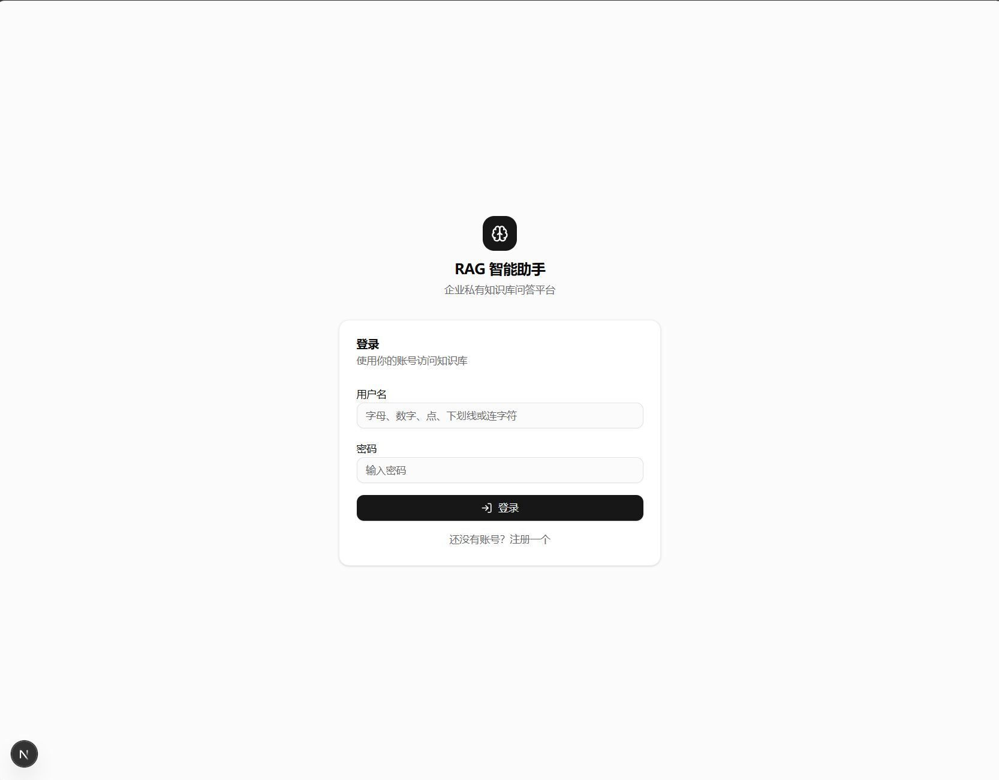
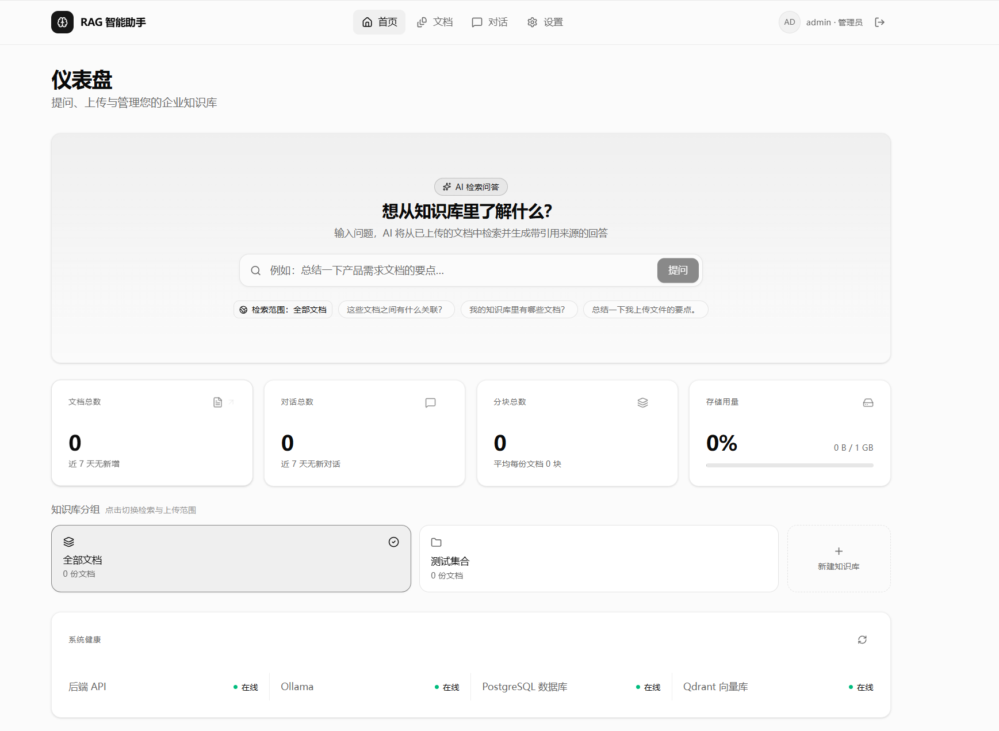
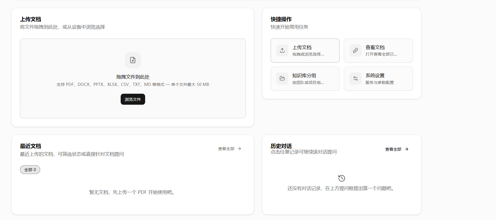

<div align="center">

# RAG 智能助手

### 企业私有知识库问答平台

面向生产环境的端到端 RAG 系统：多用户鉴权 · 文档解析与切分 · 混合召回 + 精排 + 证据评估 · 主图谱编排 · 全本地推理。

<br />


</div>

---

## 一、简介

RAG 智能助手是一套面向企业内部使用的**检索增强生成（RAG）平台**，把企业私有文档变成可被自然语言检索的知识库。系统在本地完成文档解析、切分、向量化、检索、重排、证据评估与生成，**所有推理与数据均跑在本地**（Ollama + PostgreSQL + Qdrant），数据不出网。

与传统"上传文档 → 直接问"型 RAG 不同，本项目把生产环境中真正需要的工程能力落到代码：

- **意图路由**：一条问句可能问知识、问文档、聊闲天，系统能识别并选择不同支路。
- **混合召回**：BM25 关键词检索 + 向量语义检索，互补短板。
- **证据评估**：检索回来的内容可能被分数欺骗，LLM 评估"能否作答"，不够就改写再试。
- **结构感知切分**：表格、代码块、Markdown 标题不会被粗暴截断。
- **小到大检索**：先命中精确子块，回填更大父块给 LLM 看完整上下文。

---

## 二、应用截图

<div align="center">

| 登录 | 仪表盘 |
|:---:|:---:|
|  |  |
| 用户名密码登录，含注册入口 | 实时统计 · 系统健康 · 知识库分组 |

| 文档 |
|:---:|
|  |
| 拖拽上传 · 快捷操作 · 最近文档 · 历史对话 |

</div>

---

## 三、核心特性

| 模块 | 能力 |
|:---|:---|
| **多用户与企业落地** | 登录注册 · JWT 鉴权 · 每用户文档所有权 · 知识库（KB Collection）分组 · 反馈与审计日志 |
| **多格式文档** | PDF · DOCX · PPTX · XLSX · CSV · TXT · Markdown；单文件 ≤ 50 MB |
| **结构感知切分** | 按 Markdown 标题分层；按 token 数（而非字符数）切分；句子边界滑窗重叠；代码块与表格**不被从中间拆开** |
| **小到大检索** | 为每个子块建索引（更准）；命中后回填父块（更大上下文）；支持配置开关 |
| **混合检索** | BM25（字符 bigram）+ 向量 ANN（Qdrant），用 **RRF（Reciprocal Rank Fusion）** 融合 |
| **Cross-Encoder 精排** | 用 `bge-reranker-base` 对 Top-K 候选重打分，过滤掉"分数高但语义不相关"的噪声 |
| **LLM 证据评估** | 不是看分数，是用 LLM 判断"这段证据是否真能回答问题"；判 bad 时自动改写并重试 |
| **重写-重试循环** | 指代消解 + 多查询扩展；evidence 不够好自动改写 query，最多重试 N 次再拒答 |
| **五意图路由** | 自动识别 `document_summary` / `knowledge_qa` / `general_chat` / `doc_relations` / `list_documents` 五种意图，走不同支路 |
| **闲聊兜底** | 闲聊类问题直接调 LLM，**不检索、不假装查了知识库**，避免幻觉措辞 |
| **跨文档关联与总结** | 总结支路：按文档分别抽取主题-要点-总览；关联支路：发现文档之间的关系与差异 |
| **幻觉守卫** | 三道防线：精排分数阈值 → LLM 证据评估 → 改写仍失败则礼貌拒答 |
| **流式输出** | Server-Sent Events（SSE）逐 token 输出，前端实时渲染思考与正文 |
| **来源溯源** | 每个回答带可点击引用：文件名 · 页码 · 章节标题 · 原文片段 |
| **系统健康监测** | 仪表盘实时探测：后端 API / Ollama / PostgreSQL / Qdrant 任一离线即告警 |

---

## 四、算法与架构亮点

### 4.1 主图谱（Master Graph）— 统一编排入口

把所有支路收口到一张 LangGraph 状态机里，避免"散落多个 RAG 函数"难以维护的问题。

```
                    ┌─────────────┐
                    │ Query Router│   ← LLM 分类（5 意图）
                    └──────┬──────┘
                           │
        ┌─────────┬─────────┼─────────┬────────────┐
        ▼         ▼         ▼         ▼            ▼
   summary    knowledge_qa   chat   doc_relations  list_documents
     支路        主支路      闲聊      关联分析       文档列表
                  │
        ┌─────────┼─────────┐
        ▼         ▼         ▼
     rewrite   retrieve   history
   指代消解+多查询  混合检索    上下文
        │         │
        └────┬────┘
             ▼
        retrieve (BM25 + 向量 ANN + RRF + 精排)
             │
             ▼
        Retrieval Grader（LLM 证据评估）
        │                  │
        ▼ good             ▼ bad
     generate         rewrite（最多 N 次）
                            │
                       还 bad → 礼貌拒答
```

14 个节点；`grade → rewrite` 是 retry 回边，确保系统"宁可改写也不乱答"。

### 4.2 混合检索 + 精排 + 证据评估（三阶段检索）

不是简单"向量化 → 余弦相似度 → 取 Top-K"，而是三阶段：

| 阶段 | 目的 | 实现 |
|:---|:---|:---|
| **粗排** | 高召回，捞出候选池 | BM25（字符 bigram）+ 向量 ANN，**RRF 融合**取前 20 |
| **精排** | 高精度，淘汰噪声 | `bge-reranker-base` cross-encoder 重打分，取 Top-K |
| **证据评估** | 看"能不能答"，不是看"像不像" | LLM 对每条证据打 relevant / not_relevant；只保留相关证据 |

> 价值：单纯看精排分数会被一种情况欺骗——"分数 0.82 但答非所问"（比如问"营收增长率"但只搜到"利润率"）。证据评估能抓这种误召回。

### 4.3 结构感知切分（Chunker）

| 特性 | 说明 |
|:---|:---|
| **Token-aware** | 按 token 数而非字符数切，避免中英文长度差异导致 chunk 大小失控 |
| **句子边界重叠** | 重叠区在句号边界对齐，不在字符中间断开 |
| **表格/代码块保护** | 跟踪 Markdown 围栏状态，确保代码块、表格整块出现或整块不在 chunk 里 |
| **小到大索引** | 父块 ≈ 子块大小 × 2.5；检索时用更小的子块精确定位，召回时回填更大父块给 LLM |

### 4.4 五意图路由

用一个轻量 LLM 调用把问句分到五条支路：

| 意图 | 触发场景 | 处理方式 |
|:---|:---|:---|
| `document_summary` | 总结一份/多份文档 | 文档级总结流（Document Summary Node） |
| `knowledge_qa` | 从知识库找答案 | 主支路（重写 → 检索 → 评估 → 生成） |
| `general_chat` | 闲聊 / 写作 / 编程 | 直接调 LLM，**不检索** |
| `doc_relations` | 文档之间的关联与差异 | 跨文档关联分析 |
| `list_documents` | 列出库内文档 | 确定性 DB 直读，不进 LLM |

> 工程要点：路由判定**关闭 LLM thinking**，实测比开启快 10~19 倍（0.7 s vs 7~13 s），准确率完全一致。

---

## 五、工程化能力

| 能力 | 实现 |
|:---|:---|
| **确定性 Chunk ID** | SHA-1(doc_id + chunk_index + offset) → 幂等可重入 |
| **重复文档检测** | per-user 文件哈希 + 去重；同一文件重复上传自动跳过 |
| **断点续传索引** | 处理中断后可从断点继续，不重做已完成 chunk |
| **自适应批量向量化** | 批次大小随 API 错误率动态收缩（10 → 5 → 2），成功后逐步恢复 |
| **指数退避 + 抖动** | 网络抖动时退避重试，避免雪崩 |
| **路由延迟兜底** | Router / Grader 调用失败时自动降级到默认路由（knowledge_qa） |
| **流式 + 渐进式输出** | SSE：thinking → sources → chunk tokens → done；前端可分别处理 |
| **来源溯源** | 每条回答带可点击引用，定位到文档-页码-章节-片段 |
| **审计与反馈** | 用户反馈（赞/踩/原因）进入审计日志，可用于后续评测与微调 |
| **权限隔离** | 用户只能看到自己的文档与对话；管理员视图额外可见全量 |

---

## 六、技术栈

| 层 | 选型 |
|:---|:---|
| **前端** | Next.js 15 · React 19 · TypeScript 5 · Tailwind CSS · 流式 SSE 客户端 |
| **后端** | FastAPI · LangGraph · SQLAlchemy · Pydantic · JWT 鉴权 |
| **检索** | 自研 BM25（字符 bigram） · Qdrant 向量库 · RRF 融合 · bge-reranker 精排 |
| **生成** | Ollama 本地推理（qwen3:8b 等） · LangChain · 流式输出 |
| **数据** | PostgreSQL 16（元数据 · 对话 · 用户 · 审计）· Qdrant（向量 + payload） |
| **工程** | Docker · docker-compose · Alembic 迁移 · 可恢复的增量索引 |

---

## 七、快速开始

### 1. 克隆

```bash
git clone https://github.com/fanfanfan333/Production-RAG-Agent.git
cd Production-RAG-Agent
```

### 2. 准备环境变量

```bash
cp .env.example .env
cp backend/.env.example backend/.env
```

按需填写：`POSTGRES_PASSWORD`、`QDRANT_URL`、`OLLAMA_BASE_URL` 等。

### 3. 启动依赖与后端

```bash
cd backend
docker compose up --build
```

后端将运行在 `http://localhost:8000`，Swagger 文档：`http://localhost:8000/docs`。

### 4. 启动前端

```bash
cd ..
npm install
npm run dev
```

打开 `http://localhost:3000`，注册账号 → 上传文档 → 提问。

---

## 八、项目结构

```
Production-RAG-Agent/
├── app/                              Next.js 页面（登录 / 仪表盘 / 文档 / 对话 / 设置）
├── components/                       共享 UI 组件（侧边栏 / 引用 / 思考气泡 / 快捷操作）
├── lib/                              前端工具（API 封装 · 鉴权上下文 · 流式客户端）
│
├── backend/
│   ├── app/
│   │   ├── api/                      REST 端点（auth · documents · query · feedback · ...）
│   │   ├── db/                       模型 · 会话 · Alembic 迁移
│   │   ├── schemas/                  Pydantic 请求/响应模型
│   │   ├── middleware/               网关中间件（限流、鉴权透传）
│   │   └── services/
│   │       ├── routers/query_router         LLM 意图路由
│   │       ├── graders/retrieval_grader     LLM 证据评估
│   │       ├── nodes/                       主图谱各支路节点
│   │       │   ├── context_builder          上下文组装（含父块回填）
│   │       │   ├── document_summary_node    文档总结
│   │       │   └── general_chat_node        闲聊兜底
│   │       ├── master_graph                 14 节点统一编排入口
│   │       ├── chunker                      结构感知切分
│   │       ├── retrieval_service           三阶段检索
│   │       ├── hybrid_search                BM25 + 向量 + RRF
│   │       ├── reranker                     cross-encoder 精排
│   │       ├── query_transform              重写 + 指代消解
│   │       ├── prompt_security              prompt 注入防护
│   │       ├── auth_service / permissions   鉴权与权限
│   │       └── audit_service                审计与反馈
│   ├── docker-compose.yml
│   ├── Dockerfile
│   └── requirements.txt
│
├── screenshots/                      README 截图
├── README.md
└── package.json
```

---

## 九、许可

本项目以 MIT 协议开源。