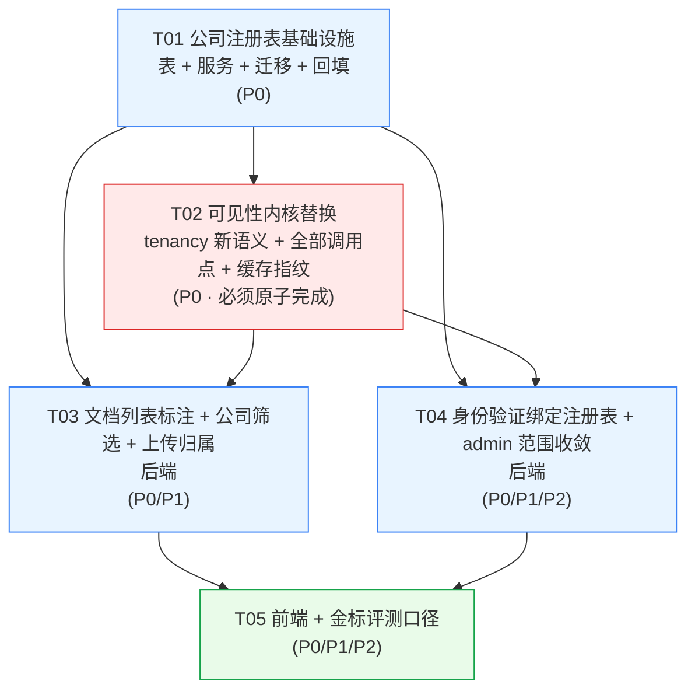

# 增量架构设计 + 任务分解
## 公司注册表 · 测试公司作用域 · 文档三层标注

> 需求来源：`docs/PRD-increment-company-scope.md`（PRD 已定稿）
> 工作目录：`D:\RAG\Production-RAG-Agent`
> 本文只做**设计与任务分解**，不含实现代码（给到签名 / SQL / schema / 伪代码粒度）。
> 配套文件：`docs/class-diagram.mermaid`、`docs/sequence-diagram.mermaid`

> ## ⚠️【Rev2 修订】private 的 ACL 分支改为「与租户无关」+ 撤掉评测特设 scope
> team-lead 实测新证据：admin 的两份金标文档（`研发部-2024年度技术方案`、`Python AI大模型成神手册 (1)`）**owner=admin 本人、但 tenant=`default`**。
> 原设计让 admin 的 `tenant_ids` = 自建测试公司（不含 `default`），第一层过滤会把这两份文档滤掉 → **admin 看不到自己上传的文档**（真实功能回归，非仅评测问题）。
> **裁决（team-lead）**：把 `private / NULL` 层级改为**只按 `owner_id == 我` 判定、不参与租户过滤**；`department / tenant` 层级才受租户集合约束。
> - **§决策 2 的 `document_scope_clause` 合并形态 → 【Rev2 作废】**（新形态见 §10.2）
> - **§决策 9「金标评测专用 scope」→ 【Rev2 作废】**（改回 admin 真实 scope，见 §10.5）
> - **§决策 8 的 `GET /companies/visible` → 【Rev2 作废】**（改为 `GET /companies/accessible`，见 §10.6）
> - 受影响的 4 个函数、Qdrant 等价形态、任务调整 → **见文末 §10「Rev2 修订详情」**
> - **最终裁决**：§8 待明确事项**已全部拍板**；**删除不放开**（【已裁决 10-A】，见 §10.3②）；新增 **§10.9 不可退化基线**（QA 硬门禁）。
> - 文中被推翻的段落均以 `【Rev2 作废】` 标注。

---

# Part A：实现方案与关键设计决策

## 0. 一句话总览

本轮把「公司」从**推导概念**（`GROUP BY users.tenant_id`）升级为**可管理的一等注册实体**（新表 `companies`），
并以此为唯一事实源，把 `platform_wide`（=「不加 tenant 过滤 = 全库」）**整体替换**成「**限定到一组 tenant_id**」的作用域语义，
让**列表与检索共用同一份范围对象**，从而同时满足 P0-6（admin 只看自建测试公司）、P0-7（列表==检索）、P0-8（个人库私密不可动摇）。

---

## 1. 逐条关键设计决策（含被否决的替代方案）

### 决策 1（对应 §三.2）：`platform_wide: bool` → `tenant_ids: frozenset[str] | None` + `owns_tenant_ids: frozenset[str]`

**决策**：删除所有可见性函数上的 `platform_wide` 参数，换成两个集合参数：

| 新参数 | 语义 | 谁能拿到非空 |
|---|---|---|
| `tenant_ids: frozenset[str] \| None` | 第一层公司过滤**集合**。`frozenset`（可空）= `tenant_id IN (...)`；空集 = **fail-closed 返回空**；`None` = 不限制（**仅** `unrestricted=True` 诊断路径） | 所有人（普通用户 = `{自己公司}`；admin = `{自身所属租户 default} ∪ {自建测试公司}`） |
| `owns_tenant_ids: frozenset[str]` | 「**可见他人 private 文档**」的租户集合。仅当 actor 是该租户的**创建者**时非空 | **只有平台管理员**，值 = 其自建测试公司集合 |

为什么拆成两个集合而不是只用一个：**普通 `company_admin` 有 `tenant_ids={本公司}` 但 `owns_tenant_ids=∅`**（看不到同事的私库）；
**admin 有 `tenant_ids = {自身所属租户} ∪ {自建公司}`、`owns_tenant_ids = {自建公司}`**（前者比后者多的那一项就是 admin 自己的 `default`：它是 admin 的空间、但其中没有「他人私库」可放行，故不进 `owns`）。
两者语义不同、必须分开，否则「admin 放开 private」就会写成全局放开（违反 P0-8 与 §三.3）。

**被否决的替代方案**：
- ❌ **继续堆布尔**（`platform_wide` + 新增 `owns_private` + `tenant_set`）：三种布尔组合会产生 8 种状态，其中多数无意义，是最容易出「某条路径忘了带某个布尔」的结构。
- ❌ **只用一个 `tenant_ids`，把 admin 的 private 例外塞进 `tenant_wide`**：`tenant_wide` 的本义是「本租户内所有**部门库**」（`TENANT_WIDE_READER_ROLES`），用它表达 private 会污染既有权重的语义，且无法被单测区分。
- ❌ **把 `tenant_id` 保留为单值 + 额外传 `tenant_set`**：两套并存必然分叉（有人传前者有人传后者），正是 §三.1 要消灭的形态。

### 决策 2（对应 §三.1）：新增 `document_scope_clause()` 作为**唯一 SQL 组装点**，把「租户过滤 + ACL」合并

现状：租户过滤（第一层）与 `document_acl_clause`（第二层）在 **5 处各写一遍**（`list_documents` / `list_accessible_documents` /
`keyword_search` / `retrieve_chunks` 的 `valid_docs` / `rag_graph._list_completed_documents`）。「改一处必须三处口径一致」靠人肉。

**决策**：`tenancy.py` 新增

```python
def tenant_clause(tenant_ids, *, column=Document.tenant_id):
    # None -> true()（不限制，仅 unrestricted）; 空集 -> false()（fail-closed）; 否则 column.in_(sorted(...))

def document_scope_clause(*, owner_id, department_id, tenant_ids,
                          owns_tenant_ids=frozenset(), tenant_wide=False):
    # = and_( tenant_clause(tenant_ids), document_acl_clause(...) )
```

> **【Rev2 作废】** 上面这个「`and_(tenant_clause, document_acl_clause)`」合并形态**作废**：它会把「owner=admin 但 tenant=`default` 的自己私库」一并滤掉。修订形态（tenant 集合 OR 自己私库）见 **§10.2**。「合并成单一入口」这条纪律 Rev2 不变。

**所有列表 / 检索 / 关键词腿 / 摘要 / DB 兜底校验一律只调 `document_scope_clause`**，不再各自拼租户条件。
`document_acl_clause` 保留（ACL 单层），但**不再单独出现在调用点**。这一个改动把「列表与检索共用同一份范围对象」从约定变成**结构保证**。

`document_scope_clause` 内保留历史「只给 owner 不给公司」的保守退化（`tenant_ids is None` 且非 unrestricted → 追加 `owner_id == owner`，`tenant_wide=False`），行为与现状逐字一致，避免破坏诊断脚本。

### 决策 3（对应 §三.4）：公司注册表 `companies`

```sql
CREATE TABLE companies (
    tenant_id    VARCHAR(64)  PRIMARY KEY,                     -- 稳定标识（改名不变）
    display_name VARCHAR(128) NOT NULL,                        -- 展示名
    name_key     VARCHAR(128) NOT NULL,                        -- 归一化键（唯一性判定）
    created_by   UUID         NULL REFERENCES users(id) ON DELETE SET NULL,
    is_test      BOOLEAN      NOT NULL DEFAULT false,          -- 创建者为平台管理员
    created_at   TIMESTAMPTZ  NOT NULL DEFAULT now(),
    updated_at   TIMESTAMPTZ  NOT NULL DEFAULT now(),
    CONSTRAINT uq_companies_name_key UNIQUE (name_key)
);
CREATE INDEX ix_companies_created_by ON companies(created_by);
```

- **`tenant_id` 作主键、且与名称解耦**：这是 P0-4「改名不改 tenant_id、零迁移」的前提。**新公司用 `generate_tenant_id()` 生成随机安全 id**（`"c" + uuid4().hex[:12]`，满足 `_TENANT_ID_RE`），**不再**用 `company_id_from_name(name)`——后者是「名称哈希」，改名即换 id，与 P0-4 冲突。
- **`name_key` 唯一约束**（P0-3）：归一化规则统一为

  ```
  name_key = unicodedata.normalize("NFKC", name) → 去除全部空白（含全角空格） → str.casefold()
  ```

  之所以「去除**全部**空白」而不是「只 strip 首尾」：验收明确要求「重名（含空格/大小写变体）拒绝」，取「宁严勿松」的一侧（对公司名而言空白不承载语义）。此规则是**全项目唯一**的归一化实现（见 §共享知识），注册/建公司/改名/按名解析全部调用同一个 `normalize_company_name_key()`。
- **`is_test`**：PRD 默认值 #1 说「创建者 == admin 的公司即测试公司」。直接把「是不是测试公司」物化成一列，理由：`created_by` 是 `ON DELETE SET NULL`，一旦管理员账号被删，若靠 `created_by IS NOT NULL` 判测试公司会**静默漂移**；`is_test` 把分类钉死。
  - admin 的**可见集合** = `{c.tenant_id : c.created_by == 当前 admin.id}`（用 `created_by` 定位到**具体某个** admin，而不是「任意 admin」——见 §待明确事项 1）。
- **不加 `is_active`**（否决）：本轮没有任何「停用公司」需求，YAGNI；先不加列，需要时再加（本项目 `create_all` 不给已存在表加列，将来补列要走迁移，成本与现在写一条迁移一样）。

**改名留痕（P2-2）落法（决策）**：**复用 `audit_logs`**，`action="company.rename"`、`resource_type="company"`、`resource_id=tenant_id`、`detail="旧名→新名; by <username>"`。
理由：① 改名**不是**需要查询/恢复的业务实体（P2-2 明说「不要求恢复旧名」），只是合规事件，`audit_logs` 正是为「谁在何时做了什么」而生；② 它已带 `created_at` / `username` / `user_id`，天然满足「旧名→新名/时间/操作者」；③ 新开 `company_rename_logs` 表会多出一个几乎不再被读的事实源。
**被否决**：在 `companies` 上加 `previous_name`（只能留一次，连续改名会丢历史）。

### 决策 4（对应 §三.6 / §四.1）：名称→标识的权威源从「名称哈希」换成「注册表查表」

- `create_staff_request` 不再调 `company_id_from_name`，改为：**先给 `company_id`（下拉值）→ 查注册表 `get_company`；命中用注册表的 `tenant_id`，未命中 400「请先由管理员注册该公司」**；兼容「只给 `company_name`」的旧入口：用 `find_by_name(name_key)` 解析（因此**改名后新名可解析、旧名失效** = P1-2）。
- `staff_requests.company_name/company_id` 两列**已存在**，无需改表；落库时 `company_name` 存注册表当前 `display_name`（快照，供历史回溯）。
- 部门仍走 `department_id_from_name`（部门不是本轮的一等实体，PRD 默认 #3 也确认部门名以成员 `department_name` 为权威）。
- **兼容旧数据**：`company_id_from_name` **保留但仅供回填脚本一次性使用**，业务新代码不再调用（grep 只剩回填脚本一处）。

### 决策 5（对应 §三.5）：现有 5 家租户的归属一次性裁定 + 回填

回填由**幂等脚本**完成（不硬编码进迁移，避免迁移里塞业务规则）：

`backend/scripts/backfill_company_registry.py`，规则：

| tenant_id | company_name | created_by | is_test | display_name（改名后） |
|---|---|---|---|---|
| `c8111de986583` | 转入检索公司bjld8 | **admin** | true | **测试公司1** |
| `cfb08c53677c4` | 转入检索公司1z5pp | **admin** | true | **测试公司2** |
| `c309a7cb9f496` | A公司 | `NULL` | false | A公司 |
| `cfb08c53677c4`（另一家）A/B 之外 | B公司 | `NULL` | false | B公司 |
| `default` | — | **不入表** | — | — |

- **`default` 不入注册表**：它是历史/占位租户（admin 本人所在），`list_companies` 本就排除 `role=admin`。把它当公司会出现「名叫 default 的公司」这一自相矛盾项（见 `tenancy.company_display_name` 现有注释）。
- **A公司 / B公司 → `created_by = NULL`**：§三.5 明确「不能属于 admin」，否则 admin 就能看到它们的**文档**，违反 P0-6。`created_by=NULL` 使它们对 admin 的**文档可见集合**（`owns_tenant_ids`）**恒不命中**（P0-6 不变）；它们仍由本公司 `company_admin/kb_admin` 通过 tenant 内路径管理（非 admin 的 `list_companies/list_members` 走 `effective_tenant_id` 分支，不受影响）。
  - **「文档可见集合」与「公司管理清单」是两个不同的范围**（用户 2026-09-19 拍板）：A公司 / B公司**会出现在平台管理员的「公司管理清单」**中 —— `staff_service.list_companies` 的口径已改为「**全部已注册公司**」（含无主历史公司），管理面板可见其**存在与成员数**，并可由平台管理员**改名**。
  - 改名走 `company_registry.can_platform_admin_rename`（`created_by is None` → 放行），只改 `display_name` / `name_key` + 同步 `users.company_name`，**绝不回填 `created_by`** —— 一旦回填它们就会进入 `owns_tenant_ids`，那才是**真的**击穿 P0-6。
- **不改 `documents.tenant_id`、不改 Qdrant payload、不重跑向量**：回填只写 `companies` 表 + `users.company_name`（展示副本，改名时同步）。
- 脚本用 `--assign / --rename` 显式参数（含上表默认值），**幂等**（存在即跳过 / 更新而非插入）。

### 决策 6（对应 §三.7）：admin 上传必须**显式**指定归属公司

`POST /upload` 增加 `company_id: str` 表单字段。

> **【Rev3 前提校正】** 本条决策原文写着「admin 的 `effective_tenant_id` 是 `default`，会落进一个它自己看不到的租户」—— **这句与实现相反，已作废**。事实是：admin 的自身租户就是 `default`，且 `default` **在** `request_scope(admin).tenant_ids` 内，admin **看得见**这块空间里的文档（`/companies/accessible` 里 `default` 一项 `doc_count=1` 即实证；该选项在下拉里显示为「**管理员**」）。

因此决策 6 的实质不是「把 admin 关在自建测试公司里」，而是「**不许落到随机的占位租户**」：

- `is_platform_admin(user)` 时 `company_id` **必填**，合法目标 = **调用者自身所属租户**（admin 即 `default`）∪ `request_scope(user).owns_tenant_ids`（自建测试公司集合）。
  - **自身空间恒合法**：`normalize_tenant_id(company_id) == effective_tenant_id(user)` → 直接放行，与调用者有没有创建过公司**无关**（不是「创建过公司才有资格传」）。
  - 未选择（空 / 空串）→ **400「请选择归属公司」**。⚠️ 空串必须**先**排除：`normalize_tenant_id("")` 会回落成 `"default"`，若让它参与「是不是自己」的比较，「未选择」会被误判成「选了自己」从而绕过 400。
  - 选了**他人**公司（既非自身租户、也不在自建集合内）→ **403「只能上传到你创建的测试公司或管理员空间」**。
  - 未选自身空间**且**一家自建公司都没有 → **400「暂无测试公司，请先创建公司」**（P0-6 引导文案）。
  - `tenant_id = company_id`（选择生效）。
- 且当 `access_level == department` 且 actor 是平台管理员时，**还需显式 `department_id`**（校验在该公司部门清单内），否则部门库文档 `department_id=None` → 部门内谁都检索不到（现行为即有此坑，本轮顺手堵上）。
- 非 admin：忽略 `company_id`（服务端强制用 `effective_tenant_id(user)`），避免成员把文档传进别家公司。

### 决策 7（对应 §三.8）：admin 的审核队列 / 成员管理 / 公司清单全部收敛

| 位置 | 现状 | 新口径 |
|---|---|---|
| `can_review_staff` | admin 可审任意公司 | admin 仅当 `request.company_id ∈ self.owns_tenant_ids` 才可审；其余角色不变（同公司 + 等级严格更高） |
| `list_inbox` | admin 看全部公司申请 | admin 仅看 `company_id ∈ 自建集合` 的申请 |
| `summary.pending_for_me` | admin 计全部 | 同上收敛 |
| `list_members` | admin 默认全部公司 | admin 默认「自建公司并集」的成员；传 `company_id` 时必须 ∈ 自建集合，否则 403 |
| `list_companies` | `GROUP BY users.tenant_id`（推导） | **改为读注册表**：admin → 自己创建的公司；其余管理员 → 本公司。返回 `{company_id, company_name, member_count, is_test}`（`member_count` 仍按 users 聚合） |
| `set_member_identity` / `delete_member` | admin 跨公司可改/可删 | admin 仅可操作 `target.tenant_id ∈ 自建集合` 的成员 |

为使 `can_review_staff` 保持纯函数，签名改为接收已解析的集合：

```python
def can_review_staff(request, reviewer, *, applicant_role=None,
                     reviewer_tenant_ids: frozenset[str] | None = None) -> bool
```

### 决策 8（对应 §五.5 / §四.5）：前端公司数据来源

**两类清单、两个端点，避免混用**：

1. **身份验证下拉候选 = 全部已注册公司**（P0-5）——任何**已登录**用户可用（未验证用户也要能开弹窗）：
   `GET /companies` → `[{company_id, company_name}]`（读注册表；不要求 `staff.admin`，不要求身份验证）。
2. **文档页公司筛选候选 = 调用者可见范围**（P1-1）——`GET /companies/visible` → admin = 自建测试公司；普通成员 = 本公司（前端仅对 admin 显示筛选器）。

> **【Rev2 作废】** 端点 `GET /companies/visible` **作废**，改为 **`GET /companies/accessible`**（`document.read` 权限，返回 `company_id + display_name + doc_count`）。理由与完整定义见 **§10.6**。
   该端点内部调 `request_scope(user)`，**候选与列表/检索同源**，从结构上杜绝「筛选项里出现看不见的公司」。

**被否决**：复用 `GET /staff/companies`（决策 7 已把它改成 admin 的**自建**公司，且它是 `staff.admin` 权限、语义是「成员管理过滤」，不是「可见公司」；复用会把两件事耦合）。

### 决策 9（对应 §四.3）：金标评测的处理方案（**重点**）

**问题**：`golden_v1.json` 的 16 正例依赖 admin **跨公司**可见「研发部技术方案」「Python 手册」等文档；admin 收敛后这批用例大面积失效。
（现 `evaluation.py` 与 `run_eval_baseline.py` 都以 admin 身份 + `scope_for(user)` 跑。）

**决策（推荐方案）**：**评测不是「某个用户」，而是「一个有界的 scope」**，把 scope 显式定义为「**金标文档自身所属租户的并集**」，并对 list 与 search **施加同一 scope**：

```
eval_scope = DocumentScope(
    owner_id   = admin.id,
    tenant_ids = frozenset({doc.tenant_id for 金标文档}),   # 由金标集运行时解析得到
    owns_tenant_ids = frozenset(),                          # 个人库仍私密（P0-8 不动摇）
    department_id = None,
    tenant_wide = True,                                     # 评测需跨部门命中金标块
)
```

- `retrieve_chunks(**eval_scope.acl_kwargs())` 与 `list_documents(**eval_scope.acl_kwargs())` 用**同一个** scope → 「列表可见集合 == 检索可命中集合」在评测自身即被断言（harness 增加一条断言：金标文档若在 list 中可见，则必须能在 search 命中；反之不得命中 list 之外的文档）。
- 仅**平台管理员**可走该口径（`/eval/run` 里 `if user.is_admin else scope_for(user)`）；`run_eval_baseline.py` 以 admin 运行，行为与线上评测同源。
- 金标文档**不搬迁**（不改 `documents.tenant_id` / 向量），满足 §三.5 硬约束。
- 由于 `owns_tenant_ids=∅`，金标里那 3 份 **private（归属李四/王五/某某）**仍不可见 —— 与 `golden_v1.json` 的 `scope_limitation` 完全一致（那 3 份本就不在评测范围内）。

**被否决的替代方案**：
- ❌ **把金标文档迁到 admin 的测试公司**：直接违反 §三.5「改名/迁移不得改动 `documents.tenant_id` 与向量 payload」。
- ❌ **`unrestricted=True` 承载评测**：它「不做任何权限过滤」，度量的是一个**任何真实用户都无法达到**的口径，必然破坏「列表==检索」硬约束（且代码注释已明确它「仅诊断脚本/系统内部调用」）。
- ❌ **另建一个「评测专用管理员账号」**：单账号只有一个 `tenant_id`，而金标文档**横跨多个公司**，单一 tenant 的账号结构上覆盖不到（要么再走 admin，回到原点；要么搬文档，被否决）。

### 决策 10（对应 §三.2 / §四.2）：缓存指纹必须带上「租户集合」

现状：`retrieval_service` 的 `perm_ctx`（≈1470 行）**不含 `tenant_id`**，`scoped_cache_key` 只带**单个** `tenant_id`。引入租户集合后若不同步，会「跨公司串缓存」。

**决策**：
- `tenancy.py` 新增 `tenant_scope_fingerprint(tenant_ids) -> str`（`"all"` | `"none"` | `"s:" + sha1(",".join(sorted))[:12]`）。
- `permission_context(user, *, owner_id=None, tenant_ids=None, owns_tenant_ids=None)` 追加 `tenant_scope_fingerprint(tenant_ids)` 与 `tenant_scope_fingerprint(owns_tenant_ids)`（admin 的指纹因此随「新建公司」变化 → 旧缓存自动失效；**改名不改 tenant_ids ⇒ 指纹不变 ⇒ 无需失效**，正确）。
- `scoped_cache_key(tenant_scope, perm_context, raw_key)`：第一参从「单 tenant_id」改为「tenant 集合」，内部用指纹渲染。
- `retrieval_service` 的 `perm_ctx` 改为 `f"{owner}:{dept}:{fp(tenant_ids)}:{'TW'…}:{fp(owns_tenant_ids)}"`；BM25 语料缓存（内存腿 `_bm25_keyword_candidates`）与 PG 关键词腿的缓存键随之统一。

### 决策 11（对应 §四.1）：`rag_graph.py` 的 `_retrieve_node` 是一处**既存漏传**，须一并修

`rag_graph.py:301` 的 `retrieve_chunks(...)` **只传了 `owner_id/collection_id/extra_queries`**，没传任何租户/ACL 参数 —— 一旦该节点被触发，会退化成「仅 owner」（fail-closed 下可能返回空，或按 owner 退化）。该路径疑似已被 `master_graph` 取代（活跃入口是 `query.py::stream_master`），但 `rag_graph.py` 的 `stream_document_list/_list_completed_documents` **仍在用**。
**决策**：不假设它是死代码 —— 按 §四.1 要求，对 `rag_graph.py` 的 **两处**（`_retrieve_node` 的 retrieve_chunks、`_list_completed_documents` 的租户条件）都给出改造；若工程师确认 `_retrieve_node` 无调用方，则就地删除该节点（避免留一个漏传权限的入口）。

---

## 2. 文件清单（相对路径）

### 新增

| 文件 | 说明 |
|---|---|
| `backend/app/db/company_models.py` | `companies` 表 ORM（`Company`） |
| `backend/alembic/versions/<rev>_add_companies_registry.py` | 建表 + 唯一约束与索引（`IF NOT EXISTS` 幂等） |
| `backend/app/services/company_registry.py` | 公司注册表服务：归一化 / 生成 id / create / rename / get / find_by_name / list / display_names / tenant_ids_created_by / assert_admin_owns / backfill |
| `backend/scripts/backfill_company_registry.py` | 一次性、幂等回填 5 家租户归属 + bjld8/1z5pp 改名测试公司1/2 |
| `backend/app/api/companies.py` | `GET /companies`、`GET /companies/visible`、`POST /companies`、`PATCH /companies/{id}` |
| `backend/app/schemas/company.py` | `CompanyCreate/CompanyRename/CompanyItem/VisibleCompanyItem` Pydantic schema |
| `backend/tests/test_company_registry.py` | 归一化/唯一/越权重名/create/rename tenant_id 不变 + 审计 |
| `backend/tests/test_scope_isolation_tenant_set.py` | **列表==检索**等价性、admin 仅见自建、`owns_tenant_ids` 单测（P0-6/P0-7/P0-8 断言） |
| `components/staff/company-manager.tsx` | admin 后台「创建公司 / 改名」入口（P0-2/P0-4/P2-1） |

### 修改（后端）

| 文件 | 改什么 |
|---|---|
| `backend/app/services/tenancy.py` | **核心**：`DocumentScope` 改字段；新增 `tenant_clause/tenant_scope_fingerprint/document_scope_clause`；`scope_for(user, owned_tenant_ids=…)`；新增 async `request_scope(user)`；`document_acl_clause`（加 `owns_tenant_ids`、private 特例）；`can_access_document/delete_permission_for/can_request_delete`（加 `tenant_ids/owns_tenant_ids`）；`permission_context/scoped_cache_key`（带集合指纹）；删除 `platform_wide` |
| `backend/app/services/retrieval_service.py` | `retrieve_chunks` 签名换集合；`_visibility_conditions`（admin 私库例外改为「tenant∈owns」）；1221/1266/1360/1390 三处纵深防御改用 `document_scope_clause`；`_scroll_corpus`/内存腿/`_bm25_keyword_candidates` 租户过滤改集合（`MatchAny`）；`_pg_keyword_candidates` 传集合；1470 `perm_ctx` 加集合指纹；1799 尾部 Permission Check 改 `in` |
| `backend/app/services/pg_keyword_search.py` | `keyword_search` 签名 `tenant_id→tenant_ids`、加 `owns_tenant_ids`；SQL 用 `document_scope_clause`（`tenant_id IN (...)`） |
| `backend/app/services/document_query_service.py` | `list_documents/get_document_chunks/delete_document` 换集合参数；payload 新增 `tenant_name/department_name`；`_compose_scope_labels` 批量取公司名（注册表）+ 部门名（`list_department_options`）；新增 `company_id` 列表过滤参数 |
| `backend/app/services/relation_service.py` | `list_accessible_documents`/`collect_document_digests` 换集合参数 + `document_scope_clause` |
| `backend/app/services/rag_graph.py` | `_list_completed_documents` / `stream_document_list` 换集合参数；`_retrieve_node` 补传权限参数（或删除该节点，见决策 11） |
| `backend/app/services/master_graph.py` | `MasterState`：`tenant_id→tenant_ids`、删 `platform_wide`、加 `owns_tenant_ids`；`stream_master` 入参与 initial_state；`_summary_digests_node`/`_collect_digests_node`/主 retrieve 节点传集合 |
| `backend/app/services/knowledge_tier_service.py` | `publish_capability(user, doc, *, owns_tenant_ids=frozenset())`；`list_department_options` 复用为「某公司部门名清单」 |
| `backend/app/services/staff_service.py` | `create_staff_request`（注册表解析）；`can_review_staff`/`list_inbox`/`summary`/`list_members`/`list_companies`/`set_member_identity`/`delete_member` 按决策 7 收敛（admin 用 `tenant_ids_created_by`） |
| `backend/app/services/share_service.py` | `delete_permission_for/can_request_delete` 调用点补 `owns_tenant_ids`（admin 场景） |
| `backend/app/services/permissions.py` | `can_access_all_documents_platform` 文档语义更新（跨**自建测试公司**）；角色矩阵不变；顶部权限表文案更新 |
| `backend/app/api/query.py` | `scope_for→await request_scope`；`stream_master`/`stream_document_list` 传 `**scope.acl_kwargs()` |
| `backend/app/api/document_management.py` | 三处 `scope_for→await request_scope`；列表端点加 `company_id` 查询参数；`can_access_document`/`publish_capability` 调用补 `owns_tenant_ids` |
| `backend/app/api/documents.py` | `POST /upload` 增加 `company_id`（admin 必填 + 归属校验 + 部门校验，决策 6） |
| `backend/app/api/conversations.py` | 会话隔离改用 `effective_tenant_id(user)`（语义等价，见 §共享知识） |
| `backend/app/api/staff.py` | `CreateStaffRequest` 加 `company_id`；`GET /staff/companies` 语义更新；新增公司创建/改名端点（或让 `companies.py` 承载） |
| `backend/app/api/evaluation.py` | `/eval/run` 改用**评测 scope**（决策 9） |
| `backend/app/schemas/document_management.py` | `DocumentSummary` 新增 `tenant_name: str\|None`、`department_name: str\|None` |
| `backend/app/main.py` | `import company_models`（让 `create_all` 建表）+ 注册 `companies` router |
| `backend/scripts/run_eval_baseline.py` | admin 用评测 scope；负例/分带测量同步 |

### 修改（前端）

| 文件 | 改什么 |
|---|---|
| `components/documents/access-badge.tsx` | 组件按 `level + companyName + departmentName` **内部计算展示文本**（见 §共享知识 标签规则），保留三图标/三色；`tierScopeName` 不变 |
| `components/documents/documents-list.tsx` | 传 `companyName/departmentName`；新增 admin「公司筛选器」（候选=`/companies/visible`，P1-1）；空列表引导（P0-6 兜底文案） |
| `components/documents/document-sharing-dialog.tsx` | `AccessTierBadge` 调用点传公司/部门名 |
| `components/staff/identity-dialog.tsx` | 「公司名称」自由输入 → **下拉**（`GET /companies`），提交 `company_id`；无注册公司时给「请先由管理员注册该公司」提示 |
| `components/staff/member-panel.tsx` | 公司下拉改读（已收敛的）`/staff/companies`；接入 `CompanyManager`（创建/改名） |
| `lib/types.ts` | `Document` 加 `companyName?/departmentName?`；`CompanyOption` 复用/新增轻量 `CompanyChoice` |
| `lib/api/documents.ts` | `getDocuments` 加 `companyId`；新增 `getVisibleCompanies()` |
| `lib/api/staff.ts` | 新增 `getRegisteredCompanies()`、`createCompany()`、`renameCompany()`；`createStaffRequest` 改传 `company_id` |
| `lib/api/normalize.ts` | `normalizeDocument` 归一化 `company_name/department_name` |
| `lib/hooks/use-documents.ts` | `useDocuments({companyId})` 透传 |

---

## 3. 数据结构与接口

### 3.1 新表 DDL（含约束与索引）

见 §决策 3。迁移文件用与既有迁移一致的**幂等**写法（`sa.inspect` 探测 + `IF NOT EXISTS`），与启动时 `Base.metadata.create_all` 兼容。

### 3.2 Pydantic schema（`app/schemas/company.py`）

```python
class CompanyCreate(BaseModel):
    display_name: str = Field(..., min_length=1, max_length=128)

class CompanyRename(BaseModel):
    display_name: str = Field(..., min_length=1, max_length=128)

class CompanyItem(BaseModel):        # /companies
    company_id: str
    company_name: str

class VisibleCompanyItem(BaseModel): # /companies/visible
    company_id: str
    company_name: str
    is_test: bool = False
    member_count: int = 0
```

`app/schemas/document_management.py::DocumentSummary` 新增：

```python
tenant_name: str | None = None        # 公司展示名（注册表）
department_name: str | None = None    # 部门展示名（该公司内的部门名）
```

`app/api/staff.py::CreateStaffRequest`：

```python
company_id: str | None = Field(None, description="已注册公司的标识（下拉值，优先）")
company_name: str | None = Field(None, max_length=128, description="兼容旧入口：按名解析")
department_name: str = Field(..., max_length=128)
duty: str = Field(..., max_length=128)
```

### 3.3 API 路径 + 请求/响应

| 方法 | 路径 | 权限 | 请求 | 响应 |
|---|---|---|---|---|
| GET | `/companies` | 已登录 | — | `{items:[{company_id, company_name}]}` |
| GET | `/companies/visible` | 已登录 | — | `{items:[{company_id, company_name, is_test, member_count}]}` |
| POST | `/companies` | 平台管理员 | `{display_name}` | `{company_id, company_name, created_at}`；重名 409「公司已存在」 |
| PATCH | `/companies/{company_id}` | 平台管理员（须自建） | `{display_name}` | `{company_id, company_name, updated_at, message:"已改名"}`；非自建 403；重名 409 |
| GET | `/documents` | `document.read` | 新增 query `company_id?` | `DocumentSummary[]`（新增 `tenant_name/department_name`） |
| POST | `/upload` | `document.write` | 新增 form `company_id?` | 202；admin 缺 `company_id` → 400 |
| GET | `/staff/companies` | `staff.admin` | — | admin = 自建公司；其他 = 本公司（新增 `is_test`） |
| POST | `/staff/requests` | 已登录 | `{company_id?, company_name?, department_name, duty}` | 未注册 → 400「请先由管理员注册该公司」 |

### 3.4 关键函数：改造前 → 改造后

**tenancy.py**

```python
# 改造前
def scope_for(user) -> DocumentScope:
    tenant_id = None if platform else effective_tenant_id(user)
    tenant_wide = platform or role in TENANT_WIDE_READER_ROLES
    platform_wide = platform

# 改造后
def scope_for(user, *, owned_tenant_ids: frozenset[str] | None = None) -> DocumentScope:
    # 普通用户: tenant_ids={own}, owns_tenant_ids=∅
    # admin:    tenant_ids=owned_tenant_ids or ∅, owns_tenant_ids=同左
async def request_scope(user) -> DocumentScope:      # admin 时查注册表拿自建集合
    ...

# 改造前
def document_acl_clause(*, owner_id, department_id, tenant_wide=False,
                        platform_wide=False, read_all=None) -> ColumnElement
# 改造后
def document_acl_clause(*, owner_id, department_id, tenant_wide=False,
                        owns_tenant_ids: frozenset[str] = frozenset(),
                        read_all=None) -> ColumnElement
def document_scope_clause(*, owner_id, department_id, tenant_ids,
                          owns_tenant_ids=frozenset(), tenant_wide=False) -> ColumnElement  # 新

# 改造前
def can_access_document(doc, user, *, owner_id=None) -> bool
# 改造后
def can_access_document(doc, user, *, owner_id=None,
                        tenant_ids: frozenset[str] | None = None,
                        owns_tenant_ids: frozenset[str] = frozenset()) -> bool
# admin 传 tenant_ids=None/空 → 视为空集合（fail-closed），绝不回退全平台
# 【Rev2 作废】上面这条判定顺序有误（会把 admin 自己 default 租户的私库滤掉）：
#   修订为「private/NULL 分支在**公司边界之前**直接返回」，见 §10.3①。

# 改造前
def permission_context(user, *, owner_id=None) -> str
def scoped_cache_key(tenant_id: str | None, perm_context, raw_key) -> str
# 改造后
def permission_context(user, *, owner_id=None, tenant_ids=None, owns_tenant_ids=None) -> str
def scoped_cache_key(tenant_scope: frozenset[str] | None, perm_context, raw_key) -> str
def tenant_scope_fingerprint(tenant_ids: frozenset[str] | None) -> str  # 新
```

**DocumentScope（新形态）**

```python
@dataclass(frozen=True)
class DocumentScope:
    owner_id: uuid.UUID | None
    tenant_ids: frozenset[str] | None          # None = 不限制（仅 unrestricted 诊断）
    owns_tenant_ids: frozenset[str] = frozenset()
    department_id: str | None = None
    tenant_wide: bool = False

    @property
    def cross_tenant(self) -> bool: return self.tenant_ids is not None and len(self.tenant_ids) > 1
    @property
    def label(self) -> str: ...
    def acl_kwargs(self) -> dict:
        """统一喂给 list/retrieve/keyword 的 kwargs，杜绝各调用点手拼。"""
        return {
            "owner_id": str(self.owner_id) if self.owner_id else None,
            "tenant_ids": self.tenant_ids,
            "owns_tenant_ids": self.owns_tenant_ids,
            "user_department_id": self.department_id,
            "tenant_wide": self.tenant_wide,
        }
```

**retrieval_service.py**

```python
# 改造前
async def retrieve_chunks(query, top_k=5, ..., tenant_id=None, user_department_id=None,
                          tenant_wide=False, platform_wide=False, unrestricted=False, metadata_filter=None)
# 改造后
async def retrieve_chunks(query, top_k=5, ..., tenant_ids: frozenset[str] | None = None,
                          user_department_id=None, tenant_wide=False,
                          owns_tenant_ids: frozenset[str] = frozenset(),
                          unrestricted=False, metadata_filter=None)

# 改造前
def _visibility_conditions(owner_id, department_id, tenant_wide, platform_wide) -> list
# 改造后
def _visibility_conditions(owner_id, department_id, tenant_wide, owns_tenant_ids) -> list
#  cond1: private 仅 user_id==owner_id  "或"  tenant_id ∈ owns_tenant_ids（用 MatchAny / must_not 组合）
#  cond2: department 仅当 not tenant_wide 才限制 department_id

# 改造前
async def _scroll_corpus(client, collection_name, collection_id, max_points, tenant_id=None)
# 改造后
async def _scroll_corpus(client, collection_name, collection_id, max_points, tenant_ids=None)
#  tenant 条件由 MatchValue → MatchAny(values=sorted(tenant_ids))
```

**pg_keyword_search.py**

```python
# 改造前
async def keyword_search(session, *, query, limit, tenant_id, owner_id, user_department_id,
                         tenant_wide=False, platform_wide=False, ...)
# 改造后
async def keyword_search(session, *, query, limit, tenant_ids, owner_id, user_department_id,
                         tenant_wide=False, owns_tenant_ids=frozenset(), ...)
# SQL: stmt.where(document_scope_clause(owner_id=…, department_id=…,
#        tenant_ids=…, owns_tenant_ids=…, tenant_wide=…))   # 取代原来的 tenant==/owner 兜底
```

**company_registry.py（新）**

```python
def normalize_company_name_key(name: str | None) -> str        # NFKC + 去空白 + casefold
def generate_tenant_id() -> str                                # "c"+uuid4().hex[:12]
async def create_company(actor: User, display_name: str) -> Company
async def rename_company(actor: User, tenant_id: str, new_name: str) -> Company
async def get_company(tenant_id: str) -> Company | None
async def find_by_name(name: str) -> Company | None
async def list_registered_companies() -> list[Company]
async def company_display_names(tenant_ids: frozenset[str] | None) -> dict[str, str]
async def tenant_ids_created_by(admin_id: uuid.UUID) -> frozenset[str]
async def assert_admin_owns(actor: User, tenant_id: str) -> None   # 非自建 → StaffError(403)
async def backfill_from_existing() -> int
```

---

## 4. 程序调用流程

见 `docs/sequence-diagram.mermaid`（3 张）：

1. **admin 打开文档列表并检索**：`request_scope(admin)` → `tenant_ids_created_by` → 同一个 `DocumentScope` 同时喂给 `list_documents` 与 `retrieve_chunks`，一路到 Qdrant `must(tenant_id IN …)` + `must_not(_visibility_conditions)`、BM25 `document_scope_clause`、以及列表 payload 的 `tenant_name/department_name`。
2. **admin 创建公司 → 用户注册提交身份验证 → admin 同意 → 用户进入公司**：`POST /companies` → `GET /companies` 下拉 → `create_staff_request` 查注册表（未注册即拒）→ `list_inbox`（admin 只看到自建公司申请）→ `review_staff_request`（以注册表最新 `display_name` 落 `users`）。
3. **公司改名**：`PATCH /companies/{id}` → `assert_admin_owns` → `name_key` 唯一校验 → 改 `companies.display_name/name_key` + 同步 `users.company_name`（展示副本）→ 写 `audit_logs`；**`documents.tenant_id` 与 Qdrant payload 一律不动**。

---

# Part B：任务分解

> 依赖原则：T01 是纯「加表 + 加服务 + 加迁移」的**低耦合基础设施**，是唯一「无前置」的任务；
> T02 是**必须一次做完**的可见性内核替换（不能半迁移，否则列表/检索口径分叉）；
> T03/T04 只依赖 T01+T02，彼此**可并行**；T05 依赖全部。

## 5. 依赖包

**无新增第三方依赖。** 后端仅用既有 `sqlalchemy` / `alembic` / `fastapi` / `pydantic` + 标准库 `unicodedata`；前端仅用既有依赖。

---

## 6. 任务列表（按实现顺序）

### T01 — 公司注册表基础设施（数据 + 服务 + 迁移 + 回填）
- **源文件**：
  - 新增 `backend/app/db/company_models.py`、`backend/app/services/company_registry.py`、`backend/app/schemas/company.py`、`backend/alembic/versions/<rev>_add_companies_registry.py`、`backend/scripts/backfill_company_registry.py`、`backend/tests/test_company_registry.py`
  - 修改 `backend/app/main.py`（import 模型 + 注册 router 见 T03/T04 协同，本任务先 import 模型让 `create_all` 生效）
- **内容**：建 `companies` 表（DDL 见 §3.1/决策 3）；实现 `normalize_company_name_key`/`generate_tenant_id`/`create_company`/`rename_company`/`get_company`/`find_by_name`/`list_registered_companies`/`company_display_names`/`tenant_ids_created_by`/`assert_admin_owns`；回填脚本按决策 5 裁定 5 家租户 + bjld8/1z5pp → 测试公司1/2；改名写 `audit_logs("company.rename")`。
- **验收点**：`create_company` 重名（大小写/空格变体）→ 409；`rename_company` 后 `tenant_id` 不变、`users.company_name` 同步、存在 `company.rename` 审计；回填后 `companies` 恰为 4 行、`default` 不在表内、bjld8/1z5pp 的 `created_by==admin`、A/B 的 `created_by IS NULL`。
- **依赖**：无
- **优先级**：P0

### T02 — 可见性内核替换（tenancy 新语义 + 全部调用点 + 缓存指纹 + 单测）
- **源文件**：
  - 修改 `backend/app/services/tenancy.py`（决策 1/2/10）、`retrieval_service.py`、`pg_keyword_search.py`、`document_query_service.py`、`relation_service.py`、`rag_graph.py`、`master_graph.py`、`knowledge_tier_service.py`、`share_service.py`、`permissions.py`、`api/query.py`、`api/document_management.py`、`api/conversations.py`、`api/evaluation.py`
  - 新增 `backend/tests/test_scope_isolation_tenant_set.py`
- **内容**：`DocumentScope` 改形态；新增 `tenant_clause/tenant_scope_fingerprint/document_scope_clause`；`scope_for(user, owned_tenant_ids)` + async `request_scope`；`document_acl_clause/can_access_document/delete_permission_for/can_request_delete` 加 `owns_tenant_ids`；**删除全部 `platform_wide`**；`permission_context/scoped_cache_key` 带集合指纹；`retrieve_chunks/_visibility_conditions/_scroll_corpus/_bm25_keyword_candidates/_pg_keyword_candidates/keyword_search` 换集合参数；**5 处纵深防御统一改 `document_scope_clause`**；`retrieval_service` 尾部 Permission Check（1799）改 `in tenant_ids`；`perm_ctx` 加集合指纹；`_retrieve_node` 补传（或删除，决策 11）；`conversations.py` 改用 `effective_tenant_id(user)`；`evaluation.py` 用评测 scope（决策 9）。
- **验收点**：`grep -r platform_wide backend/app` 为空；同一 admin：`list_documents` 可见文档集合 == `retrieve_chunks` 可命中文档集合（对同一语料）；admin 无自建公司 → 列表/检索均空（不回退全平台）；普通成员他人 private 对 admin 及同公司他人**均不可见/不可检索**；admin 检索能命中「自建测试公司内成员的 private」；换租户集合后 BM25 语料缓存键不同（不串缓存）。
- **依赖**：T01（需 `request_scope` 用到的 `tenant_ids_created_by`）
- **优先级**：P0

### T03 — 文档列表三层标注 + 公司筛选 + 上传归属收敛（后端）
- **源文件**：修改 `backend/app/services/document_query_service.py`（payload 组装 + `_compose_scope_labels` + `company_id` 过滤）、`backend/app/schemas/document_management.py`、`backend/app/api/document_management.py`、`backend/app/api/documents.py`、新增 `backend/app/api/companies.py`、修改 `backend/app/main.py`（注册 companies router）、`backend/app/services/knowledge_tier_service.py`（复用 `list_department_options` 取部门名）
- **内容**：`DocumentSummary` 加 `tenant_name/department_name`；`list_documents` 批量取公司名（注册表）+ 部门名（按 distinct tenant 调 `list_department_options`）+ 新增 `company_id` 过滤；`GET /companies`、`GET /companies/visible`；`POST /upload` 收敛 admin（决策 6）。
- **验收点**：三类文档返回的 `access_level/tenant_name/department_name` 正确（部门=`测试公司1 · 营销部门` 数据齐、公司=`测试公司1`、个人仅层级词，且**无 null 参与拼接**）；`GET /companies/accessible`（Rev2 取代 `/companies/visible`）对 admin 返回**自身租户（显示「管理员」）∪ 自建公司**，且与列表可见范围一致；admin 不选 `company_id`（含空串）上传 → **400「请选择归属公司」**；admin 选**他人**公司 → **403**（不是 400）；admin 选「管理员」（自身 `default`）→ **200，即使它一家自建公司都没有**。
- **依赖**：T01、T02
- **优先级**：P0（P1-1/P1-3 归入本任务）

### T04 — 身份验证绑定注册表 + admin 审核/成员/公司范围收敛（后端）
- **源文件**：修改 `backend/app/services/staff_service.py`、`backend/app/api/staff.py`
- **内容**：`create_staff_request` 改查注册表（决策 4）；`can_review_staff/list_inbox/summary/list_members/list_companies/set_member_identity/delete_member` 按决策 7 收敛（admin 用 `tenant_ids_created_by`）；`list_companies` 改为读注册表；`CreateStaffRequest` 加 `company_id`。
- **验收点**：用旧名提交 → 400「请先由管理员注册该公司」，新名/`company_id` → 成功；admin 的 `inbox/members/companies` 只含自建公司（他公司申请/成员不出现，且跨公司操作 403）；`pending` 用户不可见知识库（既有 `require_permission` 闸门不回归）；批准后 `users.tenant_id/company_name` 取自注册表最新名。
- **依赖**：T01、T02
- **优先级**：P0（P0-5、P1-2、P2-1 归入本任务）

### T05 — 前端（标注/筛选/身份下拉/公司管理）+ 金标评测口径
- **源文件**：修改 `components/documents/access-badge.tsx`、`documents-list.tsx`、`document-sharing-dialog.tsx`、`components/staff/identity-dialog.tsx`、`member-panel.tsx`、`lib/types.ts`、`lib/api/documents.ts`、`lib/api/staff.ts`、`lib/api/normalize.ts`、`lib/hooks/use-documents.ts`；新增 `components/staff/company-manager.tsx`；修改 `backend/scripts/run_eval_baseline.py`、`backend/eval/golden_v1.json`（`scope_limitation` 文案与 `thresholds` 复测）
- **内容**：徽标按 `level+companyName+departmentName` 渲染（不出现 `undefined`）；文档页 admin 公司筛选器 + 无公司引导；身份弹窗公司下拉（提交 `company_id`）；成员面板 + 公司管理（创建/改名）即时刷新；前端 scope 字段归一化；评测按决策 9 用金标租户 scope 重跑并复测阈值。
- **验收点**：P0-1 三标签文本/图标断言；P1-1 选指定公司仅显示该公司；P2-1 创建/改名后列表即时刷新；评测：`列表可见集合 == 检索可命中集合` 断言通过、负例仍拒答、`min_recall_at_10`/`min_multi_evidence_all_found_rate` 复测并更新 `max_rerank_min_score_ratio`。
- **依赖**：T01、T02、T03、T04
- **优先级**：P0（P0-1/P1-1/P2-1/P2-2 前端呈现 + 评测守卫）

---

## 7. 共享知识 / 跨文件约定

- **公司标识 vs 展示名**：业务与权限**一律用 `tenant_id`**（稳定标识）；展示名只从 `companies.display_name`（注册表）或同步副本 `users.company_name` 取。**禁止**用名称做绑定/比较/权限判定。
- **公司名归一化规则（唯一实现）**：`normalize_company_name_key = NFKC → 去全部空白 → casefold`。注册 / 建公司 / 改名 / 按名解析**必须**都调它；`companies.name_key` 唯一约束是最后一道闸。
- **作用域参数形态（全项目一致）**：`tenant_ids: frozenset[str] | None`（`None` 仅 `unrestricted` 诊断）、`owns_tenant_ids: frozenset[str]`。**不再出现 `platform_wide`**；调用点优先用 `scope.acl_kwargs()` 而非手拼。
- **`owns_tenant_ids` 的唯一来源**：`request_scope(admin).owns_tenant_ids`（= 自建测试公司）。它**只**用于「他人 private **可见**」这一个特例（**仅读路径**：`document_scope_clause`/`can_access_document`/`_visibility_conditions`）；任何把它写成「角色是 admin 即可」的写法都视为缺陷（P0-8）。**禁止**把它用于**删除**判定（【已裁决 10-A】：private 恒 owner-only）。
- **SQL 组装唯一入口**：列表/检索/关键词/摘要/兜底校验一律 `document_scope_clause(...)`；`document_acl_clause` 不再单独出现在调用点。
- **缓存键**：任何权限相关缓存必须经 `scoped_cache_key(tenant_scope, permission_context, raw_key)`，`permission_context` 必须含租户集合指纹。
- **错误文案（全项目统一）**：重名 `公司已存在`；未注册 `请先由管理员注册该公司`；admin 未选公司 `请选择归属公司`；admin 选他人公司（403）`只能上传到你创建的测试公司或管理员空间`；admin 既未选自身空间又无测试公司 `暂无测试公司，请先创建公司`。
  - 注：旧文案「请选择归属的**测试**公司」已废止 —— 合法目标**不只是**测试公司，admin 的自身空间「管理员」同样是合法归属，因此统一为**中性**的「请选择归属公司」。
- **标签展示规则（前端唯一函数）**：`private→"个人"`；`tenant→companyName || "公司"`；`department→ (companyName && departmentName) ? "companyName · departmentName" : (departmentName || companyName || "部门")`。**任一字段缺失都不得拼出 `undefined`**。tooltip 保留 `知识库层级：{companyName/部门/个人}知识库`。
- **会话隔离口径**：会话属**个人**数据，用 `effective_tenant_id(user)`（admin = `default`），**不使用** `tenant_ids` 集合（admin 不因自建公司而看到别人的会话）。
- **评测 scope**：`tenant_ids = 金标文档所属租户并集`、`owns_tenant_ids=∅`、`tenant_wide=True`，仅平台管理员可用；list 与 search 同一 scope。
- **不改动项**：`documents.tenant_id`、Qdrant payload、`document_chunk_terms`、既有 `ACCESS_*` 常量与三层知识库语义（**不引入第四层**）。

---

## 8. 待明确事项（**已全部裁决**）

> 以下 7 项已由 team-lead 拍板。裁决结论用 **【已裁决】** 标注；对应落点见 §10.4 对照表。

1. **「测试公司」判定口径（PRD 默认 #1）** — **【已裁决】采纳建议**：`owns_tenant_ids` = **`created_by == 当前 admin 的 user id`** 的公司集合（按 **id 锁定**，不是「任意 admin」）。理由：多管理员时，「A 建的测试公司」不应自动对 B 可见/可检索，否则是跨人越权；按 id 锁定更安全、可单测。**推翻** PRD 原文「创建者是任意 admin」的松口径。

2. **admin 上传层级与归属（PRD 默认 #2）** — **【已裁决】采纳但加一条**：
   - admin 上传**必须**显式指定 `company_id`；合法目标 = **自身租户**（admin 即 `default`，下拉显示「管理员」，且**恒合法**）∪ **自建测试公司**（缺 → 400「请选择归属公司」；他人公司 → 403「只能上传到你创建的测试公司或管理员空间」；既没选自身空间又无自建公司 → 400「暂无测试公司，请先创建公司」）。完整真值表见**决策 6（Rev3 校正）**。
   - **admin 上传的默认 `access_level` = `tenant`（公司库）**，落在所选空间内（自建测试公司 **或** 自身的「管理员」空间）。理由：admin 建测试公司就是为了让测试账号能检索到素材；若默认 private，测试账号登进去检索为空，会让人误判系统坏了。仍允许 admin 显式选 private（归属自己，无害）。
   - **非 admin 上传完全不变**（`DEFAULT_DOCUMENT_ACCESS_LEVEL` 保持 `private`）。
   - admin **有自己的空间**：它的 `effective_tenant_id` 就是 `default`（下拉显示「管理员」，不属于任何**注册公司**、也不在 `companies` 表里）。其可见的 private = ①自己（任意租户，含 `default`）+ ②自建测试公司内成员的个人文档（由 `owns_tenant_ids` 表达）。

3. **部门名权威来源（PRD 默认 #3）** — **【已裁决】采纳**。文档标签的部门名 = 「该文档 `tenant_id` 下、`department_id` 对应的部门名」，取自 `users.department_name` 聚合（复用 `list_department_options(tenant_id)`）；文档 `owner_id` 为 NULL（离职解绑）时同样能取到，**不依赖 owner**。

4. **改名后名称→标识映射替换（PRD 默认 #4）** — **【已裁决】采纳**。放弃「名称确定性哈希」作为业务权威；**绑定/权限一律用注册表 `tenant_id`**；名称只用于「下拉展示」与「兼容旧入口的按名解析」，解析走 `name_key`（`find_by_name`）。因此**新名可解析、旧名失效**；`company_id_from_name` 仅保留给一次性回填脚本。**新公司 tenant_id 随机生成**（`generate_tenant_id()`），**不再由名称派生**（否则改名必然换 id，与 P0-4 冲突）。bjld8→测试公司1、1z5pp→测试公司2 **只改展示名，`tenant_id` 不变**。

5. **admin 未创建测试公司时兜底（PRD 默认 #5）** — **【已裁决】采纳**：列表/检索在公司维度均为空 + 文档页引导「暂无测试公司，请先创建公司」；筛选器显示「全部公司(0)」；**`GET /companies/accessible` 除「管理员」外无任何公司项**（Rev2：原 `/companies/visible` 已被取代，见 §10.6）。
   > **【Rev3 校正】** 「列表/检索**均空**」只在**公司维度**成立：admin 的 `tenant_ids` 恒含其自身所属租户 `default`（= {default} ∪ 自建集合，见 `scope_for`），因此即便一家测试公司都没有，admin **仍能看到自己 `default` 空间里的文档**（/companies/accessible 里也就仍有「管理员」这一项，只是除它之外没有公司）。「空」= 无公司项，**不等于** admin 一无所有。**实现要求**：admin 的 `tenant_ids=frozenset()` 必须走 **fail-closed**（空集 → 返回空），**绝不能**因为「集合为空」被 `if tenant_ids:` 判成 falsy 而退化为「不限制」——本次改造最危险的 `falsy` 陷阱（详见决策 1 与 `tenant_clause` 三分支）。

6. **金标评测处理（§四.3）** — **【已裁决】采纳 Rev2（§10.5）**：金标评测用 admin **真实 scope**（`request_scope(admin)`），**不设特设评测 scope**（决策 9 整节作废）；保留「list == search」硬约束，并**新增回归断言**「admin 能看见自己 `default` 租户的 private 文档」。

7. **A公司 / B公司的 `created_by`（§三.5）** — **【已裁决】采纳**：`created_by = NULL`（对 admin 恒不可见，不命中**文档可见集合**）。**不**扩大范围到 company_admin（本轮不做「公司自管理/公司管理员改名」）。
   > **【Rev4 增补裁决，用户 2026-09-19】公司管理清单放开 + 无主公司可改名**：本轮只调整**公司管理清单**的展示口径与**改名权限**，不动文档可见范围。
   > - 公司管理清单放开为「**全部已注册公司**」（不再是「仅自己创建的」）——单一口径点 `staff_service.list_companies`。
   > - 新增「平台管理员可给**无主（`created_by IS NULL`）**历史公司（A公司 / B公司）改名」，判定点 `company_registry.can_platform_admin_rename`。
   > - **护栏：改名绝不写 `created_by`**（只改 `display_name` / `name_key` + 同步 `users.company_name`），因此**不改变任何人的文档可见范围**；原裁决（`created_by = NULL`）与 P0-6 均维持不变。

---

## 9. 任务依赖图



> 关键路径：**T01 → T02 → {T03 ∥ T04} → T05**。T02 是唯一不可拆分的原子任务（可见性口径必须一次切换到位，否则列表与检索分叉即 P0-7 破口）。

---

# Part C：Rev2 修订详情（回应打回）

> 本节是**差异修订**，不重写全文。凡被本节推翻的段落，均在原处标了 `【Rev2 作废】`；本节给出**取代后的完整形态**。
> 修订范围：`document_scope_clause`（PG + Qdrant）、4 个判定函数、评测口径、文档页公司清单端点、任务列表。

## 10.1 触发与裁决（问题重述）

**实测新证据**（team-lead 提供）：

| 文档 | `owner_id` | `tenant_id` | `access_level` |
|---|---|---|---|
| `研发部-2024年度技术方案-2e19.docx` | `admin (c4f05143-c7a1-4de6-9145-d12bdf7e806c)` | **`default`** | `private` |
| `Python AI大模型成神手册 (1).docx` | `admin` | **`default`** | `private` |

admin 的 `tenant_ids` = `{default(自身所属租户)} ∪ {c8111de986583, cfb08c53677c4}`（自建测试公司；`owns_tenant_ids` **只**是后面的自建集合，不含 `default`）。

> **【Rev3 校正】** 原文此处写「不含 `default`」是**旧实现**的口径：现在的 `scope_for` 对 admin 取 `home = {effective_tenant_id(user)} = {default}` 再并上自建集合，所以 `default` **在**集合内。

**Rev1 的缺陷**：Rev1 把第一层做成 `and_(tenant_clause(tenant_ids), document_acl_clause(...))`，且当时 `default` 不在集合内 —— 第一层 `tenant_id IN (c8111…, cfb08…)` 会把 `tenant_id=default` 的两份文档**直接滤掉** —— 无论 ACL 怎么写。结果：**admin 看不到自己上传的文档**。这是**真实功能回归**，不是评测脚本问题（评测只是把它暴露出来的第一现场）。

**裁决（team-lead）** —— 本节的唯一正确性锚点：

> **`private / NULL` 层级只按 `owner_id == 我` 判定，不参与租户过滤；`department / tenant` 层级才受租户集合约束。**

即：**第一层「租户集合」过滤只作用于部门库/公司库；个人库的可见性由「归属人」单独决定**。admin 自建测试公司内的「他人个人库」仍按 §三.3 例外放行（`owns_tenant_ids`）。

---

## 10.2 修订后的 `document_scope_clause`（唯一 SQL 组装点 · PG）

**取代 §决策 2 中被标 `【Rev2 作废】` 的合并形态。**

```python
from sqlalchemy import and_, or_, true, false

def tenant_clause(tenant_ids, *, column=Document.tenant_id, unrestricted: bool = False):
    """第一层公司过滤。三分支，**绝不写 `if tenant_ids:`**（frozenset() 是 falsy 陷阱）。
       tenant_ids is None 且 unrestricted=True  → true()   # 仅诊断脚本「全库」
       tenant_ids is None 且 unrestricted=False → false()  # 无公司上下文：fail-closed，不开放公司层
       frozenset()（空集）                       → false()  # fail-closed
       非空 frozenset                           → column.in_(sorted(tenant_ids))
    """
    if tenant_ids is None:
        return true() if unrestricted else false()
    if not tenant_ids:                 # 空集（注意不是 `is None`）
        return false()
    return column.in_(sorted(tenant_ids))


def document_scope_clause(*, owner_id, department_id, tenant_ids,
                          owns_tenant_ids=frozenset(), tenant_wide=False,
                          unrestricted: bool = False):
    """列表 / 检索 / 关键词腿 / 摘要 / DB 兜底校验的**唯一** SQL 组装点。

    可见集 =  ① 公司边界内（tenant ∈ 集合 且 通过 ACL）
             ∪ ② 自己的个人库（owner == 我，**与租户无关**）
    """
    # ① 公司边界：租户集合 ∧ ACL（ACL 内 private 分支已含 owns 例外，见下方 document_acl_clause）
    company_bound = and_(
        tenant_clause(tenant_ids, unrestricted=unrestricted),
        document_acl_clause(
            owner_id=owner_id, department_id=department_id,
            tenant_wide=tenant_wide, owns_tenant_ids=owns_tenant_ids,
        ),
    )

    clauses = [company_bound]

    # ② 个人库：private / NULL，只认归属人（+ admin 在自建集合内的例外），**不进 tenant_clause**
    if owner_id is not None:
        personal_terms = [Document.owner_id == owner_id]           # 自己的个人库：跨租户可见（修复点）
        if owns_tenant_ids:
            personal_terms.append(
                Document.tenant_id.in_(sorted(owns_tenant_ids))    # admin 在自建公司内可见他人个人库（P0-8 唯一例外）
            )
        clauses.append(and_(
            or_(Document.access_level == ACCESS_PRIVATE, Document.access_level.is_(None)),
            or_(*personal_terms),
        ))

    return or_(*clauses) if len(clauses) > 1 else clauses[0]
```

**配套修订：`document_acl_clause` 的 private 分支**（保持「单层 ACL」语义与新口径一致）：

```python
    # 原： and_(level∈{private,NULL}, owner_id == owner_id)
    # 改： and_(level∈{private,NULL}, or_(owner_id == owner_id,
    #                                     tenant_id.in_(owns_tenant_ids)))   # owns 非空时追加
```

**关键不变式（务必逐条落进单测）**：

| # | 不变式 | 说明 |
|---|---|---|
| I1 | **private 绕开租户层** | `owner==我` 的 private 文档，无论 `tenant_id` 是否 ∈ 集合，都可见（修复 admin 的 `default` 私库） |
| I2 | **公司/部门层仍受租户约束** | `department` / `tenant` 文档必须 `tenant_id ∈ tenant_ids` |
| I3 | **空集 fail-closed** | `tenant_ids == frozenset()` ⇒ ①为 `false()`；仅剩「自己的个人库」。**禁止**因 falsy 退化成「不限制」 |
| I4 | **`owns_tenant_ids` 只放开 private** | 它**只**出现在 personal 分支与 `document_acl_clause` 的 private 分支；**不**影响部门/公司层的租户边界 |
| I5 | **历史退化自动成立** | `tenant_ids=None`（非诊断）⇒ ①为 `false()`，②为「自己的个人库」⇒ 结果＝「仅本人个人库」，正是旧的保守退化，无需再写特判 |

> 相对 Rev1 的**最小修复**就是：把「个人库」从 `company_bound` 的 `and_` 里**拿出来**，与原 `and_` 做 `or_`。其余（唯一入口、`owns_tenant_ids`、缓存指纹）不变。

---

## 10.2.1 Qdrant 等价形态（`_visibility_conditions`）

**取代 §3.4 与源码 `retrieval_service.py:626-693`。** 目标：向量前置过滤与 PG 的 `or_` **逐条同构**，且保留「老向量（缺 payload）fail-open、交 PG 终判」的既有设计。

**德摩根推导**（这就是 team-lead 要的「与 PG 等价的 `must_not` 形态」）：

```
可见 = 公司边界内 ∪ 自己个人库
不可见 = ¬(公司边界内) ∧ ¬(自己个人库)
       = (tenant ∉ 集合 ∨ ¬ACL) ∧ (¬private ∨ ¬mine)
```

Qdrant `must_not=[c1, c2, …]` 语义是「命中任一即被排除」（各条取反后 AND），所以把上式各合取项各写成一条 deny 条件即可。

**推荐写法（deny-list，最小改动、与现有代码同形）：**

```python
def _visibility_conditions(owner_id, department_id, tenant_wide,
                           tenant_ids, owns_tenant_ids) -> list:
    """返回可直接放进 Filter.must_not 的 deny 条件列表。"""
    from qdrant_client.http import models as qmodels
    def _f(key, val):
        return qmodels.FieldCondition(key=key, match=qmodels.MatchValue(value=val))
    def _any(key, vals):
        return qmodels.FieldCondition(key=key, match=qmodels.MatchAny(any=list(vals)))

    conds = []

    # ── Deny-1【Rev2 核心改动】个人库：排除「private 且 user_id≠我 且 tenant∉自建集合」
    #    must_not 里放的是「放行条件」：命中「我本人」或「我自建的测试公司」即**不排除**。
    #    这正是 Rev2 的「private 与租户无关（除非是我自建公司）」的向量侧等价。
    if owner_id:
        allow = [_f("user_id", str(owner_id))]
        if owns_tenant_ids:
            allow.append(_any("tenant_id", sorted(owns_tenant_ids)))
        conds.append(qmodels.Filter(must=[_f("access_level", "private")], must_not=allow))
    else:
        conds.append(qmodels.Filter(must=[_f("access_level", "private")]))  # 无 owner：排除全部 private

    # ── Deny-2【Rev2 新增】公司边界：非个人库文档必须 tenant ∈ 集合
    #    **这正是「把 tenant 从 must 挪出来」的落点**：老写法把 tenant 放 must，
    #    会把「自己 private 但在别的租户」的向量一起滤掉（= bug 的向量侧镜像）。
    non_personal = qmodels.Filter(should=[_f("access_level", "department"),
                                          _f("access_level", "tenant")])
    if tenant_ids is None:
        pass                                             # 诊断：不加租户边界
    elif not tenant_ids:                                 # 空集 → fail-closed：排除全部非个人库
        conds.append(non_personal)
    else:
        conds.append(qmodels.Filter(must=[non_personal],
                                    must_not=[_any("tenant_id", sorted(tenant_ids))]))

    # ── Deny-3 部门库：同部门（tenant_wide 放开）——语义不变
    if not tenant_wide:
        conds.append(qmodels.Filter(
            must=[_f("access_level", "department")],
            must_not=([_f("department_id", str(department_id))] if department_id else None),
        ))
    return conds
```

**同步修改 `retrieval_service.py:1221-1240` 的 `search_filter` 组装**：**从 `must` 中移除单值 `tenant_id`**（否则 Deny-2 失去意义、bug 复现）。`must` 只保留 `collection_id` 与 `_metadata_conditions(...)`；租户边界全部由 `_visibility_conditions` 的 Deny-2 承接。

**等价正形态（供 code review 对照，二选一实现）：**

```python
# 可见 = Filter(should=[公司边界分支, 个人库分支])
qmodels.Filter(must=[collection_id_cond, meta_conds..., qmodels.Filter(should=[
    qmodels.Filter(must=[_any("tenant_id", sorted(tenant_ids)), *_acl_allow(...)]),   # ①
    qmodels.Filter(must=[_f("access_level","private"), _f("user_id", str(owner_id))]),# ②
])])
```

> **采用 deny-list 写法**：① 与现有 `_visibility_conditions` 同形，改动最小、回归面最小；② 正形态需要把 tenant 从 `must` 整体搬到 `should`，与现有 metadata/collection 组装耦合更重。**两种写法都必须通过 §10.7 的 A/B 对照脚本**（`_audit_916/probe_acl_prefilter_916.py`），且老向量 fail-open 行为不变。

**跨公司无泄漏自证（对**普通用户**，team-lead 问题①）**：设普通用户 `owner=U, tenant_ids={A}, owns=∅`。
- A 公司他人公司库/部门库 → Deny-2：`tenant∈{A}` → 不排除 → 可见（符合「本公司全员可见」）。
- **B 公司**任意非个人库 → Deny-2：`tenant=B∉{A}` → 排除。✔ 无泄漏。
- **B 公司**任意 private（含 U 不认识的 owner）→ Deny-1：`user_id≠U` 且 `owns=∅` → 排除。✔ 无泄漏。
- U 自己在 B 的 private（现实中不存在，但语义上）→ Deny-1 放行（与 PG I1 一致）。

---

## 10.3 四个函数的修订（签名 + 判定顺序）

### ① `can_access_document`（`tenancy.py:391-435`） —— private **先于**公司边界返回

```python
def can_access_document(doc, user, *,
                        owner_id=None,
                        tenant_ids: frozenset[str] | None = None,
                        owns_tenant_ids: frozenset[str] = frozenset()) -> bool:
    if user is None or doc is None:
        return False
    uid = owner_id if owner_id is not None else user.id
    level = normalize_access_level(getattr(doc, "access_level", None))

    # ── ① 个人库 / NULL：只认归属人（+ 自建集合例外）——**与租户无关，必须最先返回** ──
    if level == ACCESS_PRIVATE or level is None:            # 注意：NULL 也要走这里（原码只在 ==PRIVATE 分支）
        if uid is not None and getattr(doc, "owner_id", None) == uid:
            return True
        if owns_tenant_ids and normalize_tenant_id(getattr(doc, "tenant_id", None)) in owns_tenant_ids:
            return True                                     # §三.3 例外：仅自建测试公司内
        return False

    # ── ② 公司边界（只对 department / tenant 层级）──────────────────────────────
    if tenant_ids is not None and \
       normalize_tenant_id(getattr(doc, "tenant_id", None)) not in tenant_ids:
        return False

    # ── ③ 层级细粒度（语义不变）────────────────────────────────────────────────
    if level == ACCESS_TENANT:
        return True
    if level == ACCESS_DEPARTMENT:
        if tenant_wide_from(user) or user.role in TENANT_WIDE_READER_ROLES:
            return True
        dept = effective_department_id(user)
        return bool(dept) and dept == (getattr(doc, "department_id", None) or "").strip()
    return False
```

**改动点**：原 415-423 是「先判 private（仅 owner），再过公司边界」。Rev2 把 private/NULL 判定的**返回值提前**，**公司边界检查只作用于非个人库**。原 `if not platform: tenant 比较` 换成 `if tenant_ids is not None and doc.tenant not in tenant_ids`（admin 不再靠 `is_platform_admin` 免边界，而是靠 `tenant_ids` 集合；`owns_tenant_ids` 提供 private 例外）。**注意 NULL 归一化**：`normalize_access_level(None)` 需明确落到「按 private 处理」，否则 NULL 老数据会跳过 ① 进入 ②（在 `default` 租户会被 admin 误放行——又是一次泄漏）。

### ② `delete_permission_for`（`tenancy.py:463-534`） —— private 同样先于公司边界返回，但**不放开 `owns`**

```python
def delete_permission_for(doc, user, *,
                          tenant_ids: frozenset[str] | None = None,
                          owns_tenant_ids: frozenset[str] = frozenset()) -> tuple[bool, str]:
    # owns_tenant_ids 仅为与 can_access_document 保持签名一致而保留，**本函数不使用它**。
    if user is None or doc is None:
        return False, "文档不存在或无权访问"
    level = normalize_access_level(getattr(doc, "access_level", None))

    # ── ① 个人库：**仅** doc.owner_id == user.id ——提到公司边界之前
    #    （否则 admin 连自己 default 里的 private 都删不了，那是回归）
    if level == ACCESS_PRIVATE or level is None:
        if getattr(doc, "owner_id", None) is not None and doc.owner_id == user.id:
            return True, ""
        return False, ("个人知识库文档只有归属人本人可以操作，"
                       "其他人（包括管理员）都无法查看或删除")
        # 【已裁决 10-A】不加 owns_tenant_ids 例外：admin 对自建测试公司内他人私库 **可读、不可删**。

    # ── ② 公司边界（不泄漏存在性）──────────────────────────────────────────────
    if tenant_ids is not None and \
       normalize_tenant_id(getattr(doc, "tenant_id", None)) not in tenant_ids:
        return False, "文档不存在或无权访问"

    # ── ③ 层级删除权（原 507-534 逻辑不变：tenant→TENANT_WIDE_DELETER_ROLES；
    #      department→TENANT_WIDE / DEPARTMENT_WIDE 分档）───────────────────────
    ...
```

**连带**：`can_request_delete(doc, user)`（537-553）新增并转发 `tenant_ids`（`owns_tenant_ids` 传不传都不影响，因 private 恒 owner-only；**建议仍传**以保持签名一致）；调用点 `share_service`、`api/document_management.py`（delete / publish_capability）补传 `scope.acl_kwargs()` 中的集合参数。

> **【已裁决 10-A】不放开删除**（team-lead 最终裁决，取代原「待确认」）：
> 1. 用户对「他人个人文档」的答复是「保持私密」；可见性是围绕**测试与审计**放开的，删除是不可逆销毁，两者风险不对称；
> 2. 仓库既有原则「删权跟可读走」的立法目的是防「看不见的东西被删」，**不是**反过来要求「看得见就必须能删」——把它推成后者的后果是扩大删除面；
> 3. 用户本轮明确要求「不要将我的项目变得更弱」，扩大删除面属于削弱。
>
> 结论：admin 对「自建测试公司内他人私库」**可读、不可删**；`private / NULL` 的删除判定**恒为**「仅 `doc.owner_id == user.id`」。**与 §三.3「可读例外仅在自建测试公司内」并不矛盾——读放宽、删不放宽，风险不对称是刻意设计。**

### ③ `_visibility_conditions`（Qdrant） —— 见 **§10.2.1**（含 `must_not` 等价形态与 Deny-1/2/3 完整实现）

### ④ `permission_context` / `scoped_cache_key`（`tenancy.py:559-591`） —— 指纹必须区分「同 owner、异租户集合」

```python
def tenant_scope_fingerprint(tenant_ids: frozenset[str] | None) -> str:
    if tenant_ids is None:
        return "all"                                    # 诊断「全库」
    if not tenant_ids:
        return "none"                                   # fail-closed 空集（≠ all）
    return "s:" + hashlib.sha1(",".join(sorted(tenant_ids)).encode("utf-8")).hexdigest()[:12]

def permission_context(user, *, owner_id=None,
                       tenant_ids=None, owns_tenant_ids=None) -> str:
    if user is None:
        return "anonymous"
    uid = owner_id if owner_id is not None else user.id
    parts = [
        str(uid),
        user.role or "",
        effective_department_id(user) or "-",
        "T=" + tenant_scope_fingerprint(tenant_ids),        # 【Rev2】租户集合参与指纹
        "O=" + tenant_scope_fingerprint(frozenset(owns_tenant_ids or ())),  # 【Rev2】自建集合单独参与
    ]
    return hashlib.sha256("|".join(parts).encode("utf-8")).hexdigest()[:16]

def scoped_cache_key(tenant_ids: frozenset[str] | None, perm_context: str, raw_key: str) -> str:
    return f"{tenant_scope_fingerprint(tenant_ids)}::{perm_context}::{raw_key}"
```

**为什么这样就够了（team-lead 问题③）**：`tenant_scope_fingerprint` 对**排序后的集合**做哈希，因此「**同一个 owner、不同 `tenant_ids`**」必然产生不同指纹（`{A}`→`s:xxx`、`{B}`→`s:yyy`、`∅`→`none`、`None`→`all` 四态互异）。`T=` 同时进 `permission_context` 与 `scoped_cache_key`，**双保险**；`O=` 额外区分「同租户集合但自建集合不同」的 admin。**改名不改 `tenant_ids` ⇒ 指纹不变 ⇒ 缓存不失效**（正确）；**新建/删除测试公司 ⇒ 集合变 ⇒ 指纹变 ⇒ 旧缓存自然失效**（正确）。

**调用点**：`retrieval_service.py:1470` 的 `perm_ctx` 改为
`f"{owner}:{dept}:{tenant_scope_fingerprint(tenant_ids)}:{'TW' if tenant_wide else '-'}:{tenant_scope_fingerprint(owns_tenant_ids)}"`；BM25 内存腿缓存键（`_scroll_corpus` 附近）与 PG 关键词腿缓存键统一经 `scoped_cache_key`。

---

## 10.4 §三 硬约束落点对照（修订后）

| §三 | 落点（修订后） | 状态变化 |
|---|---|---|
| §三.1 可见性唯一实现点 | `document_scope_clause`（§10.2）；**列表==检索共用同一 scope 对象** | 不变（入口仍唯一） |
| §三.2 `platform_wide` 替换 + `perm_ctx` 指纹 | §10.2（集合语义）+ §10.3④（`T=`/`O=` 指纹） | **修复**（指纹含集合，区分同 owner 异租户） |
| §三.3 个人库私密不动摇 + admin 例外可单测 | §10.3①（**读**：owner OR 自建集合例外）+ §10.3②（**删**：恒 owner-only，**不放开**，见 10-A）+ §10.2.1 Deny-1 | **修复**（原公理成立但被租户层误杀）；读/删不对称=刻意设计 |
| §三.4 注册表表结构 | 决策 3（不变） | 不变 |
| §三.5 5 租户裁定 + 改名零迁移 | 决策 5（不变）；**新增回归断言**：admin 可见自己 `default` 私库（§10.5）+ 逐格可见矩阵（§10.9） | **补充断言** |
| §三.6 名称→id 权威源 | 决策 4（不变） | 不变 |
| §三.7 admin 上传指定测试公司 | 决策 6（不变）；**+ `company_id` 必填（限自建，缺→400/非自建→403）+ admin 默认 `access_level=tenant`**（§8#2） | 补两条（问题④裁决） |
| §三.8 审核/成员/公司收敛 | 决策 7（不变） | 不变 |

---

## 10.5 金标评测：改回 admin **真实 scope** + 回归断言（取代 §决策 9）

**§决策 9「金标评测专用 scope」整节 `【Rev2 作废】`。** team-lead 已否决「评测特设 scope」（它把 bug 掩盖过去，而不是暴露）。修订如下：

```
eval_scope = await request_scope(admin)          # ← 就是 admin 的真实 scope，不特设
# 即： tenant_ids      = {所属租户 default} ∪ tenant_ids_created_by(admin.id)
#                        （= 自身「管理员」空间 ∪ 自建测试公司集合）
#     owns_tenant_ids = tenant_ids_created_by(admin.id)  （不含 default：自身空间里没有「他人私库」）
#     department_id   = None
#     tenant_wide     = True                               （评测需跨部门命中金标块）
```

- `evaluation.py::run_evaluation`（157）、`run_eval_baseline.py`（122/187）统一用该 scope；`retrieve_chunks(**scope.acl_kwargs())` 与 `list_documents(**scope.acl_kwargs())` **同一 scope**。
- **硬约束断言（保留）**：金标文档在 `list` 中可见 ⟺ 能在 `search` 命中；`search` 不得命中 `list` 之外的文档。
- **【新增】功能回归断言（P0，本次修复的守卫）**：admin 必须能看到**自己上传、且落在 `default`（不在任何自建测试公司）** 的 private 文档。
  - 断言形式：`assert any(d.owner_id == admin.id for d in visible)`（**不写死文档名**，避免脆弱）。
  - 等价地：`can_access_document(doc, admin, owner_id=admin.id, tenant_ids=scope.tenant_ids, owns_tenant_ids=scope.owns_tenant_ids) is True`。
- **`golden_v1.json` 的实际影响**（**修正 Rev1 的判断**）：16 正例里，`研发部-2024年度技术方案`、`Python AI大模型成神手册` 这两份 owner=admin/tenant=`default` 的文档，**在 Rev2 由 ①（private owner-only）自动可见 → 恢复命中**。其余（`紫罗兰计划`×2、`探测载体`×2 等）若落在 admin 自建测试公司（c8111/cfb08）内，则由 ①（company_bound）命中 → **同样恢复**。因此**预期 16 正例全部恢复**；仍需 QA 实测确认是否有依赖 A/B 公司文档的用例（若有，单独标注为「需重录」）。
  - `scope_limitation` 文案更新为：**admin 可见 =（自建测试公司 ∪ 自身所属租户 `default`）内的全部层级 ∪（含 `default` 在内的）自己的个人库**。
  - `thresholds`（`min_recall_at_10` / `min_multi_evidence_all_found_rate` / `max_rerank_min_score_ratio`）**复测后更新**（由 QA 执行，见任务 #4）。
- 3 份 negative 用例**不变**（仍不得命中他公司私库）。

**被否决的替代方案（更新）**：
- ❌ 金标评测专用 scope（Rev1 §决策 9）—— **掩盖 bug，已作废**。
- ❌ 搬迁金标文档/重入库 —— 违反 §三.5（不改 `documents.tenant_id`/payload），维持否决。
- ❌ `unrestricted=True` —— 破坏「列表==检索」，维持否决。

---

## 10.6 文档页公司清单端点：`GET /companies/accessible`（取代 `/companies/visible`）

**§决策 8 的第 2 条（`/companies/visible`）`【Rev2 作废】`**，改为 team-lead 指定的 `GET /companies/accessible`。理由：文档页筛选需要**「我的可见公司列表」+ 每家文档数**，`visible` 既缺 `doc_count`、命名也不如 `accessible` 贴切。

```python
# app/schemas/company.py
class AccessibleCompanyItem(BaseModel):
    company_id: str
    display_name: str                     # 注意：字段名用 display_name（team-lead 指定）
    doc_count: int = 0

# app/api/companies.py
@router.get("/companies/accessible", response_model=list[AccessibleCompanyItem])
async def list_accessible_companies(user=Depends(require_permission("document.read"))):
    scope = await request_scope(user)                    # 候选与列表/检索**同源**
    tenant_ids = scope.tenant_ids or frozenset()         # None(诊断) 在此端点按空处理
    names = await company_display_names(tenant_ids)      # 注册表 display_name
    # doc_count 用 document_scope_clause(...) 统计 → 计数与列表过滤结果**逐条一致**
    counts = await document_query_service.count_by_tenant(
        owner_id=str(user.id), tenant_ids=tenant_ids,
        owns_tenant_ids=scope.owns_tenant_ids,
        department_id=scope.department_id, tenant_wide=scope.tenant_wide,
    )
    return [AccessibleCompanyItem(company_id=t, display_name=names.get(t, t),
                                  doc_count=counts.get(t, 0))
            for t in sorted(tenant_ids)]
```

**关键点**：
- 权限 = `document.read`（与文档列表端点一致），**非** `staff.admin`。
- `doc_count` 必须走 `document_scope_clause`（**同一入口**）→ 从结构上保证「**筛选项里的计数 == 选中该公司的列表结果数**」，杜绝「筛选项显示 3 家但点进去空」。
- admin 候选 = 自建测试公司集合（空则返回 `[]`，前端显示「全部公司(0)」引导）；普通成员候选 = 本公司。
- 保留 `GET /companies`（决策 8 第 1 条，登录可见，供身份验证下拉）不变。

---

## 10.7 任务列表调整（T02 / T03 / T05）

> T01 / T04 不涉及本次修订，维持原样。

### T02 — 可见性内核替换（**新增/替换验收点**）

| 类型 | 内容 |
|---|---|
| **替换** | §3.4 `can_access_document` 改造后注释「admin 传 `tenant_ids=None/空` → 视为空集合」→ 改为 §10.3① 的「**private 先返回、公司边界只作用于非个人库**」。 |
| **替换** | `_visibility_conditions` 由 `platform_wide→department_id=None` 改为 §10.2.1 的 **Deny-1（private 与租户无关、含 owns 放行）/ Deny-2（非个人库租户边界）**；`search_filter` **从 `must` 移除单值 `tenant_id`**。 |
| **新增** | `tenant_scope_fingerprint`，`permission_context` 加 `T=`/`O=`；`scoped_cache_key` 首参改集合。 |
| **新增验收（P0 · 回归守卫）** | 构造 `doc(owner=admin, tenant=default, level=private)`：`can_access_document(...) is True`，且出现在 `list_documents` **与** `retrieve_chunks` 结果中。 |
| **新增验收（P0 · 无泄漏）** | 普通用户 `{tenant=A, owns=∅}`：无法看到 B 公司的公司库/部门库/任意 private（`can_access_document` 与检索命中集合均为空）。 |
| **新增验收（P0 · 缓存）** | 同 `owner`、`tenant_ids={A}` 与 `{B}` 两次调用 → `scoped_cache_key` 不同；`frozenset()` 与 `None` 指纹不同（`none` ≠ `all`）。 |
| **替换验收** | 原「admin 无自建公司 → 列表/检索均空」保留，并补一句：**空集必须 fail-closed，不得因 `if tenant_ids:` falsy 退化为全库**。 |
| **新增（决策 11 附带）** | Qdrant 改动必须过 `_audit_916/probe_acl_prefilter_916.py` 的 A/B 对照，老向量 fail-open 行为不变。 |

### T03 — 文档列表标注 + 公司筛选 + 上传归属（**调整**）

| 类型 | 内容 |
|---|---|
| **替换** | `GET /companies/visible` → **`GET /companies/accessible`**（§10.6：`document.read`、返回 `company_id + display_name + doc_count`）。 |
| **新增** | `document_query_service.count_by_tenant(...)`（走 `document_scope_clause`，供 `/companies/accessible` 与列表一致计数）。 |
| **新增验收** | `/companies/accessible` 的 `doc_count` == 以该 `company_id` 过滤列表的条数（逐公司断言）；admin 无公司时返回 `[]`。 |
| **保留+补** | `POST /upload` 收敛（决策 6）：admin `company_id` **必填**（限自建，缺→400/非自建→403）；**admin 默认 `access_level=tenant`**（§8#2），仍允许显式 private（归属自己）。 |

### T05 — 前端 + 金标评测（**调整**）

| 类型 | 内容 |
|---|---|
| **替换** | 文档页筛选器数据源由 `/companies/visible` 改为 **`/companies/accessible`**（`company_id / display_name / doc_count`）。 |
| **替换** | 金标评测**改回 admin 真实 scope**（§10.5），新增**功能回归断言**（admin 可见自己 `default` 私库）；`golden_v1.json` 仅更新 `scope_limitation` 文案与复测 `thresholds`（正例预期不变）。 |
| **替换验收** | 原「列表可见集合 == 检索可命中集合」保留；**补**「admin 可见自己 `default`/private 文档」断言。 |

### 需同步更新的配套产物

- `docs/sequence-diagram.mermaid` **图 1**：在「admin 打开列表并检索」中补一条 self-message：`retrieve_chunks/list_documents → or_( tenant_bound , personal(owner==me) )`，明示 private 分支**不经过** tenant 过滤。
- `docs/class-diagram.mermaid`：`DocumentScope` 去掉 `platform_wide`（若图上有）；`Tenancy` 增 `document_scope_clause / tenant_scope_fingerprint / tenant_clause`；新增 `AccessibleCompanyItem`。

---

## 10.8 作废清单（Rev1 → Rev2 一眼对照）

| # | 被推翻的段落 / 内容 | 位置 | 取代为 |
|---|---|---|---|
| 1 | `document_scope_clause = and_(tenant_clause, document_acl_clause)` | §决策 2（已标作废）/ §3.4 | **§10.2** |
| 2 | 「金标评测专用 scope = 金标文档租户并集」 | §决策 9（整节作废）/ §8 待明确 #6 / §7 共享知识「评测 scope」条 | **§10.5**（admin 真实 scope + 回归断言） |
| 3 | `can_access_document`：private 判定后仍过 `if not platform` 公司边界 | §3.4 | **§10.3①**（private 先返回） |
| 4 | `delete_permission_for`：公司边界先行（491-495） | §3.4 | **§10.3②**（private 先返回） |
| 5 | `_visibility_conditions(platform_wide)`，tenant 在 `search_filter.must` | §3.4 | **§10.2.1**（Deny-1/2；tenant 移出 must） |
| 6 | `scoped_cache_key` 只带单 `tenant_id`、`perm_context` 无集合指纹 | §决策 10 部分内容 | **§10.3④**（`T=`/`O=` 双指纹） |
| 7 | `GET /companies/visible` | §决策 8 第 2 条 / §3.3 表 | **§10.6** `GET /companies/accessible` |
| 8 | `DocumentScope.platform_wide` 字段 | §3.4 `DocumentScope` 新形态 | 删除；改由 `tenant_ids=None + unrestricted=True`（仅诊断）表达 |

**Rev2.1 增补（team-lead 最终裁决，仅 `docs/` 内更新）**：

| # | 被推翻 / 调整的内容 | 位置 | 取代为 |
|---|---|---|---|
| 9 | `delete_permission_for` 的 private 分支**放开** `owns_tenant_ids`（可删自建公司内他人私库） | §10.3②（本人 Rev2 初稿） | **【已裁决 10-A】不放开删除**：private 恒「仅 `doc.owner_id == user.id`」；读放宽、删不放宽（§10.3②） |
| 10 | §8 原「待确认」措辞（#1 建议/#2 询问/#5 `/companies/visible`/#6 特设 scope/#7 建议） | §8 全节 | **全部【已裁决】**：见 §8 修订版（含 #2 admin 默认 `access_level=tenant`） |
| 11 | 缺少「改动前可见矩阵」硬门禁 | 新增 | **§10.9** |

> **未作废、保持 Rev1**：公司注册表 DDL（决策 3）、名称归一化（决策 3/5）、名称→id 权威源（决策 4）、5 租户裁定（决策 5）、admin 上传归属（决策 6）、审核/成员/公司收敛（决策 7）、`owns_tenant_ids` **读**语义（决策 1/10）、历史退化「仅本人」（I5）、三层知识库语义不变的约束。
>
> **两个 `falsy` 陷阱（务必写进单测）**：`frozenset()` 不得被判为「不限制」；`tenant_ids=None` 在**非** `unrestricted` 时必须 fail-closed（而非「全库」）。
>
> **读/删不对称（10-A）**：`owns_tenant_ids` **只**进入「读」路径（`document_scope_clause` / `can_access_document` / `_visibility_conditions` / `permission_context`）；**禁止**进入 `delete_permission_for` 的 private 分支。

---

## 10.9 不可退化基线（验收硬门禁，供 QA 直接引用）

**来源**：team-lead 实测 `D:\Temp\rag2\baseline_before.json`（**改动前**逐账号可见矩阵）。本表是**改动后的硬门禁**：**任何一格减少都必须由某条需求显式授权**。

| 账号 | 改动前可见数 | 可见文档明细（文档名 · 所属 tenant · access_level） |
|---|---|---|
| **admin** | **6** | ①`研发部-2024年度技术方案-2e19.docx` · `default` · private（owner=admin）<br/>②`Python AI大模型成神手册 (1).docx` · `default` · private（owner=admin）<br/>③`紫罗兰计划-bjld8.txt` · `c8111de986583`(bjld8→测试公司1) · department<br/>④`探测载体-bjld8.txt` · `c8111de986583` · tenant<br/>⑤`紫罗兰计划-1z5pp.txt` · `cfb08c53677c4`(1z5pp→测试公司2) · department<br/>⑥`探测载体-1z5pp.txt` · `cfb08c53677c4` · tenant |
| `lisi@a-company.com` | 1 | 自己的 private（A 公司） |
| `wangwu@b-company.com` | 1 | 自己的 private（B 公司） |
| `moumou@b-company.com` | 1 | 自己的 private（B 公司） |
| `zhangsan@a-company.com` | 0 | —（A 公司普通成员，无本人文档） |

**改动后必须逐格不变（6 / 1 / 1 / 1 / 0）**，各格的「怎么回来」：

- admin 的 ①②：靠 **Rev2 核心修复** —— `private` 只认 owner（**与租户无关**），故 `default` 租户的两份自己私库**可见**（§10.2 I1 / §10.3① / §10.2.1 Deny-1）。
- admin 的 ③④⑤⑥：靠 `tenant_ids = {c8111de986583, cfb08c53677c4}`（= 测试公司1/2）+ `tenant_wide=True`（公司/部门库通吃）。
- `lisi / wangwu / moumou` 各 1：A/B 公司的 private **本来就只有本人可见**（admin 看不到它们属**既有行为**，非回归；§三.3）。
- `zhangsan` 0：不存在可见文档，保持 0。

**净效果 = 0 格减少**。本轮唯一授权收紧项是「**admin 不再跨到自建测试公司之外的非个人库**」；而这一条在**改动前的可见矩阵里本来就没有可见差异**（A/B 公司的文档**全是 private**，admin 本来看不到），所以收紧项**不命中任何一格** → **0 格减少**成立。

> **QA 用法**：直接对 `baseline_before.json` 做逐账号 diff（改动后 vs 改动前），断言**没有任一账号的可见集合变小**；若有，必须指出由哪条需求授权，否则判**回归失败**。
>
> **与 §10.5 回归断言的关系**：§10.5 是「admin 至少能看见自己 `default` 的 private」的**存在性**断言；§10.9 是「**无一格减少**」的**逐格**断言。两者互补，QA 都要跑。
>
> **pytest 基线（team-lead 复测）**：**572 passed / 2 skipped**；改动后不得出现**新增失败**或**跳过数变化**。
