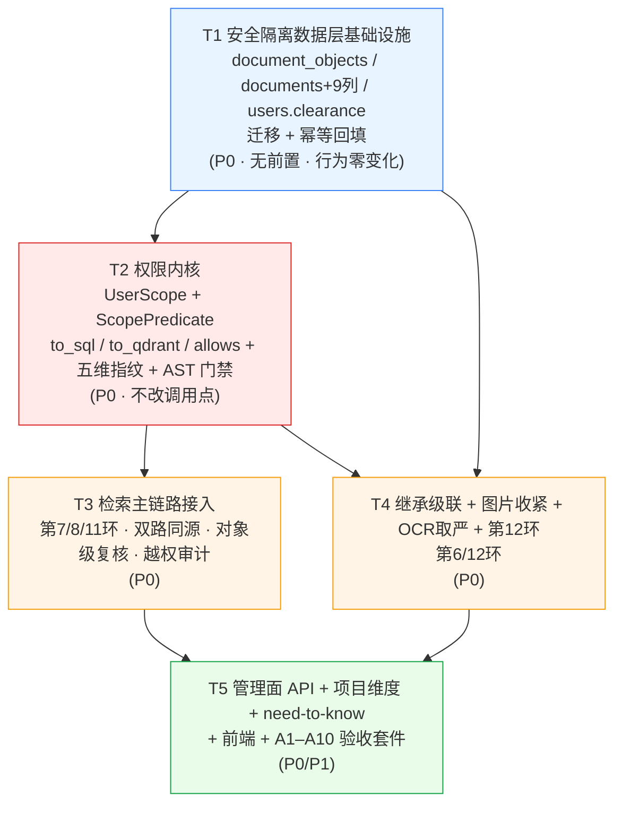

# 增量架构设计 + 任务分解（**Rev1**）
## 请求级数据隔离 · 五维权限模型（租户 / 部门 / 角色 / 密级 / 项目）

> 需求来源：`docs/PRD-increment-security-isolation.md`（PRD 已定稿）
> 上游基线：`docs/system_design.md`（Rev2/Rev3/Rev4 —— 公司注册表与三层作用域，**本文沿用其行文与工程纪律**）
> 工作目录：`D:\RAG\Production-RAG-Agent`
> 本文只做**设计与任务分解**，不含实现代码（给到签名 / SQL / schema / 伪代码粒度）。
> 配套文件：`docs/class-diagram-security-isolation.mermaid`、`docs/sequence-diagram-security-isolation.mermaid`
> （**刻意不覆盖**上一轮的 `class-diagram.mermaid` / `sequence-diagram.mermaid` —— 它们是上一轮增量设计的交付物，覆盖等于删除。）

> ### 本文的标注约定（沿用上游）
> - **【已裁决】** —— team-lead / 项目负责人已拍板，工程师照做，不要再当待确认项
> - **【Rev1 裁决】** —— 本轮由架构师作出的实现侧裁决（含与 PRD 字段表的偏差，需 team-lead 知悉）
> - **【待确认】** —— 仍阻塞或影响验收口径
> - **被否决的替代方案** —— 每条关键决策都给出，避免工程师走回头路

> ## ⚠️【Rev2 追加】补 Query Rewrite / 子查询阶段的 Scope 继承 + 引用点击再校验
> team-lead 复核指出：Rev1 全文 grep `rewrite` / `改写` / `子查询` **零命中** ——
> 「环节 4 · Query」里「意图分析 → Query Rewrite → 子查询生成」这一整段**没有落点**，
> 而项目负责人明确要求 Scope 贯穿 Query Rewrite 与多路召回。
> 本轮补：**决策 15**（Rewrite / 子查询的 Scope 继承，含改写器注入风险的正反论证）、
> **决策 16**（引用溯源"点击时再校验"的两条路径：文本来源 / 原始图片）、**§1.1 对标补表**、
> 任务列表调整（进 T3 / T4）。同时吸收 team-lead 的 **4 项裁决**（§17-2 / §17-4 / §17-5 / §17-6 已关闭）。
> 新增段落均以 `【Rev2 追加】` 标注。

> ## ⚠️【Rev3 追加】QA 取证回填后的设计修订（含 **2 处设计缺口**）
> QA 取证报告 `docs/audit_parsing_and_vision.md` 已出（其**附录 A** 是专门为
> `document_objects.object_id` 做的定向取证，应本文 §17-1 的请求）。
> 本版把 §17-1 / §17-7 两条待明确**关闭**，并新增 §19：
> ① 三项取证结论与其对 schema 的影响；② **父块（small-to-big 回填）不在 `document_objects` 里 —— 设计缺口**；
> ③ **`GET /documents/generated/{filename}` 无归属校验 —— 旁路缺口**；
> ④ `department_id` payload 缺口对部门隔离的影响；⑤ 与 QA 在 `user_id`/`owner_id` 命名上的一处分歧。
> **【Rev3 裁决到齐，见 §19.7】**：命名**保持 `user_id` 不改名**；父块**选 A**（物化 `parent_chunk`，含 `max(文档, 子对象)` 规格）；
> §17-8**按 access 校验、绝不改写存储历史**。另更正：§19 缺口 2（generated 端点）**在此前已被 P0 修复**，仅作旁路面留档。
> 读 §19 前请先读 §17-1 / §17-7 的关闭状态。

---

# Part A：实现方案与关键设计决策

## 0. 一句话总览

本轮在**已上线的三层隔离（租户 / 层级 / 个人）之上叠加两个新维度**（密级 `security_level` 与项目 `project_ids`），
并把它做成**请求级不可变的 `UserScope`**：

1. **一个 IR，三个编译器** —— `UserScope` → `ScopePredicate`（纯数据中间表示）→ 分别编译成
   ① PG SQL 条件、② Qdrant Filter、③ Python 逐对象判定 `allows()`。
   **三处判定同源由此成为结构保证，而不是靠"两处代码写一样"的约定**（对应 PRD P0-5 双路同源、环节 7/11/12 三处复用）。
2. **对象级权限落 PG** —— 新增 `document_objects` 表，把 `doc / text_chunk / table / code / image` 五种对象
   的权限用**同一张表、同一套字段**表达，PG 是权威源、Qdrant payload 是副本。
   **OCR 派生对象（图片→文本/表格/代码）的有效密级取 `max(父文档, 源图片)`**，堵住"图看不了但搜得到字"的破口。
3. **收紧同步、放宽异步** —— 收紧改 PG 权威源（同步，窗口为零），Qdrant 副本异步追平，
   检索后一律以 PG 复核（第 11 环），`acl_sync_state` 标记一致性水位。

---

## 1. 现状逐环节对标（12 环节）

> **本表基于实际读过的代码**：文件名 + 函数名 + 行号均来自当前仓库 `backend/app`。

| # | 环节 | 现有实现（文件 · 函数 · 行） | 是否满足 | 差距 | 本轮动作 |
|---|---|---|---|---|---|
| 1 | **身份认证** | `api/auth.py`（Keycloak + JWT）、`services/auth_service.py`、`services/permissions.py::require_permission`(174) → `get_current_user`；主体属性落在 `db/user_models.py::User`(25)：`role`(78) / `tenant_id`(87) / `department_id`(92) / `keycloak_sub`(109) | **部分** | 认证只解析出**三个**主体属性；`clearance` 与 `project_ids` **全库不存在**（已 grep 确认） | **新增**：`users.clearance` 列 + `projects` / `project_members` 表；认证后一次性解析五维，任一缺失按最小权限 |
| 2 | **授权** | `permissions.py::ROLE_PERMISSIONS`(119) / `has_permission`(139) / `can_access_all_documents_in_tenant`(151)（复用 `tenancy.TENANT_WIDE_READER_ROLES`）/ `require_permission`(174) | **是** | 角色矩阵完整，且**只管动作能力、不产出数据范围**（与 PRD 2.2 一致）；缺"授予密级例外"这一**动作**的权限点 | **加固**：新增 `security.grant` / `security.escalate` / `security.review.grant` 三个动作权限点；角色矩阵与历史映射**一个不动** |
| 3 | **Scope 生成** | `tenancy.py::DocumentScope`(256)（frozen dataclass）/ `scope_for`(304) / `request_scope`(347)（admin 查注册表）/ `content_scope`(412)（内容消费剔除测试公司）/ `DocumentScope.acl_kwargs`(293) | **部分** | 三维（owner / tenant 集合 / dept + tenant_wide）齐备且 fail-closed；但 `acl_kwargs()` 只产出 5 个键，**无 clearance / project_ids / principals**；无五维指纹 | **新增**：`UserScope`（组合层，见决策 1）+ `security_kwargs()` + `scope_fingerprint` |
| 4 | **Query** | `api/query.py::_stream_rag`(152-220) 生成 scope 后透传给 `stream_master` / `stream_document_list`；`master_graph.MasterState`(144) 承接；`master_graph._retrieve_node`(320) 调 `retrieve_chunks`(371) | **部分** | 入口**已绑定** scope（无"全库检索"路径），但 scope 以 **4 个标量**散着传，存在"漏传其一"的结构风险；`rag_graph._retrieve_node`(301) 是上一轮已识别的**既存漏传** | **加固**：改为整体透传 `UserScope`；`rag_graph._retrieve_node` 补传或删除（沿用上游决策 11） |
| 5 | **文档 ACL** | `db/models.py::Document`(44)：`tenant_id`(102) / `access_level`(106) / `department_id`(110)；`tenancy.document_acl_clause`(459) / `document_scope_clause`(514) / `can_access_document`(569)；`knowledge_tier_service.set_document_access_level`(292) + `resync_document_acl_payload`(370)；`vector_service.update_document_access_payload`(438) | **部分** | 三层 ACL 完整、**PG 是权威源**、`access_level` 三值稳定；缺 `security_level` / `visibility_mode` / `project_ids` / `acl_allow` / `acl_deny` / `acl_expires_at` | **新增**：`documents` 加 9 列（§4.2）；`document_objects` 镜像 doc 行 |
| 6 | **图片 ACL** | `chunker.build_image_chunks`(722)（图片建成独立 chunk）；`vector_service.VectorPoint`(108-135) 的 `image_id` / `image_path` / `image_type` / `analyze_*`；`upsert_vectors`(301-358) 写 payload；`nodes/multimodal_context_node.build_multimodal_context`(205) 回显原图；`image_understanding/classifier.classify_image`(449) | **否** | ① 图片对象**在 PG 里没有记录**，只有 Qdrant payload 副本 → 违反"PG 是权威源"；② 无任何权限字段；③ `classifier` **不含敏感实体识别**（身份证/印章类），PRD P1-4 的自动提级缺信号 | **新增**（不重构多模态）：`document_objects` 的 `object_type='image'` 行承载图片级 ACL；`image_security.py` 提供提级/剔除；自动提级留字段、本期不接 |
| 7 | **检索前过滤** | `retrieval_service._visibility_conditions`(644) → Qdrant `must_not` deny-list（Deny-1 个人库 / Deny-2 公司边界 / Deny-3 部门）；`search_filter` 组装(1296-1356)；`_scroll_corpus`(407) 内存 BM25 语料；`pg_keyword_search.keyword_search`(264) → `document_scope_clause`(346) | **部分** | 三维已**在 ANN 之前**下推（做得对）；但 ① 无密级/项目；② **两路条件由两个不同函数各自拼装**（`_visibility_conditions` vs `document_scope_clause`），语义等价靠人肉 → 这正是 PRD P0-5 要消灭的形态 | **加固 + 新增**：统一为 `to_qdrant(ScopePredicate)` / `to_sql(ScopePredicate)`（决策 2） |
| 8 | **双路检索** | 向量腿 `retrieval_service`(1378-1402) 多路 ANN；PG 关键词腿(1537-1608)；内存 BM25 腿(1610-1640) → `_bm25_candidates`(499)，缓存键用 `perm_ctx`(1523) | **部分** | 两路独立召回且都带 scope；但缓存键是手拼字符串、**不含 clearance / project_ids** → 不同密级用户会串缓存（PRD 4.2 硬要求） | **加固**：缓存键统一走 `cache_key_for_scope(user_scope, raw_key)` |
| 9 | **RRF 融合** | `hybrid_search.rrf_fuse`；调用点 `retrieval_service`(1778-1802)；`strong_keyword` 白名单 | **是** | 输入只来自已过第 7 环的 `merged`；权重与打分**不含权限字段** | **无需改动**（补一条测试断言：融合后候选集 ⊆ 第 7 环输出集） |
| 10 | **Rerank** | `reranker.rerank_chunks`；调用点 `retrieval_service`(1762 / 1808)；输出再送 Permission Check(1825) | **是** | CrossEncoder 只吃已过 Scope 的候选；只评估语义相关性 | **无需改动**（补测试断言：Top20 ⊆ 第 7 环输出集） |
| 11 | **检索后复核** | `retrieval_service`：`valid_docs`(1425-1457) = COMPLETED + `document_scope_clause`；Permission Check(1825-1839) 按 `c.document_id in valid_docs` | **部分** | 已有"PG 权威复核"骨架且位置正确；但 ① 粒度只到 **document_id**，图片/表格/代码块的对象级收紧未被复核（A3/A5 破口）；② 剔除只 `logger.error`，**无审计留痕**（A4 不满足） | **加固 + 新增**：对象级复核（`document_objects`）+ `record_acl_drop()` 审计 |
| 12 | **Context → Final Check → 引用** | `master_graph._multimodal_context_node`(488) / `_generate_node`(691) / `_citation_verifier_node`(641) / `_output_guard_node`(939)；`nodes/context_builder.build_context`(103)；`nodes/multimodal_context_node.MultimodalBlock`(58) | **否** | ① **无 LLM 输入前最终校验**；② `sources` 无权限快照；③ 图片回显不经图片级 ACL；④ 引用点击不再校验；⑤ 全剔除时走 `_refuse_node`(728) 已有拒答文案，但**未区分"权限剔除"与"证据不足"**（A10 的"部分回答"分支缺失） | **新增**：Final Check 节点 + 快照入 sources + 打开时再校验 + 三段降级文案 |

**小结**：已满足 4 项（2 / 9 / 10 完整，1 部分可复用），**需加固 5 项**（3 / 4 / 7 / 8 / 11），**需从零新增 3 项**（5 的密级与项目字段、6 的图片对象 ACL、12 的最终校验与溯源）。

### §1.1【Rev2 追加】环节 4 的细分：Query Rewrite / 子查询生成

> Rev1 的 12 行表把"环节 4 · Query"当成了一个原子环节，漏掉了它内部的
> **Query Rewrite → 多查询扩展 → 子查询拆解 → HyDE** 这一段。补表如下（文件名/函数名/行号均来自实际读码）。

| 子环节 | 现有实现（文件 · 函数 · 行） | 是否满足 | 差距 | 本轮动作 |
|---|---|---|---|---|
| **4a 意图分析 / 路由** | `master_graph._route_node`(216) → `query_router.route_query`；`_route_by_intent`(238) | **是** | 路由只决定走哪条链，**不触及权限**；`forced_mode` 也只读前端字符串 | **无需改动** |
| **4b Query Rewrite** | `query_transform.rewrite_query`(293) → `_rewrite_query_impl`(325)；产物 `RewriteResult`(123)；防漂移闸门 `_passes_drift_gate`(224)；提示词 `_REWRITE_SYSTEM_PROMPT`(76) | **是（但需显式锁定）** | 改写器**当前**只吃 `(query: str, history_messages)`，拿不到 Scope，**客观上无法改权限** —— 但这是巧合而非设计，没有任何机制阻止后来者给 `rewrite_query` 加一个 `scope` 参数 | **加固**：把"改写只吃文本"写成契约并加测试（决策 15-2/15-3） |
| **4c 子查询 / 变体生成** | 同 `_rewrite_query_impl`(325) 内：`variants = _clean_list(parsed["variants"])`(455)、`subqueries = _clean_list(parsed["subqueries"])`(457)、`hyde`(460-471)；消费侧 `master_graph._rewrite_node`(256)→`query_extra`(304)；`rag_graph._rewrite_node`(262)→`query_extra`(281) | **部分** | 子问题由 **LLM 一次调用**产出、合并进 `query_extra` 后**一次**传给 `retrieve_chunks`；fan-out 发生在 `retrieval_service` 内部（向量 1387 `gather` / PG 关键词 1541 `gather` / 内存 BM25 1610 `for` 串行）—— **三条 fan-out 共用同一个 `search_filter` 与同一份 scope 变量**，这是好事；但 `rag_graph._retrieve_node`(301) 是既存漏传，且没有任何测试断言"子查询与父查询同 Scope" | **加固**（决策 15-1）：显式化 + 等价性测试 |
| **4d 注入清洗（已有）** | `master_graph._retrieve_node`(342-363)：`sanitize_retrieval_query` 对每个变体/HyDE 过闸；`query_transform` 内历史先 `normalize_text` 再 `sanitize_document_context`(394-395) | **是** | 已有隐形字符剥离 + high-risk 丢弃 | **无需改动**（补一条测试：清洗**不改变** Scope） |
| **4e 改写缓存** | `query_transform._cache_get`(181) / `_cache_put`(193)；`cache_key = f"{query}\x00{history_fingerprint(...)}"`(350) | **否** | 缓存键**不含任何 Scope 维度** | **加固**（决策 15-6） |

---

## 2. 关键设计决策

### 决策 1 —— `UserScope` 用**组合**，不改造 `DocumentScope`

`DocumentScope` 已被 `tenancy.py`（`scope_for` / `request_scope` / `content_scope`）、`api/query.py`、
`master_graph.py`、`rag_graph.py`、`document_query_service.py`、`relation_service.py` 等十余处消费，
且 `acl_kwargs()` 是"列表与检索同源"的结构保证（上游决策 2）。

**决策**：新增 `UserScope`（frozen dataclass），**内嵌**一个 `DocumentScope`：

```python
# backend/app/services/security_scope.py
@dataclass(frozen=True)
class UserScope:
    base: DocumentScope            # 既有三维，一个字段都不改
    user_id: str
    role: str
    clearance: int                 # 0..3
    project_ids: frozenset[str]
    principals: frozenset[str]     # ["user:u1","dept:d1","role:kb_admin","project:p1"]
    issued_at: datetime
    strict: bool = False           # 严格模式（未标注密级按最高处理，P1-3）

    @property
    def scope_fingerprint(self) -> str: ...      # 见决策 9
    def acl_kwargs(self) -> dict:                # = self.base.acl_kwargs()（转发，零破坏）
    def security_kwargs(self) -> dict:           # 新增五维部分
    def predicate(self, *, now=None) -> ScopePredicate:   # → 决策 2 的 IR
```

**被否决的替代方案**：
- ❌ **把 `DocumentScope` 改名/重写成五维**：一次性触碰十余个调用点，任一处签名漏改就是"静默降级为不过滤"。
  上游 Rev2 已经吃过一次"漏传权限参数"的亏（`rag_graph._retrieve_node`），不再制造第二次。
- ❌ **让 `UserScope` 继承 `DocumentScope`**：继承会让 `replace(scope, ...)` 与 `isinstance` 判定混入五维语义，
  而 `document_scope_clause` 只应看到三维部分。组合的边界更清晰。
- ❌ **不建对象，继续加标量参数**：`retrieve_chunks` 已经有 7 个权限入参，再加 4 个就是 11 个 ——
  这正是"某条路径忘了带某个布尔"的结构（上游决策 1 明确否决过堆布尔）。

### 决策 2 —— **一个 IR，三个编译器**（本文的核心）

PRD 要求：① 第 7 环两路 Scope 表达式语义等价（P0-5 / A2）；② 第 7 / 11 / 12 环复用同一份判定。
"复用同一份判定"如果是靠"两处代码写一样"，它必然在某次改动后分叉。

**决策**：引入**纯数据中间表示** `ScopePredicate`，三个编译器都只消费它：

```
UserScope ──predicate()──▶ ScopePredicate ──┬─▶ to_sql(pred, model)      → ColumnElement      (PG：第 7 环关键词腿 / 第 11 环)
                                            ├─▶ to_qdrant(pred)          → qmodels.Filter      (Qdrant：第 7 环向量腿 / 内存 BM25)
                                            └─▶ allows(pred, obj_view)   → Decision            (Python：第 11 / 12 环逐对象)
```

```python
# backend/app/services/security_policy.py
@dataclass(frozen=True)
class ScopePredicate:
    """UserScope 的**可执行形态**：三个编译器的唯一输入。"""
    user_id: str | None
    tenant_ids: frozenset[str] | None      # None = 不限制（仅 unrestricted 诊断）
    owns_tenant_ids: frozenset[str]
    department_id: str | None
    tenant_wide: bool
    clearance: int
    project_ids: frozenset[str]
    principals: frozenset[str]
    now: datetime                          # 注入，便于测试"已过期"
    unrestricted: bool = False

@dataclass(frozen=True)
class ObjectACLView:
    """对象权限视图：PG 行与 Qdrant payload 的**共同最小字段集**。"""
    object_id: str
    object_type: str                       # doc|text_chunk|table|code|image
    document_id: str
    tenant_id: str
    owner_id: str | None
    user_id: str | None                    # Qdrant 侧的所有者字段名（= owner 副本）
    department_id: str | None
    access_level: str | None
    visibility_mode: str                   # tier|project（缺失按 tier）
    project_ids: frozenset[str]
    security_level: int | None             # 缺失 → 按 strict 处理（默认 = 1）
    parent_security_level: int | None
    effective_security_level: int | None   # = max(security_level, parent_security_level)
    acl_allow: frozenset[str]
    acl_deny: frozenset[str]
    acl_expires_at: datetime | None
    excluded: bool
    acl_sync_state: str

@dataclass(frozen=True)
class Decision:
    allowed: bool
    reason: str                            # 见 §10 日志字段（审计用）
    gate: str                              # tenant|security|source|deny|ok
```

**语义（= PRD 2.3 判定式的可执行版）**：

```python
def allows(pred: ScopePredicate, obj: ObjectACLView) -> Decision:
    # 0. fail-closed：对象权限视图缺失关键字段 → 拒
    if obj is None or not obj.object_id:
        return Decision(False, "missing_object_view", "tenant")

    # 1. 硬闸门 A：租户（对 private 的例外沿用上游 Rev2：只认 owner / 自建集合）
    if not _tenant_gate(pred, obj):        # 内部保留 "private 与租户无关" 的 I1 不变式
        return Decision(False, "tenant_mismatch", "tenant")

    # 2. deny 一票否决（**优先于一切，含 admin 与 owner 本人**）
    if pred.principals & obj.acl_deny:
        return Decision(False, "acl_deny_hit", "deny")
    if obj.excluded:
        return Decision(False, "object_excluded", "deny")

    # 3. 硬闸门 B：密级（need-to-know 例外可越过，但必须未过期）
    eff = _effective_level(obj, pred)      # 缺失 → strict? 3 : 1；派生取 max
    ntu_ok = _need_to_know_ok(pred, obj)   # principals ∩ acl_allow ≠ ∅ 且未过期
    if eff > pred.clearance and not ntu_ok:
        return Decision(False, f"clearance_short(eff={eff},clr={pred.clearance})", "security")

    # 4. 范围来源（OR）：owner / dept / tenant / project / acl
    if not _source_gate(pred, obj):
        return Decision(False, "no_source_hit", "source")

    return Decision(True, "ok", "ok")
```

**三处复用如何成为结构保证**：
- 第 7 环（PG 关键词腿）= `stmt.where(to_sql(pred, Document))`
- 第 7 环（Qdrant 向量腿）= `search_filter.must_not += to_qdrant(pred)`
- 第 11 环（PG 权威复核）= 逐个 `document_objects` 行 `allows(pred, view)`
- 第 12 环（Final Check）= 对 `context_blocks` 逐个 `allows(pred, view)`

**它们不可能分叉，因为分叉的唯一方式是新增第四个编译器** —— 而 AST 测试（决策 10）会拦住任何绕过 `to_sql` / `to_qdrant` / `allows` 的手拼条件。

**被否决的替代方案**：
- ❌ **两路各写一个函数 + 写测试保证一致**：测试只能覆盖被想到的用例，`_visibility_conditions` 与
  `document_scope_clause` 事实上已经这样并存了三轮，每次加维度都要人肉对齐一次。
- ❌ **只做 Python 侧 `allows()`，SQL / Qdrant 各自翻译**：翻译即分叉，同上。
- ❌ **把对象拉进进程用 `allows()` 过滤**：第 7 环的价值是"ANN **之前**过滤"（`_visibility_conditions` 注释
  里写得很清楚：候选池被占满后自己的东西一份都进不来）。进程内过滤等于放弃第 7 环。

### 决策 3 —— 密级在 Qdrant 侧用 **deny-list + fail-open**，与现有形态一致

现状 `_visibility_conditions` 是 `must_not` deny-list，且**刻意 fail-open**：缺 payload 字段的老向量不被排除，
交 PG 的 `document_scope_clause` 终判（源码 659-663 行有明确注释）。

**决策**：新增的密级条件沿用同一形态：

```python
# Deny-4【新增】密级：排除「effective_security_level 存在 且 > clearance」
conds.append(qmodels.Filter(must_not=[
    qmodels.FieldCondition(key="effective_security_level",
                           range=qmodels.Range(gt=pred.clearance)),
]))
# 注：Range 在字段缺失时不匹配 → 老向量不排除 → fail-open → 由第 11 环 PG 复核拦下（P0-6）
```

配套开关 `ACL_SECURITY_PREFILTER_STRICT`（默认 `false`）：置 `true` 时改用
`must: Range(lte=clearance)` 白名单形态 —— **但只允许在存量回填脚本跑完之后开启**，
`backfill_security_level.py` 结束时会打印提示；开启前若存在 `effective_security_level IS NULL` 的对象，
启动自检打 `ERROR` 日志（不阻断启动，避免运维被卡死）。

**被否决的替代方案**：
- ❌ **默认白名单（`must: lte=clearance`）**：存量向量的 payload 里没有 `effective_security_level` →
  全部不匹配 → **存量文档一夜之间全部检索不到**。这是最严重的一次性业务中断，直接击穿不可退化基线。
- ❌ **密级完全不不下推、只靠第 11 环 PG 复核**：候选池会被高密级对象占满（同公司几千份 secret 文档时，
  `candidate_pool` 可能一个 internal 对象都进不来），表现为"低密级用户搜不到自己的东西"。
  这正是 `_visibility_conditions` 存在的理由，不能在新维度上重蹈。

### 决策 4 —— 项目维度：作为 `source_gate` 的**第四个 OR 分支**

```python
def _source_gate(pred, obj) -> bool:
    if obj.owner_id and obj.owner_id == pred.user_id:            return True   # owner_hit
    if obj.access_level == "tenant":                              return True   # tenant_hit
    if obj.access_level == "department" and (
        pred.tenant_wide or obj.department_id == pred.department_id): return True  # dept_hit
    if obj.visibility_mode == "project" and (obj.project_ids & pred.project_ids):
        return True                                                            # project_hit（新增）
    if (pred.principals & obj.acl_allow) and _not_expired(obj, pred.now):
        return True                                                            # acl_hit（含 need-to-know）
    return False
```

`visibility_mode` 默认 `tier`、缺失按 `tier`、`project_ids` 缺失按空集 ⇒ **存量文档行为零变化**（PRD Q3 的核心诉求）。

**被否决**：把 `project` 塞进 `access_level` 第四值 —— PRD Q3 已否决（破坏三值与前端标签体系），且
"属于部门库 + 属于某项目"的组合会被单值枚举丢掉。

### 决策 5 —— 新增 `document_objects` 表承载五种对象的统一权限

现状：只有 `documents` 表有 ACL；`text_chunk / table / code / image` **只存在于 Qdrant payload**，
PG 里与之相关的只有 `document_chunk_terms`（词项串）和 `chunk_parents`（父块正文），**都装不了权限**。

**决策**：新增独立表 `document_objects`（完整 DDL 见 §4.1）。理由与 `document_metadata` 完全一致 ——
本项目启动时用 `Base.metadata.create_all`，它**只建不存在的表、不给已存在的表加列**，独立表升级路径零操作。

**被否决的替代方案**：
- ❌ **只给 `documents` 加列**：无法表达**图片级收紧**与**表格/代码块级提级**（PRD P0-8 硬需求），
  也就无法满足 A5（图提级后 OCR 文本也不可检索）。
- ❌ **复用 `document_chunk_terms`**：它的主键是 `(document_id, chunk_index)`，一行 = 一个 chunk 的 bigram 串，
  往里塞权限会让关键词腿的 GIN 表变胖，且图片对象（无 chunk_index 语义的独立对象）无处安放。
- ❌ **图片 ACL 只放 Qdrant payload**：直接违反 PRD 环节 5.1「PG 是权限权威源」；
  且 `classifier` / `vision` 的产出会重写 payload，权限字段有被覆盖的风险。

### 决策 6 —— `documents` 与 `document_objects` **双写，`documents` 仍是列表/检索第一入口**

`document_scope_clause` 目前按 `Document.*` 写，被 5+ 处调用；列表端点读 `Document`。

**决策**：
- `documents` **加列**（§4.2），`document_scope_clause` 只需要在既有 `and_` 上**追加**密级与项目条件
  （`document_objects` 不参与列表/SQL 主路径，避免引入一次 join 的性能与语义风险）。
- `document_objects` 里为每份文档写一行 `object_type='doc'` 的**镜像**，供第 11 / 12 环的**对象级统一视图**消费。
- 双写一致性由 `security_cascade.sync_doc_row()` 收口：**任何写 `documents.security_level` 的路径都必须经过它**。

**被否决**：让 `document_scope_clause` 改成 join `document_objects` —— 会同时改变列表、检索、关键词、
摘要、DB 兜底五条路径的执行计划，风险与收益不成比例。

### 决策 7 —— 密级字段缺失的 fail-closed 口径（PRD Q2 = **默认 1** + 严格模式开关）

```python
def _effective_level(obj: ObjectACLView, pred: ScopePredicate) -> int:
    own  = obj.security_level
    par  = obj.parent_security_level
    eff  = obj.effective_security_level
    # 派生字段缺失时按 max(自身, 父) 现算，避免只写了一个
    if eff is None:
        vals = [v for v in (own, par) if v is not None]
        eff = max(vals) if vals else None
    if eff is None:
        return SECURITY_LEVEL_MAX if pred.strict else DEFAULT_SECURITY_LEVEL   # 3 : 1
    # 已物化 → 仍取 max（防止有人只写了 security_level 忘了重算 effective）
    return max(eff, own or 0, par or 0)
```

**关键**：`max(...)` 而不是"信任物化值" —— 因为派生对象只收紧不放宽是 PRD 3.2 的硬约束，
**物化值被写错时也必须由判定侧兜住**（"取严"在计算侧再上一次锁）。

### 决策 8 —— **剔除**用 `excluded` 布尔列（PRD 字段表的**实现补字段**）

PRD Q4 选 B：图片级收紧做"提级"与"剔除"两种。PRD 第 4 节字段表里没有表达"剔除"的字段
（`acl_deny` 是**按主体**拒绝，剔除是**对所有人**，语义不同）。

> **【Rev1 裁决】** 新增 `excluded: bool NOT NULL DEFAULT false`。这是 PRD 字段表之外的**唯一**实现补字段：
> - `excluded=true` 的对象：不进检索候选（第 7 环 `must_not` 命中）、不进上下文（第 12 环剔除）、
>   不回显原图、其 OCR 派生对象**同步 excluded**（取严红线）。
> - 与 `acl_deny` 的关系：`excluded` 是"对象整体下线"，`acl_deny` 是"对特定主体拒绝"，两者独立。

**被否决**：用 `acl_deny=['*']` 表达 —— 通配主体不在 PRD 的 principal 格式里，
且会让"通配"这一特殊语义散落在数组里，判定侧必须为它写一条专用分支（更易漏）。

### 决策 9 —— `scope_fingerprint` 五维 + 缓存分区

```python
def _fp_set(values) -> str:
    if values is None: return "all"
    if not values:     return "none"          # 空集 ≠ None（沿用上游 tenant_scope_fingerprint 三分支）
    return "s:" + hashlib.sha1(",".join(sorted(values)).encode()).hexdigest()[:12]

# UserScope.scope_fingerprint
parts = [
    "v1",
    f"u:{self.user_id}",
    f"T:{_fp_set(self.base.tenant_ids)}",
    f"O:{_fp_set(self.base.owns_tenant_ids)}",
    f"d:{self.base.department_id or '-'}",
    f"w:{'1' if self.base.tenant_wide else '0'}",
    f"c:{self.clearance}",
    f"p:{_fp_set(self.project_ids)}",
    f"a:{_fp_set(self.principals)}",
    f"s:{'1' if self.strict else '0'}",
]
scope_fingerprint = hashlib.sha256("|".join(parts).encode()).hexdigest()[:20]
```

**缓存落地**：新增 `cache_key_for_scope(scope, raw_key) -> str`，返回 `f"{scope.scope_fingerprint}::{raw_key}"`。
**不改动现有 `scoped_cache_key` 签名**（它已被 `retrieval_service` 与 `_bm25_candidates` 消费），
只在 `retrieval_service` 的 3 处缓存键调用点换成新函数：BM25 语料缓存(`_bm25_candidates`:523)、
`perm_ctx`(1523)、以及将来可能新增的密级相关缓存。

**为什么这样就够了**：指纹对**排序后的集合**做哈希 ⇒ 不同 clearance / 不同 project 集合 / 不同 principals
必然产生不同指纹；`c:` 一位之差就换键。**不同 Scope 不共用缓存**因此是哈希的性质，不是约定。

### 决策 10 —— "Query 必须绑定 Scope"的**四层结构保证**（用户红线 1）

> 红线原文：「任何用户的 Query 在进入检索器时就必须绑定 UserScope，禁止先检索全库再依赖 Prompt 做权限隔离」。
> 下面四条是它**靠什么机制成立**的答案，缺一条就退回成"约定"。

| 层 | 机制 | 落点 |
|---|---|---|
| **① 签名强制** | 新增**唯一推荐入口** `retrieve_chunks_scoped(query, *, scope: UserScope, ...)`：内部 `scope.predicate()` → 透传给 `retrieve_chunks` 与新过滤器。`retrieve_chunks` 保留不动（兼容），但其既有 fail-closed（源码 1254-1267：无任何权限上下文时 `return []`）**继续生效**，因此"漏传"的后果是空结果，不是全库 | `retrieval_service.py` |
| **② 运行时不可变** | `UserScope` 与 `ScopePredicate` 均为 `@dataclass(frozen=True)`；集合字段一律 `frozenset`；`list` 字段一律 `tuple`。任何"链路内补权限"的写法会 `FrozenInstanceError` | `security_scope.py` / `security_policy.py` |
| **③ CI 静态门禁（AST）** | 新增 `tests/test_no_unscoped_retrieval.py`：用 `ast` 遍历 `app/services/**` 与 `app/api/**`，对每一个 `retrieve_chunks(` / `keyword_search(` / `client.search(` / `client.scroll(` 调用点断言「关键字参数里含 `scope=` 或 `unrestricted=True`，或该调用点位于 `UNSCOPED_ALLOWLIST`」。`UNSCOPED_ALLOWLIST` 是一个**显式写在测试里**的常量（初始只含 `scripts/` 下的诊断脚本），任何人要加一行都必须改测试并在 PR 里被看见 —— 这是把"禁止绕过"变成可执行门禁 | `backend/tests/` |
| **④ 禁止链路内重新签发** | 同一 AST 测试的第二条断言：`request_scope(` / `request_security_scope(` 只允许出现在 `app/api/**` 与白名单内；出现在 `app/services/**` 即判失败（链路内不得重新查库放宽 scope） | `backend/tests/` |

**AST 测试伪代码**（工程师照此实现）：

```python
UNSCOPED_ALLOWLIST = {
    "backend/app/services/retrieval_service.py::retrieve_chunks",   # 定义处，不是调用点
    "backend/scripts/run_eval_baseline.py",
    ...
}

def test_no_unscoped_retrieval_calls():
    offenders = []
    for path in iter_py_files("backend/app"):
        tree = ast.parse(read(path))
        for node in ast.walk(tree):
            if not isinstance(node, ast.Call): continue
            name = dotted_name(node.func)
            if name in {"retrieve_chunks", "keyword_search", "client.search", "client.scroll"}:
                kw = {k.arg for k in node.keywords}
                if not ({"scope", "unrestricted"} & kw) and f"{path}::{name}" not in UNSCOPED_ALLOWLIST:
                    offenders.append(f"{path}:{node.lineno} {name}()")
    assert not offenders, "检索调用必须显式传 scope= 或 unrestricted=True"
```

**被否决的替代方案**：
- ❌ **只写文档约定 + code review**：上游 `rag_graph._retrieve_node` 就是这么漏的（写了注释、仍然漏传）。
- ❌ **把 `scope` 设成必填位置参数并删掉旧签名**：会一次性打断 `evaluation.py` / `run_eval_baseline.py` /
  `rag_graph.py` / 若干测试，属于"为了安全先破坏" —— 与"不可退化"冲突。**兼容层 + fail-closed + AST 门禁**是等价安全、零破坏的路线。

### 决策 11 —— 图片级收紧的**最小侵入**落法（用户红线：不重构多模态）

**允许**：新增 `app/services/image_security.py`，只做三件事：
1. `escalate_image_object(document_id, image_id, *, security_level=None, excluded=None, actor)` —— 写 `document_objects` 的 `object_type='image'` 行；
2. 调 `security_cascade.cascade_image_derived(...)` —— **同步**重算该图所有 OCR 派生对象（table / code / text）；
3. 异步推 Qdrant payload（`set_payload` 按 `image_id` 过滤）。

**禁止**（红线）：修改 `image_understanding/*` 任何文件的解析/识别行为；修改 `vision_service.py`；修改 `parsers/image_parser.py`。

**唯一允许的增量补丁**：`build_image_chunks` 之后新增一个**可选**的敏感实体透传
（`ExtractedImage.sensitive_entities`，默认 `[]`）—— 因为 `classifier.classify_image`(449) 目前**没有**
敏感实体识别（已 grep 确认：`身份证 / 印章 / sensitive` 在 `image_understanding/` 下零命中），
所以 **P0 只留字段不接自动提级**，P1-4 需要先给 classifier 加识别信号（见 §待确认 3）。

### 决策 12 —— OCR 派生取严（用户红线 2）

`security_cascade.materialize_document_objects()` 中，**对 `image_id` 非空的所有派生块**：

```python
src = image_objects[chunk.image_id]           # 源图片对象
eff = max(doc.security_level or 1, src.effective_security_level or 1)
row = DocumentObject(
    object_id   = point_id_of(chunk),
    object_type = "table" if chunk.content_type == "table" else "code",
    parent_object_id = src.object_id,          # 父 = 源图片（不是文档）
    inherited_from   = src.object_id,
    security_level   = chunk_self_level or 0,
    parent_security_level = src.effective_security_level,
    effective_security_level = eff,            # ← 取严
    excluded      = bool(src.excluded or doc.excluded),
    acl_deny      = union(doc.acl_deny, src.acl_deny),
    acl_allow     = frozenset(),               # 派生对象**不得**通过 acl_allow 获得父之外的可见性（PRD 3.2）
    project_ids   = union(doc.project_ids, src.project_ids),   # 只加闸，不放宽
    visibility_mode = "project" if (doc.visibility_mode == "project"
                                    or src.visibility_mode == "project") else "tier",
)
```

图片被提级/剔除后，`cascade_image_derived(image_object_id)` **同步**重算并写回（收紧方向，不允许异步窗口）。

**被否决**：让 OCR 派生块直接继承文档权限、只在图片"剔除"时同步删 ——
那样"图片提级到 3 但 OCR 表格还是 1"的窗口会一直开着（PRD 3.4 明确点名这是最严重的继承漏洞）。

### 决策 13 —— need-to-know 授予：`acl_grants` 表是权威源，`acl_allow` 是物化副本

`document_objects.acl_allow / acl_deny / acl_expires_at` 是**数组/单值**，无法表达"多主体、各自有效期"。

**决策**：新增 `acl_grants` 表（per-subject 一条，带 `expires_at` / `status` / 审批人），
批准时物化进 `document_objects.acl_allow` + 取**最早**到期时间写 `acl_expires_at`；
第 11 环复核时若 `acl_sync_state != 'synced'` 或命中了 `acl_allow`，**追加一次 `acl_grants` 的未过期/未撤销确认**。

- **pending 期间不写 `acl_allow`** ⇒ A7（pending 期他人不可见）天然成立。
- **禁止自我授予**：`granted_by != subject_user_id`，且调用者须持有 `security.grant` 权限，写审计。
- 到期回收：新增定时任务 `expire_acl_grants()`（复用现有 `recover_stuck_documents` 的调度位置）。

### 决策 14 —— 角色 → 默认 clearance 映射（Q7 = **不豁免**）

```python
# security_policy.py
DEFAULT_CLEARANCE_BY_ROLE = {
    "employee": 1, "user": 1, "editor": 1, "viewer": 1,
    "dept_manager": 2, "manager": 2,
    "kb_admin": 3, "company_admin": 3,
    "admin": 3,                    # 【已裁决 Q7】有上限的"高"，不是"无限"
}
```

- `users.clearance` 是**可配置列**，上表只在**列为空/首次创建**时写入初值；管理员可下调（A8）。
- **角色不产生隐式 need-to-know**：`principals` 里带 `role:<role>` 只是为了让 `acl_allow` 能按角色授予，
  `allows()` 不会因为 `role=admin` 就跳过密级闸门 —— 判定式里没有任何 `if role == admin: return True`。

---

### 决策 15【Rev2 追加】—— Query Rewrite / 子查询的 Scope 继承

> **总纲一句话**：**Rewrite 只能改 query 的文本，不能改 Scope；Scope 也不随文本变化。**
> 二者在代码上靠"数据流向单向 + frozen 对象 + 契约测试"三重保证，而不是靠"大家记得别改"。

#### 15-1 继承机制：同一个实例，不是重新签发

**现状取证**（已读码确认）：

| 事实 | 位置 |
|---|---|
| 子问题 / 变体 **不由**每个子查询各自发起一次 `retrieve_chunks`；它们被合并成 `query_extra` 后**一次性**传入 `retrieve_chunks(extra_queries=...)` | `master_graph._rewrite_node`(304) → `_retrieve_node`(371-377) |
| fan-out 发生在 `retrieve_chunks` **内部**：向量腿 `asyncio.gather` | `retrieval_service.py:1387` |
| PG 关键词腿 `asyncio.gather` | `retrieval_service.py:1541` |
| 内存 BM25 腿 `for q in queries: await _bm25_candidates(...)`（**串行**，既有行为，本轮不改） | `retrieval_service.py:1610-1625` |
| 三条 fan-out **共用同一个 `search_filter` 局部变量**与同一批 scope 标量参数 | `retrieval_service.py:1299-1356`（`search_filter` 构造）→ 1384 / 1546 / 1623（消费） |

**这个现状是好的**：因为 fan-out 在 `retrieve_chunks` 内部且共用一个 `search_filter`，
"子查询绕过 Scope"在物理上需要**新写一条不传 `search_filter` 的 ANN 调用** ——
而那正是决策 10-③ 的 AST 测试会拦住的东西。

**决策**：把这件事从"巧合"变成"显式契约"，新增一个不可变的数据载体：

```python
# backend/app/services/security_scope.py（Rev2 追加）
@dataclass(frozen=True)
class ScopedQuery:
    """一条"待检索的查询"与其 Scope 的**绑定体**。
    text 可换（改写/变体/子问题/HyDE），scope 恒为同一实例。"""
    text: str
    scope: UserScope                 # frozen；同一请求内是**同一个对象**
    kind: str = "main"               # main | variant | subquery | hyde（日志用）

    def with_text(self, new_text: str) -> "ScopedQuery":
        """**唯一**允许改写入口：只换 text，scope 原样透传（dataclasses.replace）。"""
        return replace(self, text=new_text)
```

- `master_graph._rewrite_node` 产出的 `rewritten_query` / `query_extra` / `query_hyde`
  **新增一份镜像** `scoped_queries: list[ScopedQuery]`（旧的三个 `str` 字段**保留不动**，避免打断既有拓扑与日志）。
- `_retrieve_node` 用 `scoped_queries` 组装 `retrieve_chunks_scoped(query=..., scope=..., extra_queries=...)`。
- **并发 fan-out 的闭包捕获**：`asyncio.gather(*(_ann_one(qv) for qv in vectors))` 里的 `search_filter`
  是外层局部变量，Python 闭包按引用捕获 ⇒ 所有并发分支拿到的是**同一个 Filter 对象**；
  而 `ScopePredicate` 是 `frozen=True`，即使被多处引用也**不可能被任一分支改写**。
  ⇒ **"同一实例"是由 frozen + 闭包语义共同保证的，不需要额外加锁或深拷贝。**

**被否决的替代方案**：
- ❌ **每个子查询各自调 `retrieve_chunks_scoped`**（直观但错）：多条腿各自编译一次 Filter，
  一旦某条腿漏传 scope 就静默越权，而且要改 RRF 的输入组装方式（`vector_rank_lists` / `keyword_rank_lists`）。
  现状的"一次编译 + 内部 fan-out"更安全，**保留**。
- ❌ **给 `RewriteResult` 加 `scope` 字段**：改写器是纯文本组件（`query_transform.py` 不 import 权限模块），
  把 Scope 塞进改写产物会让"改写"与"授权"耦合，也让改写缓存必须带指纹（加剧 §15-6 的问题）。

#### 15-2 文本可变、Scope 不可变（结构保证）

三条，逐条可测：

| 保证 | 机制 | 落点 |
|---|---|---|
| **① 改写器拿不到 Scope** | `rewrite_query(query: str, history_messages) -> RewriteResult` 的签名**不改、不加参数**；`query_transform.py` 保持不 import `security_scope` / `security_policy`。新增测试：`assert "security_scope" not in source_of("app/services/query_transform.py")` | `query_transform.py`（不改）+ 测试 |
| **② 绑定体的 text 可换、scope 不可换** | `ScopedQuery` 是 `frozen=True`；改 text 只能走 `with_text()`（`replace(self, text=...)`，`scope` 字段不出现在参数里 ⇒ 想换也换不了） | `security_scope.py` |
| **③ 任何"重新签发"都被拦** | 决策 10-④ 的 AST 测试：`request_security_scope(` / `scope_for(` / `request_scope(` 出现在 `app/services/**` 即失败（白名单除外） | `tests/test_no_unscoped_retrieval.py` |

**契约测试**（进 T3）：

```python
def test_rewrite_cannot_change_scope():
    scope = make_scope(clearance=1, project_ids=frozenset({"p_alpha"}))
    sq = ScopedQuery(text="我们部门今年的差旅标准", scope=scope)
    rewritten = sq.with_text("A公司 研发部 2025 差旅报销标准")   # 改写器可能补出别的公司/部门
    assert rewritten.scope is scope                              # 同一实例，不是相等而是同一
    assert rewritten.scope.predicate().clearance == 1
    assert rewritten.scope.predicate().project_ids == frozenset({"p_alpha"})

def test_query_transform_has_no_scope_dependency():
    src = Path("backend/app/services/query_transform.py").read_text()
    assert "security_scope" not in src and "security_policy" not in src
    assert "UserScope" not in src and "clearance" not in src
```

#### 15-3 风险点正面回答：改写器补出"别的公司名 / 别的部门名"，为什么不会越权？

**风险场景**：用户问"我们部门今年的差旅标准是多少？"，改写器（LLM）把它补成
`"A公司 研发部 2025 差旅报销标准"`，甚至幻觉出 `"B公司 薪酬方案"`。

**论证（三层，缺一不可）**：

1. **权限过滤发生在检索侧，不在语义侧。**
   改写产出的文本只参与 **① 向量化 `embed_batch_with_retry`**（`retrieval_service:1291`）与
   **② 词项匹配 `build_tsquery`**（`pg_keyword_search:299`）。它**只影响相似度与 ranking**，
   从不参与 `to_qdrant(pred)` / `to_sql(pred)` 的条件构造 —— 那两个函数的入参**只有 `ScopePredicate`**。
   ⇒ 改写文本里就算写着"B公司 薪酬方案"，B 公司的向量也**进不了候选池**，因为 `tenant_ids` 闸门把它们挡在 ANN 之外了。

2. **Scope 不随文本变化**（决策 15-2）：文本改了，`pred` 还是同一个 frozen 实例。

3. **反向也不成立**：即使改写文本**恰好命中**了某个越权对象（比如用户 clearance=1，但库里有个
   `effective_security_level=3` 的"差旅标准"文档语义极近），
   第 11 环的 `allows(pred, view)` 仍会把它剔除（密级闸门是 AND 硬闸门，与相关性**完全解耦**）。

**结论**：改写器注入的"别的实体名"最坏后果是**召回质量下降**（把语义带偏），**不可能**是越权。
这是"过滤在检索侧而非语义侧"这一架构选择的直接红利 —— 也正是用户红线 1 禁止"先检索全库再靠 Prompt 隔离"的理由。

**测试怎么断言**（进 T3，A1 的扩展用例）：

```python
async def test_rewritten_query_cannot_escape_scope():
    """构造：改写后明确含「其他公司名」，断言召回集合仍被原 Scope 约束。"""
    scope = make_scope(user_id="u_a", tenant_ids=frozenset({"c_a"}), clearance=1)
    # 强制改写器产出跨租户文本（monkeypatch rewrite_query，不走真实 LLM）
    monkeypatch_rewrite("B公司 2025 年度薪酬方案实施细则")

    chunks = await retrieve_chunks_scoped("我们公司差旅标准", scope=scope, top_k=20)

    # ① 候选里不得出现任何 B 公司对象
    assert all(c.tenant_id == "c_a" for c in chunks)
    # ② 候选里不得出现任何 effective_security_level > 1 的对象
    assert all(c.effective_security_level <= 1 for c in chunks)
    # ③ 反向阳性对照：把 clearance 提到 3、租户加 B 后，同一 query 必须能召回 B 的对象
    wide = replace(scope, base=replace(scope.base, tenant_ids=frozenset({"c_a", "c_b"})), clearance=3)
    assert any(c.tenant_id == "c_b" for c in await retrieve_chunks_scoped("我们公司差旅标准", scope=wide))
    # ③ 是**阳性对照**：没有它，"断言全为空"的测试会因为检索本来就失败而假通过。
```

> ⚠️ **阳性对照是这类测试的命门**：只断言"越权对象不出现"的测试，在检索链路整体坏了的时候**也会通过**。
> 上例第 ③ 条就是防假通过的（沿用上游 §"避免假通过"的工程纪律）。

#### 15-4 反向泄密：Scope 的敏感属性不得泄漏进 Rewrite 的 LLM prompt

**现状取证**：`_REWRITE_SYSTEM_PROMPT`(76-99) 是**静态常量**；
`_rewrite_query_impl` 构造的 `user_block`(387-401) **只包含**：
① `query` 原文；② 最近 4 条历史的 `normalize_text` + `sanitize_document_context` 清洗结果（截断 300 字符）。
**没有任何用户属性**（无 `tenant_id` / `department_id` / `clearance` / `project_ids`）。✅ 现状干净。

**决策（约束写成可执行规则）**：

1. `rewrite_query` 的入参**永久限制**为 `(query: str, history_messages: list[BaseMessage] | None)`。
   **禁止**新增 `user` / `scope` / `tenant` / `department` / `project` / `clearance` 任一参数。
2. 若将来需要"用历史做指代消解"，历史文本必须先过 `normalize_text` + `sanitize_document_context`
   （现状已是如此，保留）。
3. **测试**（进 T3）：`test_query_transform_has_no_scope_dependency()`（见 15-2）+ 一条
   `assert "clearance" not in _REWRITE_SYSTEM_PROMPT and "project" not in _REWRITE_SYSTEM_PROMPT`。
4. 日志同理：`master_rewrite` 的日志(306-310) 只打 `len(variants)` / `hyde` 字符数 / `source`，
   **不打**任何 Scope 字段（沿用 §15 共享知识第 12 条：`scope_fingerprint` 可打，明文属性不可打）。

**为什么这条是本设计而不是洁癖**：`project_ids` 本身是敏感信息（"某人属于'收购项目 X'"），
`clearance` 是敏感信息（"此人是低权限账号"）。把模型当黑盒外发，等于把组织架构推给一个
可能记录日志/被提示注入的组件。

#### 15-5 派生 query 与父 query 的 Scope 等价性断言（A2 的延伸）

新增测试（进 T3）：对**同一请求**内的 `main / variant / subquery / hyde` 四类 query，
断言它们送进检索器时消费的 `ScopePredicate` **是同一个对象**（`is`，不是 `==`）：

```python
def test_all_derived_queries_share_one_predicate():
    preds = {id(trace.pred) for trace in spy_retrieve_calls}   # spy 包住 retrieve_chunks_scoped
    assert len(preds) == 1, "主查询与子查询必须共用同一个 ScopePredicate 实例"
```

#### 15-6 改写缓存的 key：**不带** `scope_fingerprint`，且这是**刻意**的

**结论**：`_cache_put` / `_cache_get` 的 key **保持现状** `f"{query}\x00{history_fingerprint(...)}"`(350)，
**不**带指纹。

**理由**：
1. `RewriteResult` 里**只有字符串**（`rewritten` / `variants` / `subqueries` / `hyde`），
   **不含任何权限数据**。缓存串味的风险是"用户 A 的改写结果被用户 B 复用" —— 那泄漏的只是
   **A 的问题文本**（原文已在 A 的请求里出现过），**不是权限**。
2. 权限由 `ScopedQuery.scope` 承载，它**不进改写缓存**，因此不可能被串味。
3. 带上指纹会让缓存命中率从"全公司共享"掉到"每人一份"（`principals` 含 `user:<id>` ⇒ 指纹天然每用户不同），
   等于**废掉这个缓存** —— 而改写是 1-3 秒的 LLM 往返，是链路里最贵的一步之一。

**但必须满足的前提（写成测试）**：`RewriteResult` 不得新增任何权限相关字段。
若有朝一日要给 `RewriteResult` 加 `scope`，**必须同时**把指纹加进 key —— 这条约束写进
`query_transform.py` 的 `_cache_put` docstring 与 `test_rewrite_cannot_change_scope()` 的注释里，
让后来者看得见。

**被否决的替代方案**：
- ❌ **缓存 key 带指纹**：安全收益为零（缓存里没权限数据），性能损失巨大（缓存命中率 ≈ 0）。
  典型的"为了看起来安全而牺牲正确性之外的东西"。
- ❌ **按 clearance 分桶（只带 `c:{clearance}`）**：半吊子方案 —— 它暗示"改写结果与权限有关"，
  反而误导后来者以为"带了 clearance 就安全了"，而真正敏感的是 query 文本本身（已被问题原文覆盖）。
  **要么不带（正确），要么重写缓存的语义（过度设计）；中间态最危险。**

---

### 决策 16【Rev2 追加】—— 引用溯源「点击时再校验」（PRD P0-9）

> Rev1 的 T4 验收点 4 只有一句话且端点名写错（写了 `/chunk`，实际是 `/chunks`），
> 也没区分文本/图片两条路径、没说 citations 落库存什么。**本节是它的完整版。**

#### 16-1 现状取证（两条回源路径都已存在，但只做了**文档级**校验）

| 路径 | 端点 | 现状校验 | 差距 |
|---|---|---|---|
| **文本来源**（引用"定位原文"） | `GET /documents/{document_id}/chunks` → `api/document_management.py::get_document_chunks_endpoint`(237) → `document_query_service.get_document_chunks`(469) | 文档级：`can_access_document` / `document_scope_clause`(509)；然后 **scroll 该文档的全部 chunk**（`document_id` 单条件，531-538），**不做逐 chunk 过滤** | ① 只到文档级，图片/表格/代码块的**对象级收紧未生效** ⇒ 被单独提级或剔除的块的原文仍会随预览返回；② 无密级/项目判定 |
| **原始图片**（引用卡片回显） | `GET /documents/{document_id}/images/{image_name}` → `api/document_management.py::get_document_image_endpoint`(593) | 文档级：`can_access_document`(613)；`image_name` **完全不参与判定**，只要文档可见就能拿到任意一张图 | **图片级 ACL 完全缺失** ⇒ A5（图片单独提级后不可回显）在这里是破的 |
| 浏览器直载 | `get_current_user_media`（`api/deps.py:138`，接受 `?token=<jwt>`） | 同上 | 同上；且 `` 不带 Authorization 头，token 走 query string |

#### 16-2 设计

**(a) citations 落库 / 下发时存什么（权限快照）**

`sources` 的每条引用**新增一个 `permission_snapshot` 子对象**（既有字段一个不动）：

```python
{
    "document_id": "...", "filename": "...", "page_number": 7, "chunk_index": 12,
    "content_type": "table", "image_id": "img_...", "image_path": "...", "image_url": "...",
    # ↓ 新增（【Rev2 追加】）
    "permission_snapshot": {
        "object_id": "chk_...",              # 回源校验的主键
        "object_type": "table",
        "parent_object_id": "img_...",        # OCR 派生 → 源图片（取严溯源）
        "effective_security_level": 2,
        "visibility_mode": "tier",
        "acl_sync_state": "synced",
        "scope_fingerprint": "v1:9f1c...",    # 生成该引用时的 Scope（**仅指纹，不含明文属性**）
        "issued_at": "2026-09-20T10:22:41+08:00",
    }
}
```

- `scope_fingerprint` **只存指纹不存明文**：快照的作用是"这条引用是在哪个 Scope 下产出的"，
  用于事后排查与"Scope 变了要重算"的判断，**不是**用来做判定（判定永远重新走 `allows()`）。
- `messages.meta` / `bad_cases.sources_snapshot` 沿用现有 JSON 序列化，快照随之落库，无需新列。

**(b) 点击回源时用什么校验 —— 一律重新走 `allows()`，不信任快照**

| 路径 | 改法（**增量**） |
|---|---|
| 文本来源 | `get_document_chunks_endpoint`(237)：`scope = await request_security_scope(user)`；`get_document_chunks` 新增可选参数 `pred: ScopePredicate | None = None`（不给则行为不变）。给定时：① 文档级既有的 `document_scope_clause` **保留**；② **返回前逐 chunk** 查 `document_objects`（按 `object_id IN (...)` 批量取）→ `allows(pred, view)` 过滤 → 被剔除的 chunk **不出现在返回列表里**（而不是返回占位符，避免泄露"这里有东西被藏了"）；③ 剔除写 `record_acl_drop(stage="citation_open")` |
| 原始图片 | `get_document_image_endpoint`(593)：① 文档级 `can_access_document` **保留**；② **新增**：由 `image_name` 反查 `document_objects` 里 `object_type='image'` 的行（`resolve_image_object_id(document_id, image_name)`），`allows(pred, view)` 不过 → **404**（`detail="文档不存在或无权访问"`，**与文档不存在同一文案**，不泄露存在性）；③ 剔除写 `record_acl_drop(stage="citation_open")` |
| `?token=` 路径 | `get_current_user_media` 解出 user 后走**同一套** `request_security_scope` —— 不因为"是浏览器直载"就少校验一环 |

**(c) 图片原图路径如何校验（三点，都是既有代码没做的）**

1. **`image_name` 必须反查到对象行**再判定，不能只凭"文档可见"放行。
   反查键：`document_objects.image_path` 的 basename == `image_name`（落库时同步写 `image_path`），
   或 `image_id` 的命名规则映射。**若反查不到对象行 → fail-closed 404**（不因为"PG 里没有就放行"）。
2. **被剔除图片的 OCR 派生块同样不可回源**：由 `parent_object_id` 关联，
   `cascade_image_derived` 已把 `excluded` 同步下去，第 12 环与这里都走同一个 `allows()`。
3. **禁止用图片描述文本替代原图回显**：`image_caption` / `vision` 结论都**不得**在图片 ACL 不通过时
   作为"替身"返回（PRD 环节 12.3）。判定上就是同一条 `allows()` —— 图片对象不通过，整条引用都不下发。

**(d) 驻留期权限变更（对话历史里的旧引用）**

用户可能在权限被收紧**之后**打开三天前的对话引用。处理：
- 打开时**重新签发** `UserScope`（不是复用生成时的 Scope）—— 这是唯一允许的"重新签发"场景，
  因为它发生在**新的 HTTP 请求入口**（`api/**`），符合决策 10-④。
- 生成时的 `scope_fingerprint` 与当前不一致时，记一条 `logger.info`（"citation opened under a changed scope"），
  **不阻断**（阻断会让"我昨天还能看的引用今天打不开"变成不可解释的故障）。
- 判定结果以**当前** Scope 为准 ⇒ A3「收紧立即生效」对历史引用同样成立。

#### 16-3 验收（补进 T4）

1. 图片单独提级到 3 后，`clearance=1` 用户 `GET /documents/{id}/images/{name}` → **404**，
   且文案与"文档不存在"**完全一致**（存在性不泄露）。
2. 图片被 `excluded` 后，其 OCR 派生的 table/code chunk 在 `GET /documents/{id}/chunks` 的返回里**不存在**。
3. 文档级可见但某 chunk 提级：`chunks` 返回列表里**不含**该 chunk，且**不含任何占位标记**。
4. 上述三种剔除各产生一条 `acl.drop.citation_open` 审计。
5. **阳性对照**：`clearance=3` 的同租户用户打开同一引用 → 200 且能看到内容（防止测试因链路坏了而假通过）。
6. `?token=<jwt>` 直载路径与 Authorization 头路径的判定结果**一致**（不得因认证方式不同而放宽）。

---

## 3. UserScope 对象设计

### 3.1 字段（PRD 4.2 对齐 + 实现取舍）

| 字段 | 类型 | 来源 | 说明 |
|---|---|---|---|
| `base` | `DocumentScope` | `tenancy.request_scope(user)` / `content_scope(user)` | 既有三维，**一个字段都不改** |
| `user_id` | `str` | `user.id` | 主体 |
| `role` | `str` | `user.role` | **只用于动作能力与 `principals` 组装，不参与数据范围判定** |
| `clearance` | `int` | `users.clearance`（空则按 `DEFAULT_CLEARANCE_BY_ROLE`） | 0..3 |
| `project_ids` | `frozenset[str]` | `project_members` 表按 `user_id` + 未过期 | 项目成员集合 |
| `principals` | `frozenset[str]` | 组装：`user:<id>` / `dept:<id>` / `role:<role>` / `project:<pid>`(每个) / `group:<gid>`(预留) | `acl_allow` / `acl_deny` 匹配用 |
| `issued_at` | `datetime` | `datetime.now(timezone.utc)` | 签发时间 |
| `strict` | `bool` | `settings.SECURITY_STRICT_MODE` | 未标注密级按最高(3)处理（P1-3） |

### 3.2 生成：请求入口一次性

```python
# backend/app/services/security_scope.py
async def request_security_scope(user: User | None, *, strict: bool | None = None) -> UserScope:
    """
    **唯一签发点**。只允许被 app/api/** 调用（AST 测试强制，决策 10-④）。

    五维任一解析失败 → 按**最小权限**处理（PRD 环节 1.1）：
        clearance 解析失败 → 0
        project_ids 查询失败 → frozenset()（不抛异常，记 logger.exception）
        principals 缺失 dept → 不加 dept 项
    仅当 user is None 时返回 UserScope.anonymous()（tenant_ids=frozenset()、clearance=0 → 全拒）
    """
    base = await content_scope(user)          # 内容消费路径（含测试公司剔除，与现有检索口径一致）
    ...
    return UserScope(...)
```

**调用点**（仅三处）：`api/query.py::_stream_rag`(159 附近)、`api/document_management.py`（列表）、
`api/evaluation.py`（评测沿用 admin 真实 scope，与上游 §10.5 一致）。

### 3.3 请求级生命周期

```
HTTP 请求
  └─ api/*.py:  scope = await request_security_scope(user)      ← 唯一签发
       └─ stream_master(..., user_scope=scope)
            └─ MasterState["user_scope"] = scope                ← 冻结进图状态
                 ├─ _retrieve_node:  pred = scope.predicate()
                 │     ├─ to_qdrant(pred)  → 第 7 环向量腿
                 │     └─ to_sql(pred)     → 第 7 环关键词腿（经 retrieve_chunks → keyword_search）
                 ├─ 第 11 环: allows(pred, obj_view)            ← 同一 pred
                 └─ 第 12 环: allows(pred, obj_view)            ← 同一 pred
```

- **不可变**：`frozen=True` + `frozenset`。需要"换个部门再看"必须重新发起请求（PRD 4.2 注）。
- **不改 `MasterState` 既有字段**：新增 `user_scope: UserScope | None` 一个键，
  旧的 `tenant_ids / department_id / tenant_wide / owns_tenant_ids` **保留**（它们仍喂给 `_list_completed_documents` 等既有路径），
  由 `scope.base.acl_kwargs()` 提供 —— 上游"列表与检索同源"的结构保证不因此松动。

### 3.4 `scope_fingerprint` 与缓存分区

见决策 9。落地清单（工程师必改的 3 个缓存键）：

| 位置 | 现状 | 改为 |
|---|---|---|
| `retrieval_service._bm25_candidates`(523) | `scoped_cache_key(tenant_ids, perm_context, f"bm25::...")` | `cache_key_for_scope(scope, f"bm25::{collection_id}::{owner_id}")` |
| `retrieval_service`(1523) `perm_ctx` | 手拼 5 段 | 删除（不再需要，指纹已覆盖全部维度） |
| `retrieval_service`(1523→1624) 传参 | `perm_context=perm_ctx` | `scope=scope`（或 `cache_key=...`） |

> 注意：`perm_ctx` 变量本身**不删**（它被 `_bm25_candidates` 的形参消费），只改变其取值来源为 `scope.scope_fingerprint`，
> 以保持签名稳定。

---

## 4. Metadata Schema 落地

> **【Rev1 裁决 · PRD 字段表的一处实现偏差】** PRD 4.1-A 同时列了 `owner_id`（必填）与
> `user_id`（"现有 Qdrant payload 的所有者字段名"）。本设计**不往 payload 新增 `owner_id`**：
> payload 里已有 `user_id` 且语义完全相同，新增同义字段会制造"两处可写、一处过期"的分叉 ——
> 那正是 `document_scope_clause` 这一整轮要消灭的形态。
> 口径：**PG 权威列一律叫 `owner_id`（已存在），Qdrant 副本一律叫 `user_id`（已存在），映射关系写死在
> `security_policy.payload_to_view()` 一处**。

### 4.1 新表 `document_objects`（DDL）

```sql
CREATE TABLE IF NOT EXISTS document_objects (
    object_id           VARCHAR(128) PRIMARY KEY,   -- doc=document_id; chunk=point_id; image=image_id
    document_id         UUID NOT NULL REFERENCES documents(id) ON DELETE CASCADE,
    object_type         VARCHAR(16)  NOT NULL,      -- 【Rev3】doc|text_chunk|table|image|code(保留,本期无数据源)|parent_chunk
    parent_object_id    VARCHAR(128) NULL,          -- 派生对象的父（chunk→doc；OCR 派生→源 image）
    inherited_from      VARCHAR(128) NULL,          -- 权限继承来源对象
    inherited_at        TIMESTAMPTZ  NULL,

    -- ── 硬边界 ──────────────────────────────────────────────
    tenant_id           VARCHAR(64)  NOT NULL DEFAULT 'default',
    owner_id            UUID         NULL,
    department_id       VARCHAR(64)  NULL,

    -- ── 层级与可见范围 ──────────────────────────────────────
    access_level        VARCHAR(20)  NOT NULL DEFAULT 'private',
    visibility_mode     VARCHAR(16)  NOT NULL DEFAULT 'tier',
    project_ids         JSONB        NOT NULL DEFAULT '[]'::jsonb,
    visible_scope       VARCHAR(16)  NULL,          -- 派生只读：self|department|tenant|project|acl

    -- ── 密级 ────────────────────────────────────────────────
    security_level          SMALLINT NOT NULL DEFAULT 1,
    parent_security_level   SMALLINT NULL,
    effective_security_level SMALLINT NOT NULL DEFAULT 1,

    -- ── ACL 主体 ───────────────────────────────────────────
    acl_allow           JSONB        NOT NULL DEFAULT '[]'::jsonb,
    acl_deny            JSONB        NOT NULL DEFAULT '[]'::jsonb,
    acl_expires_at      TIMESTAMPTZ  NULL,

    -- ── 同步与共享中间态 ────────────────────────────────────
    acl_sync_state      VARCHAR(16)  NOT NULL DEFAULT 'synced',   -- synced|pending|stale
    excluded            BOOLEAN      NOT NULL DEFAULT false,      -- 【Rev1 补字段】剔除
    share_status        VARCHAR(16)  NOT NULL DEFAULT 'none',
    share_grant_scope   VARCHAR(16)  NULL,

    -- ── 定位（回显与引用溯源）────────────────────────────────
    chunk_index         INTEGER      NULL,
    page_number         INTEGER      NULL,
    image_id            VARCHAR(128) NULL,
    image_path          VARCHAR(512) NULL,
    content_type        VARCHAR(32)  NULL,

    created_at          TIMESTAMPTZ  NOT NULL DEFAULT now(),
    updated_at          TIMESTAMPTZ  NOT NULL DEFAULT now()
);

CREATE INDEX IF NOT EXISTS ix_dobj_document        ON document_objects(document_id);
CREATE INDEX IF NOT EXISTS ix_dobj_parent          ON document_objects(parent_object_id);
CREATE INDEX IF NOT EXISTS ix_dobj_type_tenant     ON document_objects(object_type, tenant_id);
CREATE INDEX IF NOT EXISTS ix_dobj_eff_level       ON document_objects(effective_security_level);
CREATE INDEX IF NOT EXISTS ix_dobj_sync            ON document_objects(acl_sync_state)
    WHERE acl_sync_state <> 'synced';                -- 部分索引：只索引"未同步"的行
CREATE INDEX IF NOT EXISTS ix_dobj_projects        ON document_objects USING gin (project_ids);
CREATE INDEX IF NOT EXISTS ix_dobj_acl_allow       ON document_objects USING gin (acl_allow);
-- 【Rev3 裁决】降为**非唯一**索引：identity 已由 PK 保证；unique 会使未来的 chunker 改动
-- （图文撞号，`chunker.py:731-735` 自陈会"静默覆盖"）把**整份文档**的入库打挂。
CREATE INDEX IF NOT EXISTS ix_dobj_doc_chunk
    ON document_objects(document_id, chunk_index) WHERE chunk_index IS NOT NULL;
```

### 4.2 `documents` 新增列（9 列）

| 列 | 类型 | 默认 | 索引 | 说明 |
|---|---|---|---|---|
| `security_level` | `SMALLINT` | `1` | `ix_documents_security_level` | 【已裁决 Q2】存量默认 1（内部） |
| `visibility_mode` | `VARCHAR(16)` | `'tier'` | `ix_documents_visibility_mode` | 【已裁决 Q3】`tier`= 存量行为零变化 |
| `project_ids` | `JSONB` | `'[]'` | GIN `ix_documents_project_ids` | 横向维度 |
| `acl_allow` | `JSONB` | `'[]'` | GIN `ix_documents_acl_allow` | need-to-know 载体 |
| `acl_deny` | `JSONB` | `'[]'` | GIN `ix_documents_acl_deny` | 一票否决 |
| `acl_expires_at` | `TIMESTAMPTZ` | `NULL` | — | 对象级兜底有效期 |
| `acl_sync_state` | `VARCHAR(16)` | `'synced'` | `ix_documents_acl_sync_state` | 与 payload 副本一致性水位 |
| `share_status` | `VARCHAR(16)` | `'none'` | — | 对齐 `ShareRequest.status` |
| `share_grant_scope` | `VARCHAR(16)` | `NULL` | — | `department`/`tenant`/`project` |

**为什么用 JSONB 而不是 `TEXT[]`**：仓库里 `section_path` / `child_indexes` / `payload` 全是 JSONB
（`db/models.py:198/272/275`），一致性优先；`?|` 操作符配合 GIN 可判"数组含任一字符串"。

**被否决**：`TEXT[]` + `&&` —— 语义更自然，但与仓库现有风格不一致，且将来给 ACL 项加结构（如"授予人"）时 JSONB 更省一次迁移。

### 4.3 `users` 新增列（1 列）

| 列 | 类型 | 默认 | 说明 |
|---|---|---|---|
| `clearance` | `SMALLINT` | `NULL`（= 按角色推导） | 显式配置优先于 `DEFAULT_CLEARANCE_BY_ROLE`；A8 靠下调此列验收 |

### 4.4 新表 `projects` / `project_members`（P0 最小集）

```sql
CREATE TABLE IF NOT EXISTS projects (
    id          VARCHAR(64) PRIMARY KEY,        -- "p_alpha"
    tenant_id   VARCHAR(64) NOT NULL DEFAULT 'default',
    name        VARCHAR(128) NOT NULL,
    created_by  UUID NULL REFERENCES users(id) ON DELETE SET NULL,
    created_at  TIMESTAMPTZ NOT NULL DEFAULT now()
);
CREATE INDEX IF NOT EXISTS ix_projects_tenant ON projects(tenant_id);

CREATE TABLE IF NOT EXISTS project_members (
    project_id  VARCHAR(64) NOT NULL REFERENCES projects(id) ON DELETE CASCADE,
    user_id     UUID NOT NULL REFERENCES users(id) ON DELETE CASCADE,
    expires_at  TIMESTAMPTZ NULL,               -- P1-2 项目临时成员
    added_by    UUID NULL REFERENCES users(id) ON DELETE SET NULL,
    added_at    TIMESTAMPTZ NOT NULL DEFAULT now(),
    PRIMARY KEY (project_id, user_id)
);
CREATE INDEX IF NOT EXISTS ix_pmember_user ON project_members(user_id);
```

### 4.5 新表 `acl_grants`（P1-1 的权威源，表在 T1 建、功能在 T5）

```sql
CREATE TABLE IF NOT EXISTS acl_grants (
    id            UUID PRIMARY KEY DEFAULT gen_random_uuid(),
    object_id     VARCHAR(128) NOT NULL,
    document_id   UUID NOT NULL REFERENCES documents(id) ON DELETE CASCADE,
    subject       VARCHAR(128) NOT NULL,     -- "user:<id>" | "dept:<id>" | "role:<r>" | "project:<p>"
    effect        VARCHAR(8)   NOT NULL,     -- allow | deny
    status        VARCHAR(16)  NOT NULL DEFAULT 'pending',   -- pending|approved|rejected|revoked|expired
    granted_by    UUID NULL REFERENCES users(id) ON DELETE SET NULL,
    reviewer_id   UUID NULL REFERENCES users(id) ON DELETE SET NULL,
    reason        TEXT NULL,
    expires_at    TIMESTAMPTZ NULL,          -- 【已裁决 Q5】need-to-know **必须**带有效期（可为空=长期但每次命中都审计）
    created_at    TIMESTAMPTZ NOT NULL DEFAULT now(),
    reviewed_at   TIMESTAMPTZ NULL
);
CREATE INDEX IF NOT EXISTS ix_aclgrants_object_status ON acl_grants(object_id, status);
CREATE INDEX IF NOT EXISTS ix_aclgrants_subject       ON acl_grants(subject, status);
```

### 4.6 Qdrant payload 扁平字段清单（**新增**）

| 字段 | 类型 | 默认 | payload 索引 | 说明 |
|---|---|---|---|---|
| `object_type` | keyword | 必填 | KEYWORD | `doc`/`text_chunk`/`table`/`code`/`image` |
| `object_id` | keyword | 必填 | KEYWORD | 与 PG `object_id` 逐字一致 |
| `parent_object_id` | keyword | null | KEYWORD | 派生父 |
| `inherited_from` | keyword | null | — | 继承来源 |
| `visibility_mode` | keyword | `"tier"` | KEYWORD | 缺失按 tier |
| `project_ids` | array[keyword] | `[]` | KEYWORD | 横向维度 |
| `visible_scope` | keyword | 派生 | — | 只读展示 |
| `security_level` | int | `1` | INTEGER | 自身密级 |
| `parent_security_level` | int | null | INTEGER | 父密级 |
| `effective_security_level` | int | `1` | **INTEGER** | **检索层实际使用** |
| `acl_allow` | array[keyword] | `[]` | KEYWORD | need-to-know |
| `acl_deny` | array[keyword] | `[]` | KEYWORD | 一票否决 |
| `acl_expires_at` | keyword(ISO) | null | — | 对象级兜底 |
| `acl_sync_state` | keyword | `"synced"` | KEYWORD | 一致性水位 |
| `excluded` | bool | `false` | **BOOL** | 剔除（决策 8） |
| `share_status` | keyword | `"none"` | — | 共享中间态 |
| `share_grant_scope` | keyword | null | — | — |

**保留不动**：`tenant_id` / `user_id`（= owner 副本）/ `access_level` / `department_id` / `document_id` /
`chunk_index` / `content_type` / `image_id` / `image_path` / `image_type` / `analyze_*` / `position` / `bbox` / `parent_*` / `doc_*`。
**不新增** `owner_id`（决策 §4 偏差说明）。

> Qdrant 的 `excluded` / `effective_security_level` 等新索引必须加进 `vector_service._ensure_payload_indexes`(202-240) 的
> `indexes` 列表（幂等 `create_payload_index`，已存在的会走 `except` 分支安全忽略）。

### 4.7 双写一致性策略

| 项 | 口径 |
|---|---|
| **权威源** | PG：`documents`（doc 级）+ `document_objects`（五种对象） |
| **副本** | Qdrant payload |
| **写入时机 1（入库）** | `document_service._run_ingestion` 中、标记 COMPLETED **之前**，与既有 `resync_document_acl_payload` 同一位置（源码 936 附近）—— 这是"必然正确"的时点（上游决策：读时对齐 + 写时兜底） |
| **写入时机 2（变更）** | `security_cascade.sync_doc_row()` 收口：**任何**改密级/项目/ACL 的路径都必须经过它；PG 同步写、`acl_sync_state='pending'`、Qdrant 异步推、推完置 `'synced'`、失败置 `'stale'` |
| **读取口径** | 第 7 环：允许用副本（fail-open，老向量不排除）；**第 11 / 12 环：一律用 PG**（`acl_sync_state != 'synced'` 时额外写审计） |
| **校验工具** | `backend/scripts/verify_acl_payload_sync.py`：抽样比对 PG 与 payload，输出不一致对象清单（QA 用，非阻断） |
| **回填** | `backend/scripts/backfill_security_level.py`：**幂等**（已存在则跳过/up-sert），先填 `documents` → 再 `materialize_document_objects` → 最后推 payload |

---

## 5. 权限判定函数设计

### 5.1 三个编译器（同一 IR）

```python
# backend/app/services/security_policy.py

def build_predicate(scope: UserScope, *, now: datetime | None = None) -> ScopePredicate: ...

def to_sql(pred: ScopePredicate, model) -> ColumnElement:
    """第 7 环 PG 关键词腿 / 列表端点 / 第 11 环批量筛选。
       失败（异常）→ 抛 ScopeCompileError，调用方 **fail-closed 返回空**（不降级为不过滤）。
    """

def to_qdrant(pred: ScopePredicate) -> qmodels.Filter:
    """第 7 环向量腿 / 内存 BM25 语料 scroll。返回的对象可直接放进 Filter.must_not。
       沿用现有 deny-list 形态（Deny-1/2/3 保留 + 新增 Deny-4 密级 / Deny-5 项目 / Deny-6 剔除）。
    """

def allows(pred: ScopePredicate, obj: ObjectACLView) -> Decision:
    """第 11 环（PG 权威逐对象复核）/ 第 12 环（Final Check）。纯函数、可单测。"""

def qdrant_filter_matches(pred: ScopePredicate, payload: dict) -> bool:
    """【测试专用】纯 Python 解释 to_qdrant 产出的 Filter（含缺失字段 fail-open 语义）。
       用于 §6 的等价性断言：allows(view_of(payload)) == qdrant_filter_matches(pred, payload)。
    """
```

### 5.2 `to_sql` 的形态（**追加**，不重写既有 `document_scope_clause`）

```python
def to_sql(pred, model):
    base = document_scope_clause(          # ← 既有三维，一行不改
        owner_id=pred.user_id,
        department_id=pred.department_id,
        tenant_ids=pred.tenant_ids,
        owns_tenant_ids=pred.owns_tenant_ids,
        tenant_wide=pred.tenant_wide,
    )
    return and_(
        base,
        _security_sql(pred, model),        # 新增：密级 + 项目 + deny + excluded
    )

def _security_sql(pred, model):
    c = []
    # 密级：缺失列的值由 DB 侧默认 1 保证（迁移里 NOT NULL DEFAULT 1），故直接比较
    c.append(or_(model.effective_security_level <= pred.clearance,
                 and_(model.acl_allow.op("?|")(sa.cast(list(pred.principals), ARRAY(String))),
                      or_(model.acl_expires_at.is_(None),
                          model.acl_expires_at > pred.now))))
    # 剔除
    c.append(model.excluded.is_(False))
    # deny 一票否决
    c.append(not_(model.acl_deny.op("?|")(sa.cast(list(pred.principals), ARRAY(String)))))
    # 项目：visibility_mode='project' 时要求命中（tier 模式不受影响 → 存量零变化）
    c.append(or_(model.visibility_mode != "project",
                 model.project_ids.op("?|")(sa.cast(sorted(pred.project_ids), ARRAY(String)))))
    return and_(*c)
```

> ⚠️ `document_scope_clause` 当前只接受 `Document` 的列（`tenant_clause` 默认 `column=Document.tenant_id`）。
> 对 `document_objects` 与 `document_chunk_terms` 的判定，`to_sql` 走**独立的 `_security_sql` + 一个精简版租户条件**，
> **不复用 `document_scope_clause`**（避免为了复用而给它加 `column` 参数、改动既有签名）。
> 这是有意的一处**受控重复**：`document_scope_clause` 服务"文档列表/检索主路径"，`to_sql` 服务"对象级视图"，
> 两者的差异由 §6 的等价性测试守住（`to_sql` 对 `Document` 模型的结果必须 ⊆ `document_scope_clause` 的结果）。

### 5.3 `to_qdrant` 的形态（Deny-list，追加 4 条）

```python
def to_qdrant(pred) -> qmodels.Filter:
    conds = list(_visibility_conditions(          # ← 既有 Deny-1/2/3 全部保留（Rev2 形态）
        owner_id=pred.user_id,
        department_id=pred.department_id,
        tenant_wide=pred.tenant_wide,
        tenant_ids=pred.tenant_ids,
        owns_tenant_ids=pred.owns_tenant_ids,
    ))
    # Deny-4 密级（决策 3：fail-open，老向量缺字段不排除）
    conds.append(qmodels.Filter(must_not=[
        qmodels.FieldCondition(key="effective_security_level",
                               range=qmodels.Range(gt=pred.clearance))]))
    # Deny-5 项目：visibility_mode=project 且 project_ids 未命中
    conds.append(qmodels.Filter(
        must=[_value("visibility_mode", "project")],
        must_not=[_any("project_ids", sorted(pred.project_ids))] if pred.project_ids else None))
    # Deny-6 剔除 / deny
    conds.append(qmodels.Filter(should=[
        _value("excluded", True),
        _any("acl_deny", sorted(pred.principals)),
    ]))
    return qmodels.Filter(must_not=conds)
```

> **Deny-5 的 fail-open 陷阱**：`must_not=[MatchAny(project_ids)]` 在 `project_ids` 字段缺失时不匹配 → 不排除 →
> 老向量（无 project 字段）即使是 `visibility_mode=project` 也不被排除。**这是安全的**：
> 因为 `visibility_mode=project` 是新字段，老向量**不可能**是 project 模式；且第 11 环 PG 复核兜底。

### 5.4 三处复用同一份判定的结构保证

| 环节 | 调用 | 输入 | 输出 |
|---|---|---|---|
| **第 7 环** | `to_sql(pred, Document)` / `to_qdrant(pred)` | 同一个 `pred` | SQL / Qdrant Filter |
| **第 11 环** | `allows(pred, ObjectACLView.from_row(row))` | 同一个 `pred` | `Decision` |
| **第 12 环** | `allows(pred, ObjectACLView.from_block(block))` | 同一个 `pred` | `Decision` |

**保证** = 三者的输入是**同一个 `ScopePredicate` 实例**（`MasterState["user_scope"].predicate()` 缓存一次，
节点间只传 `pred`），且判定逻辑只写在 `allows()` / `_security_sql()` / Deny-4/5/6 三处，
由 §6 的**等价性测试矩阵**逐项对照。任何人新增第四个判定点，AST 测试（决策 10-③）会拦住
（因为检索调用必须带 `scope=`，而带 `scope=` 就意味着走编译器）。

---

## 6. 双路下推设计（PRD P0-5 / A2）

### 6.1 同源

```
                        ┌──────────────────────────┐
   UserScope ──────────▶│  ScopePredicate (frozen) │──────┬──▶ to_sql()      → PG 关键词腿 (第 7 环)
                        └──────────────────────────┘      ├──▶ to_qdrant()   → Qdrant 向量腿 + BM25 scroll (第 7 环)
                                                          └──▶ allows()      → 第 11 / 12 环
```

**同一个 `pred` 实例**在一次请求内只构造一次（`UserScope.predicate()` 用 `functools.lru_cache` 或
`MasterState` 里存一份），两路**物理上不可能**拿到不同的表达式。

### 6.2 等价性如何断言（A2：两路 Scope 表达式序列化结果语义等价）

PRD 原文要求"序列化结果逐字节相同"。**【Rev1 裁决】** 不比对序列化字节 —— SQL 与 Qdrant Filter 是两种
不同语言，"逐字节相同"在物理上不成立；A2 的**意图**是"两路的可见集合一致"。因此用**行级等价**断言：

```python
# backend/tests/test_scope_filter_equivalence.py

@pytest.mark.parametrize("scope", SCOPE_MATRIX)          # ~12 个构造出的 UserScope
@pytest.mark.parametrize("obj", OBJECT_MATRIX)           # ~40 个构造出的 ObjectACLView（含各种字段缺失）
def test_two_legs_agree(scope, obj):
    pred = scope.predicate(now=FIXED_NOW)

    # ① Python 侧（第 11/12 环口径）
    expect = allows(pred, obj).allowed

    # ② Qdrant 侧：用镜像求值器解释 to_qdrant 产出的 Filter（含缺失字段 fail-open）
    payload = view_to_payload(obj)                        # ObjectACLView → 扁平 payload
    got_qdrant = qdrant_filter_matches(pred, payload)     # True = 未被排除
    assert got_qdrant == expect, f"Qdrant leg disagrees: {obj.object_id}"

    # ③ PG 侧：把 to_sql 套在一个内存替身模型上求值（用 sqla 的 Python 求值或 sqlite 内存库）
    got_sql = sql_clause_matches(pred, row_of(obj))
    assert got_sql == expect, f"SQL leg disagrees: {obj.object_id}"
```

矩阵必须覆盖的**边界用例**（写不进矩阵就写不成测试）：

| 场景 | 期望 |
|---|---|
| 老向量：payload 无 `effective_security_level` / `visibility_mode` / `project_ids` | Qdrant 侧 **fail-open 放行**（不被排除）；PG 侧按默认 1 / tier 判定 → 两路一致（因为 `allows()` 对缺失字段同样按默认值） |
| `effective_security_level=3`、`clearance=1` | 两路都排除 |
| `effective_security_level=3`、`clearance=1`、`acl_allow` 命中且未过期 | 两路都放行（need-to-know） |
| `acl_allow` 命中但**已过期** | 两路都排除 |
| `visibility_mode=project`、`project_ids` 未命中 | 两路都排除 |
| 同部门非项目成员 + `visibility_mode=tier` | 两路都放行（存量行为不变） |
| `acl_deny` 命中（含 owner 本人、含 admin） | 两路都排除 |
| `excluded=true` | 两路都排除 |
| `tenant_ids=frozenset()`（空集） | 两路都排除一切非个人库（fail-closed，不得因 falsy 退化） |
| `tenant_ids=None` + `unrestricted=False` | 两路都 fail-closed |

> **老向量 fail-open 与"两路一致"的兼容性**：`allows()` 对**缺失**字段按默认值（1 / tier / 空集）判定，
> 而 Qdrant 的 `Range` / `MatchAny` 对缺失字段"不匹配 ⇒ 不排除" ⇒ 也放行。**两者在缺失情形下都放行**，
> 所以矩阵里这一格是相等的 —— 这正是现有的设计意图（上游 §10.2.1 已确认保留）。

### 6.3 内存 BM25 腿

`_scroll_corpus`(407) 当前只用 `tenant_id` 过滤语料。**改为**：并入 `to_qdrant(pred)` 产出的 Filter
（`scroll_filter` 直接用它），语料在向量库侧就按五维裁剪。缓存键换 `cache_key_for_scope`（决策 9）。

---

## 7. 继承与级联设计

### 7.1 写入时机

| 时机 | 动作 | 同步性 |
|---|---|---|
| **入库收尾**（`_run_ingestion`，标记 COMPLETED 前，源码 936 附近） | `materialize_document_objects(doc, chunks, image_chunks)` 幂等 upsert 全部五种对象行 + 推 payload | 同步（此时点必然正确，沿用 `resync_document_acl_payload` 的位置论证） |
| **文档密级/项目/ACL 变更** | `security_cascade.sync_doc_row()` → 改 `documents` + `document_objects` 全派生行 | **收紧：同步**；放宽：PG 同步 + payload 异步 |
| **图片提级/剔除** | `image_security.escalate_image_object()` → 改 image 行 + `cascade_image_derived()` | **同步**（收紧方向） |
| **共享申请 approved** | `share_service` 审批处调用 `apply_share_grant()` → `share_status='approved'` + 放宽派生 | PG 同步 + payload 异步（放宽） |
| **need-to-know grant 批准** | `apply_grant()` → 物化 `acl_allow` | PG 同步 + payload 异步 |
| **grant 到期** | 定时任务 `expire_acl_grants()`（复用 `recover_stuck_documents` 的调度位置） | 异步 |

### 7.2 `acl_sync_state` 状态机

```
                  ┌───────────── 变更发生（PG 已写） ─────────────┐
                  ▼                                              │
              [pending] ──推送 payload 成功──▶ [synced] ──────────┘
                  │                              ▲
                  │ 推送失败 / 超时               │ 重试成功
                  ▼                              │
               [stale] ──────────────────────────┘
```

- **非 `synced` 时**：第 11 环**必须**以 PG 权威源判定（本来就走 PG），并**额外写一条审计**
  （`detail` 带 `acl_sync_state=<state>`），让"为什么搜不到/为什么还能搜到"可排查（P1-5）。
- `stale` 超过 `ACL_SYNC_STALE_MAX_RETRIES` → 升级为 `logger.error` + 计入 `acl_sync_stale_total` 指标。

### 7.3 收紧同步 / 放宽异步（Q8 = A）

| 方向 | PG | Qdrant payload | 生效保证 |
|---|---|---|---|
| **收紧**（提密级 / 加 deny / 剔除 / 移除项目成员） | **同步**（同一事务内改 `documents` + `document_objects` 全部派生行） | 异步 | 第 11 环走 PG ⇒ **窗口为零**（A3） |
| **放宽**（降密级 / 加项目成员 / 批准共享 / 授予例外） | 同步 | 异步 | 秒级~分钟级最终一致（A7 approved 后"立即可见"由 PG 同步保证） |

**为什么 PG 侧收紧必须同步**：PRD 说"收紧立即生效，不得有窗口"，而兜底机制是"第 11 环以 PG 为权威源" ——
所以 PG 本身若在异步任务里才更新，窗口就真的存在了。**只有 Qdrant 副本可以异步**。

### 7.4 OCR 取严（红线 2）

见决策 12。补充**级联触发点**：

```
图片被提级 (security_level 1→3)  ──同步──▶ cascade_image_derived(image_id)
                                            ├─ 重算所有 derived（parent_object_id = image_id）的
                                            │   effective_security_level = max(self, src)
                                            ├─ excluded |= src.excluded
                                            ├─ acl_deny |= src.acl_deny
                                            └─ acl_sync_state = 'pending' → 异步推 payload
图片被剔除 (excluded=true)       ──同步──▶ 同上，且所有 derived.excluded = true
```

**被剔除图片的派生对象不得作为文本证据进入上下文**（PRD 环节 12.5 表格第 3 行） —— 由第 12 环 `allows()` 的
`obj.excluded` 分支统一拦下（不写第二处逻辑）。

---

## 8. Alembic 迁移设计

**文件名**（沿用仓库风格：`p1j2k3l4m5n6_add_companies_registry.py` 之后）：

```
backend/alembic/versions/q2k3l4m5n6o7_add_security_isolation.py
    revision = "q2k3l4m5n6o7"
    down_revision = "p1j2k3l4m5n6"
```

**要点**：

1. **幂等**：全部 `CREATE TABLE IF NOT EXISTS` / `ADD COLUMN IF NOT EXISTS`（PG 无 `ADD COLUMN IF NOT EXISTS`，
   用 `sa.inspect(bind).get_columns(table)` 探测后条件添加，与仓库既有迁移的写法一致）；索引 `CREATE INDEX IF NOT EXISTS`。
2. **可回滚**：`downgrade()` 按 `upgrade()` 的**严格逆序** drop index → drop column → drop table。
   ⚠️ `downgrade` 会**丢数据**（新列被删）—— 在 docstring 里明写"回滚前请导出 `document_objects` / `acl_grants`"，
   与上游迁移的 `downgrade` 风格一致（它们也直接 drop）。
3. **存量回填**：迁移**只加列，不写业务规则**（沿用上游决策 5 的纪律 —— 业务规则放幂等脚本）。
   - `documents.security_level` 用 `server_default='1'` ⇒ 存量自动为 1（【已裁决 Q2】）
   - `documents.visibility_mode` 用 `server_default='tier'` ⇒ 存量行为零变化
   - `documents.project_ids/acl_allow/acl_deny` 用 `server_default='[]'::jsonb`
   - `users.clearance` **不加 server_default**（`NULL` = 按角色推导），避免"角色被下调后列值却不生效"
   - `document_objects` 的存量行由 **T1 的 `backfill_security_level.py` 脚本**生成（不在迁移里做）
4. **回填脚本**（`backend/scripts/backfill_security_level.py`）：
   - `--dry-run` 默认开启，输出将影响的行数；`--apply` 才写
   - **幂等**：`(document_id, chunk_index)` 唯一索引 + `ON CONFLICT DO UPDATE`（只更新权限字段）
   - 顺序：`documents` 列默认值确认 → 为每份 COMPLETED 文档 `materialize_document_objects()` → 推 Qdrant payload
   - 结束时打印：**"回填完成。若要将密级前置过滤切换为严格白名单，请确认 `effective_security_level IS NULL` 的对象数为 0 后设置 `ACL_SECURITY_PREFILTER_STRICT=true`"**
5. **与 `create_all` 的兼容**：`document_objects` / `projects` / `project_members` / `acl_grants` 四个新模型
   必须 `import` 进 `app/main.py`（与上游 `import company_models` 同一处），否则新部署下 `create_all` 不建表。

---

## 9. 文件清单（相对路径）

### 新增（后端）

| 文件 | 说明 |
|---|---|
| `backend/app/db/security_models.py` | `DocumentObject` / `Project` / `ProjectMember` / `AclGrant` 四张表 ORM |
| `backend/app/services/security_scope.py` | `UserScope` + `request_security_scope` + `principals_of` + `cache_key_for_scope` + **`ScopedQuery`【Rev2】** |
| `backend/app/services/security_policy.py` | **判定内核**：`ScopePredicate` / `ObjectACLView` / `Decision` / `allows` / `to_sql` / `to_qdrant` / `qdrant_filter_matches` / `DEFAULT_CLEARANCE_BY_ROLE` |
| `backend/app/services/security_cascade.py` | `materialize_document_objects` / `sync_doc_row` / `cascade_image_derived` / `push_payload_async` / `expire_acl_grants` |
| `backend/app/services/image_security.py` | `escalate_image_object` / `list_image_objects` / `resolve_image_object_id` |
| `backend/app/api/security.py` | 管理面端点（密级设置 / 项目 CRUD / 成员 / grant 申请与审批 / 图片提级剔除 / 回填状态） |
| `backend/app/schemas/security.py` | `SecurityLevelIn` / `VisibilityModeIn` / `ProjectIn` / `AclGrantIn` / `ImageEscalationIn` / `ObjectAclView` |
| `backend/alembic/versions/q2k3l4m5n6o7_add_security_isolation.py` | 迁移（§8） |
| `backend/scripts/backfill_security_level.py` | 幂等回填（§8.4） |
| `backend/scripts/verify_acl_payload_sync.py` | PG ↔ payload 一致性校验（QA 用） |
| `backend/tests/test_security_policy.py` | `allows()` 判定矩阵单测（含字段缺失 fail-closed、deny 覆盖、admin 不豁免、过期） |
| `backend/tests/test_scope_filter_equivalence.py` | **两路同源等价性矩阵**（§6.2，A2） |
| `backend/tests/test_no_unscoped_retrieval.py` | **AST 静态门禁**（决策 10-③④） |
| `backend/tests/test_security_isolation_e2e.py` | A1–A10 端到端断言套件 |

### 修改（后端）

| 文件 | 改什么（**全部为增量**） |
|---|---|
| `backend/app/db/models.py` | `Document` 加 9 列（§4.2）；**不动**既有列与三层语义 |
| `backend/app/db/user_models.py` | `User` 加 `clearance` 列 |
| `backend/app/main.py` | `import security_models`（`create_all` 建表）+ 注册 `security` router |
| `backend/app/services/tenancy.py` | 新增 `security_kwargs()`（转发 ACL kwargs）；`permission_context` 追加五维指纹（**不改签名**）；`DocumentScope` / `scope_for` / `request_scope` / `content_scope` / `document_scope_clause` **一行不改** |
| `backend/app/services/retrieval_service.py` | ① 新增 `retrieve_chunks_scoped()`；② `_visibility_conditions` 之后并入 `to_qdrant(pred)`（Deny-4/5/6）；③ `_scroll_corpus` 用同一 Filter；④ 缓存键换 `cache_key_for_scope`；⑤ 第 11 环改为**对象级** `allows()` + `record_acl_drop()` 审计；⑥ 尾部 Permission Check(1825) 保留并追加对象级 |
| `backend/app/services/pg_keyword_search.py` | `keyword_search` 追加 `scope: ScopePredicate | None` 参数（兼容既有标量），SQL 追加 `to_sql(pred)` |
| `backend/app/services/vector_service.py` | `VectorPoint` 加新字段（默认取安全值）；`upsert_vectors` payload 追加；`_ensure_payload_indexes` 加 8 个索引；`update_document_access_payload` 扩为可写密级/项目/ACL |
| `backend/app/services/document_service.py` | 入库收尾调 `materialize_document_objects`（COMPLETED 之前） |
| `backend/app/services/master_graph.py` | `MasterState` 加 `user_scope`；`_retrieve_node` 用 `scope.predicate()`；**新增** `_final_check_node`（第 12 环）；`_multimodal_context_node` 传 scope；`_refuse_node` 区分"权限剔除"与"证据不足"文案 |
| `backend/app/services/nodes/context_builder.py` | `build_context(chunks, *, scope=None, ...)`：给 scope 时逐块 `allows()` 过滤（不给则行为不变） |
| `backend/app/services/nodes/multimodal_context_node.py` | 同上；图片块在 Vision 之前先过图片级 ACL（**不改** Vision 调用与解析行为） |
| `backend/app/services/audit_service.py` | 新增 `record_acl_drop(...)` 便捷函数（复用 `record_audit`，`action="acl.drop"`） |
| `backend/app/api/query.py` | 生成 `UserScope` 并注入 `stream_master` / `stream_document_list` |
| `backend/app/services/rag_graph.py` | `_retrieve_node`(301) 补传 scope 或删除该节点（沿用上游决策 11） |
| `backend/app/services/permissions.py` | 新增 3 个动作权限点；**角色矩阵与历史映射不动** |
| `backend/app/services/query_transform.py` | **【Rev2】只加注释约束**：`RewriteResult` / `_cache_put` docstring 写明"不得新增权限字段、不得给 `rewrite_query` 加 Scope 参数"；**签名、提示词、缓存 key 一律不改** |
| `backend/app/api/document_management.py` | **【Rev2】** `get_document_chunks_endpoint`(237) 与 `get_document_image_endpoint`(593) 加对象级点击校验（决策 16） |
| `backend/app/services/document_query_service.py` | **【Rev2】** `get_document_chunks`(469) 加可选 `pred` 参数，返回前逐 chunk `allows()` 过滤 |
| `backend/app/config.py` | 新增 settings：`SECURITY_STRICT_MODE` / `ACL_SECURITY_PREFILTER_STRICT` / `DEFAULT_SECURITY_LEVEL` / `ACL_SYNC_*` / `PROJECT_ENABLED` |
| `backend/app/schemas/document_management.py` | `DocumentSummary` 加 `security_level` / `visibility_mode` / `project_ids` / `share_status`（可选字段，前端不用也不影响） |

### 修改（前端，T5，可裁剪）

| 文件 | 改什么 |
|---|---|
| `lib/types.ts` | `Document` 加 `securityLevel?` / `visibilityMode?` / `projectIds?`；新增 `SecurityBadge` |
| `components/documents/access-badge.tsx` | **在既有三标签之外**增加密级徽标（不替换、不删除三图标/三色） |
| `components/documents/document-security-dialog.tsx`（新增） | 密级设置 / 项目选择 / 图片提级剔除入口 |
| `lib/api/documents.ts` | 新增密级/项目相关调用 |

---

## 10. 数据结构与接口（classDiagram）

见 `docs/class-diagram-security-isolation.mermaid`。核心类：

```python
# ── security_scope.py ──────────────────────────────────────────
@dataclass(frozen=True)
class UserScope:
    base: DocumentScope
    user_id: str
    role: str
    clearance: int
    project_ids: frozenset[str]
    principals: frozenset[str]
    issued_at: datetime
    strict: bool = False

    + scope_fingerprint() -> str
    + acl_kwargs() -> dict
    + security_kwargs() -> dict
    + predicate(now=None) -> ScopePredicate

async def request_security_scope(user, *, strict=None) -> UserScope
def principals_of(user, project_ids) -> frozenset[str]
def cache_key_for_scope(scope, raw_key) -> str

# ── security_policy.py ─────────────────────────────────────────
@dataclass(frozen=True)
class ScopePredicate:
    user_id, tenant_ids, owns_tenant_ids, department_id, tenant_wide,
    clearance, project_ids, principals, now, unrestricted

@dataclass(frozen=True)
class ObjectACLView:
    object_id, object_type, document_id, tenant_id, owner_id, user_id,
    department_id, access_level, visibility_mode, project_ids,
    security_level, parent_security_level, effective_security_level,
    acl_allow, acl_deny, acl_expires_at, excluded, acl_sync_state
    + from_row(row) -> ObjectACLView
    + from_payload(payload) -> ObjectACLView

@dataclass(frozen=True)
class Decision:
    allowed: bool
    reason: str
    gate: str     # tenant|security|source|deny|ok

def build_predicate(scope, *, now=None) -> ScopePredicate
def to_sql(pred, model) -> ColumnElement
def to_qdrant(pred) -> qmodels.Filter
def allows(pred, obj) -> Decision
def qdrant_filter_matches(pred, payload) -> bool      # 测试用镜像求值器

# ── security_cascade.py ────────────────────────────────────────
async def materialize_document_objects(doc, chunks, image_chunks, *, reason) -> int
async def sync_doc_row(document_id, **fields) -> None          # 收紧同步 / 放宽异步
async def cascade_image_derived(image_object_id) -> int
async def push_payload_async(object_ids) -> None
async def expire_acl_grants() -> int

# ── image_security.py ──────────────────────────────────────────
async def escalate_image_object(document_id, image_id, *, security_level=None,
                                excluded=None, actor) -> DocumentObject
async def list_image_objects(document_id) -> list[DocumentObject]

# ── audit_service.py（新增函数）─────────────────────────────────
async def record_acl_drop(*, user_id, username, stage, object_id, document_id, reason) -> None
#   stage ∈ {"prefilter", "postcheck", "final_check"}  → action = "acl.drop.<stage>"
```

---

## 11. 程序调用流程（sequenceDiagram）

见 `docs/sequence-diagram-security-isolation.mermaid`，共 4 张：

1. **主链路（12 环节贯通）**：`POST /query` → `request_security_scope` → `UserScope` → `predicate()` →
   两路 `to_qdrant` / `to_sql` → RRF → Rerank → 第 11 环 `allows()`（PG 权威）→ 第 12 环 Final Check → LLM → 引用快照。
2. **文档权限变更（收紧）**：管理员提密级 → `sync_doc_row` 同步改 PG 全派生行 → `acl_sync_state='pending'` →
   异步推 payload → 下一次查询第 11 环走 PG ⇒ 窗口为零。
3. **图片提级 + OCR 取严**：图片含身份证 → 管理员提级 → `cascade_image_derived` 同步重算 table/code 派生 →
   低密级用户既看不到原图也搜不到 OCR 文本（A5）。
4. **need-to-know 授予**：申请 → `pending`（不写 `acl_allow`）→ 审批（禁自我授予）→ 物化 → 过期回收（A7 / P1-1）。
5. **【Rev2 追加】Query Rewrite / 子查询的 Scope 继承**：`ScopedQuery` 只换 text、scope 恒同一实例；
   改写器补出"其他公司名"也不会越权（过滤在检索侧而非语义侧）。
6. **【Rev2 追加】引用点击再校验**：`GET /documents/{id}/chunks`（逐 chunk）与
   `GET /documents/{id}/images/{name}`（按 image 对象）两条路径各自 `allows()`。

---

# Part B：任务分解

> **分组纪律**：按**功能模块/层次**分组、不按单文件拆分；每个任务含 ≥3 个相关文件；
> 任务总数 ≤5（架构师任务分解硬上限）。T3 与 T4 仅共同依赖 T1/T2，**可并行**派给两名工程师。

## 12. 依赖包

**无新增第三方依赖。** 全部使用既有：`sqlalchemy`（`JSONB` / `ARRAY` / `and_` / `or_` / `not_`）、
`alembic`、`qdrant-client`（`FieldCondition` / `MatchAny` / `Range` / `Filter`）、`pydantic`、`fastapi`；
测试用既有 `pytest` + 标准库 `ast`。前端无新增。

---

## 13. 任务列表（按实现顺序）

### T1 — 安全隔离数据层基础设施（表 / 列 / 迁移 / 幂等回填）

- **目标**：把"五维"落到存储层，且**不触碰任何检索/解析逻辑**（本任务完成时系统行为必须与开工前**逐字一致**）。
- **涉及文件（相对路径）**：
  - 新增：`backend/app/db/security_models.py`、`backend/alembic/versions/q2k3l4m5n6o7_add_security_isolation.py`、
    `backend/scripts/backfill_security_level.py`、`backend/scripts/verify_acl_payload_sync.py`、
    `backend/tests/test_security_schema.py`
  - 修改：`backend/app/db/models.py`（`Document` +9 列）、`backend/app/db/user_models.py`（`User.clearance`）、
    `backend/app/main.py`（`import security_models`）、`backend/app/config.py`（新增 settings）
- **依赖**：无（唯一无前置任务）
- **优先级**：P0
- **验收要点**：
  1. 迁移 `upgrade` 在**已有数据的库上**跑通且幂等（连跑两次无报错）；`downgrade` 能完整回滚（表/列/索引都不留）。
  2. 迁移后 `documents.security_level` 全为 `1`、`visibility_mode` 全为 `'tier'`、
     `project_ids/acl_allow/acl_deny` 全为 `'[]'`、`users.clearance IS NULL` ⇒ **现有查询一行的行为都不变**。
  3. `backfill_security_level.py --dry-run` 输出将生成的 `document_objects` 行数；
     `--apply` 后每份 COMPLETED 文档 = 1 行 `doc` + N 行 `text_chunk/table` + M 行 `image`；
     OCR 派生块（`image_id` 非空）的 `parent_object_id` = 源图 `object_id`、`effective_security_level` = `max(doc, src)`。
  4. 脚本**幂等**：连跑两次，第二次 `inserted=0 / updated=N`，不产生重复行（唯一索引生效）。
  5. 结束时按 §8.4 打印严格模式提示。
  6. `pytest backend/tests/test_security_schema.py` 全绿；**既有 572 passed / 2 skipped 不变**（不新增失败/跳过）。

### T2 — 权限内核（UserScope + 一个 IR 三个编译器 + 五维指纹 + AST 门禁）

- **目标**：把"五维判定"做成**可单测、可静态检查**的纯函数内核；**本任务不改任何检索调用点**（只新增函数与测试），
  因此同样不可能造成行为回归。
- **涉及文件**：
  - 新增：`backend/app/services/security_scope.py`、`backend/app/services/security_policy.py`、
    `backend/tests/test_security_policy.py`、`backend/tests/test_scope_filter_equivalence.py`、
    `backend/tests/test_no_unscoped_retrieval.py`
  - 修改：`backend/app/services/tenancy.py`（新增 `security_kwargs()` / `permission_context` 加指纹，**不改既有函数签名与逻辑**）、
    `backend/app/services/permissions.py`（+3 个权限点）、`backend/app/config.py`
- **依赖**：T1（需要 `document_objects` 表与 `users.clearance` 列才能构造 `ObjectACLView`）
- **优先级**：P0
- **验收要点**：
  1. `allows()` 判定矩阵全绿，且**必须**包含这 10 类边界：`deny` 覆盖 owner 本人 / `deny` 覆盖 admin /
     密级不足但有未过期 need-to-know → 放行 / 已过期 → 拒绝 / `visibility_mode=project` 未命中 → 拒绝 /
     同部门非项目成员 + `tier` → 放行（存量不变） / `tenant_ids=frozenset()` → 全拒（**不得因 falsy 退化为不限制**） /
     `tenant_ids=None` 且非 unrestricted → 全拒 / 字段缺失 → 按默认 1 / 严格模式下字段缺失 → 按 3。
  2. **A2 等价性矩阵全绿**：`~12 scope × ~40 obj`，三路（Python / Qdrant 镜像 / SQL 替身）判定**逐格相等**（§6.2）。
  3. `qdrant_filter_matches` 对"payload 缺 `effective_security_level`"的老向量返回 `True`（fail-open 保持）。
  4. **AST 门禁生效**：`test_no_unscoped_retrieval.py` 当前**通过**；把任意一个检索调用点的 `scope=` 去掉后**必须失败**
     （阳性对照，防止测试写成永真）。
  5. 不同 `clearance` / 不同 `project_ids` 的两个 `UserScope` → `cache_key_for_scope` **必然不同**（含
     `frozenset()` vs `None` 的 `none`/`all` 互异）。
  6. `scope_fingerprint` 只随五维变化：**改名/改展示名不影响指纹**（沿用上游决策 10 的论证）。

### T3 — 检索主链路接入（第 7 / 8 / 11 环 + 双路同源 + 越权审计 + **Rewrite Scope 继承**）

> **【Rev2 追加】** 本任务新增"Query Rewrite / 子查询的 Scope 继承"部分（决策 15），
> 因为它属于"检索引擎入口"这一层 —— 与 T4 的"上下文/输出层"正交，两者不冲突。

- **目标**：把 T2 的编译器接进检索主链路，让"两路同源 + PG 权威复核 + 越权留痕"真正生效（PRD P0-5 / P0-6 / P0-10）；
  并把"改写只改文本、不改 Scope"从巧合变成**契约**（决策 15）。
- **涉及文件**：
  - 修改：`backend/app/services/retrieval_service.py`（新增 `retrieve_chunks_scoped`；并入 `to_qdrant`；
    `_scroll_corpus` 用同一 Filter；缓存键换 `cache_key_for_scope`；第 11 环改对象级 `allows()` + 审计）、
    `backend/app/services/pg_keyword_search.py`、`backend/app/services/vector_service.py`（payload 新字段 + 8 个新索引）、
    `backend/app/services/audit_service.py`（`record_acl_drop`）、`backend/app/services/rag_graph.py`（`_retrieve_node` 补传或删除）、
    **`backend/app/services/query_transform.py`（只改 `RewriteResult` docstring + `_cache_put` 的约束注释；**不改签名、不改提示词、不加参数**）**、
    **`backend/app/services/security_scope.py`（新增 `ScopedQuery`）**、
    **`backend/app/services/master_graph.py` 的 `_rewrite_node`/`_retrieve_node` 部分（产出并消费 `scoped_queries`）**
  - 新增：`backend/tests/test_two_leg_scope_pushdown.py`、
    **`backend/tests/test_rewrite_scope_inheritance.py`（决策 15 的四条契约 + 注入风险阳性对照）**
- **依赖**：T1、T2
- **优先级**：P0
- **验收要点**：
  1. **A2**：同一请求内向量腿与关键词腿拿到的 Filter / SQL 由**同一个 `ScopePredicate`** 编译（测试断言 `pred is pred`）。
  2. **fail-closed**：`to_sql` / `to_qdrant` 抛 `ScopeCompileError` 时，`retrieve_chunks` 返回 `[]`
     且 `logger.error`，**不得降级为不过滤**。
  3. **A4**：第 11 环每剔除一个对象 → 一条 `audit_logs`（`action="acl.drop.postcheck"`、
     `resource_id=object_id`、`detail` 含 `stage/reason/gate/document_id`）。
  4. **A3**：构造"PG 已把文档提到 secret，但 payload 副本仍是 1"，查询后结果中**不含**该文档任何派生对象。
  5. 老向量（无新字段）**仍能被召回**（fail-open 未破坏）—— 用 T1 回填前的一份老 payload 对照。
  6. 内存 BM25 与 PG 关键词两种后端下，同一 scope 的可见集合一致（`HYBRID_KEYWORD_BACKEND` 切换对照）。
  7. 换 `clearance` 后 BM25 语料缓存键不同（不串缓存）。
  8. **【Rev2】决策 15-2 契约测试**：`rewrite_query` 签名不含任何 Scope 参数；
     `query_transform.py` 源码不含 `security_scope` / `UserScope` / `clearance`；
     `ScopedQuery.with_text()` 后 `scope is` 原实例。
  9. **【Rev2】决策 15-3 注入风险测试**：monkeypatch 改写器产出"其他公司名"的 query，
     断言召回集合仍被原 Scope 约束（`tenant` 与 `clearance` 两层）；
     且**阳性对照**（放宽 Scope 后同一 query 必须能召回）通过 —— 无阳性对照该测试视为无效。
  10. **【Rev2】决策 15-5**：同一请求内 `main / variant / subquery / hyde` 四类 query 送进检索器时
      消费的 `ScopePredicate` 是**同一个对象**（`id()` 集合大小为 1）。
  11. **【Rev2】决策 15-6**：改写缓存 key **保持不带指纹**（断言 `_cache_put` 的 key 里不含指纹），
      且 `RewriteResult` 不含任何权限字段。

### T4 — 继承级联 + 图片收紧 + OCR 取严 + 第 12 环最终校验（第 6 / 12 环）

- **目标**：堵住"图文不一致"与"LLM 输入前未校验"两个口子（PRD P0-7 / P0-8 / P0-9）。
- **涉及文件**：
  - 新增：`backend/app/services/security_cascade.py`、`backend/app/services/image_security.py`
  - 修改：`backend/app/services/document_service.py`（入库收尾 materialize）、
    `backend/app/services/master_graph.py`（`MasterState.user_scope` + 新增 `_final_check_node` + refuse 文案分流）、
    `backend/app/services/nodes/context_builder.py`、`backend/app/services/nodes/multimodal_context_node.py`、
    `backend/app/api/query.py`（签发 `UserScope` 并注入）、
    **`backend/app/api/document_management.py`（`get_document_chunks_endpoint`(237) 与
    `get_document_image_endpoint`(593) 加对象级点击校验 —— 决策 16）**、
    **`backend/app/services/document_query_service.py`（`get_document_chunks`(469) 加可选 `pred` 参数，逐 chunk 过滤）**
  - 新增：`backend/tests/test_inheritance_and_cascade.py`、
    **`backend/tests/test_citation_open_recheck.py`（决策 16 的 6 条验收）**
- **依赖**：T1、T2（**与 T3 可并行**；两者不改动同一文件的同一函数）
- **优先级**：P0
- **验收要点**：
  1. **A5 图文一致**：某图片提级到 3 后，`clearance=1` 用户既**看不到原图回显**（sources 里无该 image），
     也**检索不到**该图的 OCR 文本 / 表格 / 代码块（`derived_object_ids` 全被取严）。
  2. **红线（不重构多模态）**：`git diff --stat` 中 `app/services/image_understanding/**`、`app/services/vision/**`、
     `app/services/parsers/image_parser.py` 的改动行数 **= 0**（允许 0 行；>0 行视为违规）。
  3. **A10 三段降级**：全剔除 → 输出"没有可用资料 / 权限不足"且**不生成任何内容**；
     部分剔除 → 部分回答 + 结尾"部分内容因权限限制未包含"，且**不出现被剔除文档的名称/数量**；
     图片剔除但文本可用 → 文本回答 + 不回显该图，且回答中**不描述**该图内容。
  4. `sources` 每条带 `permission_snapshot`（`effective_security_level` / `visibility_mode` / `object_id` / `acl_sync_state`）；
     引用打开时**再次** `allows()` 校验 —— **【Rev2 修订】** 落点为**两个既有端点**（决策 16）：
     - 文本来源：`GET /documents/{document_id}/chunks`（`document_management.py:227`）逐 chunk 过滤；
     - 原始图片：`GET /documents/{document_id}/images/{image_name}`（`document_management.py:584`）按 `image_name` 反查对象行校验。
     验收见下方第 7–9 条（原第 4 条的端点名在 Rev1 里写错了，已更正）。
  5. `acl_sync_state` 状态机正确：收紧后派生行立即为最新值且 `pending`；payload 推送后置 `synced`；失败置 `stale` 并 `logger.error`。
  6. `excluded=true` 的图片，其所有派生对象同步 `excluded=true`（同步，非异步）。
  7. **【Rev2 · 决策 16】图片提级到 3 后**，`clearance=1` 用户请求 `GET /documents/{id}/images/{name}` → **404**，
     且 `detail` 与"文档不存在"**逐字一致**（存在性不泄露）。
  8. **【Rev2 · 决策 16】** 图片被 `excluded` 后，其 OCR 派生的 table / code chunk 在
     `GET /documents/{id}/chunks` 的返回列表里**不存在**（不是返回占位符）。
  9. **【Rev2 · 决策 16】** 文档可见但某 chunk 被提级：`chunks` 返回列表**不含**该 chunk、
     **不含任何占位标记**；上述三种剔除各产生一条 `acl.drop.citation_open` 审计；
     且**阳性对照**（`clearance=3` 同租户用户打开同一引用 → 200 且可见）通过；
     `?token=<jwt>` 直载路径与 Authorization 头路径判定结果一致。

### T5 — 管理面 API + 项目维度 + need-to-know + 前端呈现 + A1–A10 验收套件

- **目标**：让五维**可管理**（否则字段只是死的），并交付可跑的验收套件（PRD P0-11 / P1-1~P1-6）。
- **涉及文件**：
  - 新增：`backend/app/api/security.py`、`backend/app/schemas/security.py`、
    `backend/tests/test_security_isolation_e2e.py`、`components/documents/document-security-dialog.tsx`
  - 修改：`backend/app/main.py`（注册 router）、`backend/app/services/share_service.py`（approved 处挂 `apply_share_grant`）、
    `backend/app/schemas/document_management.py`、`lib/types.ts`、`components/documents/access-badge.tsx`、
    `lib/api/documents.ts`
  - 可选：`backend/scripts/run_eval_baseline.py`（复测阈值）、`backend/eval/golden_v1.json`（`scope_limitation` 文案）
- **依赖**：T1、T2、T3、T4
- **优先级**：P0（前 4 项）/ P1（need-to-know 与前端徽标）
- **验收要点**：
  1. **A8 角色不越密**：把 `kb_admin` 的 `clearance` 下调为 1 → 看不到 secret 文档；`admin` 同样受自身 clearance 约束
     （判定式里不存在 `if role == admin: return True`）。
  2. **A6 项目横向**：跨部门项目成员可检索 `visibility_mode=project` 且 `project_ids` 命中的文档；
     同部门但非项目成员**不可**。
  3. **A7 中间态**：`pending` 期间申请人以外（含管理员）不可见；`approved` 后立即可见；`rejected`/`cancelled` 后不可见。
  4. **P1-1**：need-to-know 带有效期生效、过期失效、**禁止自我授予**（自授返回 403 且写审计）。
  5. **A1 八采样点**：Vector 候选 / BM25 候选 / RRF 后 / Rerank 后 / Context 后 / LLM 输入 / 最终回答 / 引用列表
     **八处**均不出现 `effective_security_level > clearance` 的对象（含图片对象及其 OCR 派生）。
  6. **A9 个人库红线**：他人 `private` 文档仍仅本人可见（`owns_tenant_ids` 例外范围不变）。
  7. 前端：既有三标签（个人/部门/公司）**一个不少**；密级徽标为**新增**，不得替换既有徽标。
  8. 评测：`run_eval_baseline.py` 复测，`min_recall_at_10` / `min_multi_evidence_all_found_rate` 阈值按实测更新
     （**若下降必须给出归因，不得直接下调阈值掩盖**）。

---

## 14. 任务依赖图



> **关键路径**：`T1 → T2 → {T3 ∥ T4} → T5`。
> **T1 与 T2 是"零行为变化"任务**：T1 只加存储、T2 只加纯函数与测试 —— 这两步即使中途停工，
> 系统行为与开工前**逐字一致**。真正改变行为的只有 T3 / T4，且它们各自可独立回滚。

---

# Part C：共享知识 · 不可退化基线 · 待明确事项

## 15. 共享知识 / 跨文件约定

1. **权威源唯一**：**PG 是权限权威源，Qdrant payload 是副本**。任何"payload 里读权限来判定"的写法都是缺陷
   （第 7 环的 payload 过滤是**前置剪枝**，不是判定）。
2. **判定入口唯一**：只允许 `allows()` / `to_sql()` / `to_qdrant()` 三个函数做权限判定。
   新增第四个判定点 = 缺陷，由 `test_no_unscoped_retrieval.py` 与 code review 双重拦截。
3. **IR 是唯一输入**：三个编译器的入参**必须**是 `ScopePredicate`，不得直接吃 `UserScope` 或 `User` 对象
   （防止"某处多读了一个 user 字段"造成隐式放宽）。
4. **密级默认值**：`DEFAULT_SECURITY_LEVEL = 1`（【已裁决 Q2】）；字段缺失 → 非严格模式取 `1`、严格模式取 `3`。
   **派生对象恒取 `max(自身, 父)`**，即使物化的 `effective_security_level` 写错，判定侧也要再取一次 `max`。
5. **项目维度默认**：`visibility_mode` 默认且缺失 = `tier`；`project_ids` 默认且缺失 = 空集 ⇒ 存量行为零变化。
6. **`access_level` 三值不变**：`private` / `department` / `tenant` —— 本轮**不引入第四值**，UI 标签体系不动。
7. **fail-closed 口径（三处一致）**：
   - `tenant_ids = frozenset()` → 空集，**绝不**因 `if tenant_ids:` 判为 falsy 而退化成"不限制"；
   - `tenant_ids = None`（非 `unrestricted`）→ 同样 fail-closed；
   - 编译器抛异常 → 调用方返回空（**不降级为不过滤**）。
8. **`excluded` 与 `acl_deny` 的区别**：`excluded=true` 是"对象整体下线"（对所有人），
   `acl_deny` 是"对特定主体拒绝"。两者独立判定，都要拦。
9. **派生对象不得通过 `acl_allow` 获得父之外的可见性**：`materialize` 时 `acl_allow` 恒写空集
   （need-to-know 只在 `doc` / `image` 两类对象上授予）。
10. **principals 格式**：`user:<uuid>` / `dept:<id>` / `role:<role>` / `project:<id>` / `group:<id>`（预留）。
    **唯一组装函数** `security_scope.principals_of()`，禁止各处手拼。
11. **缓存键**：任何权限相关缓存必须经 `cache_key_for_scope(user_scope, raw_key)`；
    **禁止**手拼 `perm_ctx` 字符串（T3 完成后仓库里不得再出现新的手拼）。
12. **日志字段（三环统一，P1-5）**：
    `scope_fingerprint` / `stage`（`prefilter`|`postcheck`|`final_check`）/ `object_id` / `document_id` /
    `gate`（`tenant`|`security`|`source`|`deny`）/ `reason` / `dropped_count` / `acl_sync_state`。
    检索出口日志必须带 `scope_fingerprint` 与被剔除计数。
13. **审计事件类型**（复用 `record_audit`）：
    `acl.drop.prefilter` / `acl.drop.postcheck` / `acl.drop.final_check` /
    **`acl.drop.citation_open`（【Rev2】引用点击回源时的剔除）** / `security.level.change` /
    `security.grant.request` / `security.grant.review` / `image.escalate` / `image.exclude` / `project.member.change`。
    `resource_type="document_object"`、`resource_id=object_id`、`detail` 含 `document_id` 与 `reason`
    （⚠️ `AuditLog.resource_id` 为 `String(64)`、`detail` 截断 2000 字符 —— 长对象 id 需截断，不要超长写崩）。
14. **不改动项（红线）**：`documents.access_level` 三值语义、`tenancy.document_scope_clause` 既有三维逻辑、
    `TENANT_WIDE_READER_ROLES`、`owns_tenant_ids` 的"只放开 private 读、不放开删除"不对称设计、
    `image_understanding/*` 与 `vision_service.py` 与 `parsers/image_parser.py` 的解析/识别行为。
15. **`user_id` vs `owner_id`**：PG 列叫 `owner_id`，Qdrant payload 叫 `user_id`，**映射只写在
    `security_policy.ObjectACLView.from_payload()` 一处**（§4 偏差说明）。

> **【Rev2 追加】以下 16–19 条由决策 15 / 16 引出**

16. **Rewrite 只改文本、不改 Scope**：`rewrite_query(query: str, history_messages)` 的签名**永久**不含
    Scope / user / tenant / department / project / clearance 任一参数；`query_transform.py` **不得**
    import `security_scope` / `security_policy`。派生 query 与父 query 共享**同一个 `ScopePredicate` 实例**。
17. **改写缓存不带指纹（刻意）**：`RewriteResult` 只含字符串、不含权限数据；
    **前提是它永远不含权限字段** —— 一旦要加，必须同时把 `scope_fingerprint` 加进缓存 key（决策 15-6）。
18. **引用快照只存指纹、不存明文**：`sources[].permission_snapshot` 里的 `scope_fingerprint` 是哈希，
    **不得**落 `project_ids` / `department_id` / `clearance` 明文（它们会随 SSE 与 `messages.meta` 落到前端与库里）。
19. **引用点击一律重新判定，不信任快照**：`GET /documents/{id}/chunks` 与
    `GET /documents/{id}/images/{name}` 都必须走一次 `allows(pred, view)`，
    剔除返回 **404（文案与"文档不存在"一致）**，不返回占位符。文本路径与图片路径是**两条独立校验**。

---

## 16. 不可退化基线（QA 硬门禁）

**来源**：上游 `docs/system_design.md` §10.9 的实测可见矩阵 + 本轮的增量性质。
**用法**：改动后逐格 diff，**任一格减少必须由本 PRD 某条需求显式授权**，否则判回归失败。

| 账号 | 改动前可见数 | 改动后必须 | 怎么回来 |
|---|---|---|---|
| **admin** | **6** | **6** | 密级：admin `clearance=3` ≥ 全部存量 `security_level=1` ⇒ 全放行；项目：存量 `visibility_mode=tier` ⇒ 不参与判定；三层逻辑一行未改 |
| `lisi@a-company.com` | 1 | 1 | 自己的 private，`security_level=1` ≤ `clearance(employee)=1` ⇒ 放行 |
| `wangwu@b-company.com` | 1 | 1 | 同上 |
| `moumou@b-company.com` | 1 | 1 | 同上 |
| `zhangsan@a-company.com` | 0 | 0 | 无可见文档；不受新增维度影响 |

**逐条硬门禁**：

| # | 基线 | 判定方式 |
|---|---|---|
| **B1** | 三层知识库（private / department / company）行为**零变化**：`access_level` 三值、部门库同部门可见、公司库全员可见、个人库仅本人 | 回归断言逐层对照 |
| **B2** | **他人 `private` 文档仍仅本人可见**；admin 例外**仅限**自建测试公司（`owns_tenant_ids` 窄口径不变），且**读可、删不可**（上游【已裁决 10-A】不变） | A9 + 上游 §10.3② 单测 |
| **B3** | **解析链路能力不下降**：`parsers/*`（pdf/docx/doc/pptx/xlsx/csv/md/txt + image_parser + docling）与 `image_understanding/*` 的产出字段与识别行为不变 | `diff --stat` 对这些目录 **= 0 行**（T4 验收点 2） |
| **B4** | **老向量（缺新 payload 字段）不得被整体排除**：`effective_security_level` / `visibility_mode` / `project_ids` 缺失时，Qdrant 侧 fail-open 放行，交 PG 终判 | T3 验收点 5 |
| **B5** | **pytest 基线**：既有 **572 passed / 2 skipped**；改动后不得出现新增失败或跳过数变化 | 全量回归 |
| **B6** | **空集 / None 的 fail-closed**：`tenant_ids=frozenset()` 与 `tenant_ids=None`（非 unrestricted）都必须是"全拒"，不得因 falsy 退化成不限制 | T2 判定矩阵第 7/8 类 |
| **B7** | **UI 三标签不消失**：个人 / 部门 / 公司三个既有徽标与配色一个不少；密级徽标是**新增** | 前端回归 |
| **B8** | **评测不被掩盖**：`run_eval_baseline.py` 复测若指标下降，必须给出归因；**禁止**直接下调 `golden_v1.json` 阈值掩盖退化 | T5 验收点 8 |
| **B9** | **【Rev2】改写器 prompt 不含 Scope 明文**：`_REWRITE_SYSTEM_PROMPT`(76) 与 `user_block`(387-401) 不得出现 `clearance` / `project_ids` / `department_id` / `tenant_id` 明文；改写产物不得改变 Scope | T3 验收点 8 |
| **B10** | **【Rev2】改写召回质量不因安全改动下降**：密级/项目前置过滤上线后，`multi_query` / `subqueries` / `HyDE` 三条增强通道的**召回数与上线前一致**（对同一份 clearance=3 的 admin 账号对比） | T3 验收点 9 的阳性对照 |

> 本轮**预期净效果 = 0 格减少**：存量文档 `security_level=1`、存量 `visibility_mode=tier`、
> `employee` 默认 `clearance=1` ⇒ 密级闸门对存量**恒放行**，项目闸门**不参与**。
> 唯一可能"变紧"的是管理员显式提级或加 deny —— 那是需求授权的收紧，不是回归。

---

## 17. 待明确事项

1. **【✅ Rev3 已关闭，见 §19.1】字段取证** —— QA 报告 `docs/audit_parsing_and_vision.md` 已出，
   附录 A 给出 (a)(b)(c) 三项答案 + OCR 派生关联 + 老 payload 缺口。
   **结论摘要**：`OBJECT_ID_MODE` 保持 `"scoped"`；`content_type ∈ {text,table,image}`（**`code` 无数据源**）；
   一图一 chunk（但唯一索引建议降为非唯一）；**OCR 派生取严可落地（`image_id` 关联成立）**；
   **`department_id` payload 只有 2/104 个点有值**（部门隔离必须靠 PG）。**完整影响见 §19.1。**

2. ~~【需 team-lead 知悉】`excluded` 是 PRD 第 4 节字段表之外的实现补字段~~ ——
   ✅ **【Rev2 已裁决】接受**。它是 Q4「剔除」的唯一载体；退路 `acl_deny=['*']` 的否决理由获认可。按决策 8 实施。

3. ~~【影响 P1-4，不阻塞 P0】`image_understanding/classifier.py` 无敏感实体识别~~ ——
   ✅ **【Rev2 已裁决】本期只留 `sensitive_entities` 字段 + 人工提级 / 剔除入口，不做自动提级**（P1-4 延后）。
   设计侧影响：决策 11 的"唯一允许的增量补丁"降为可选，T4 **不得**改 `image_understanding/**`（不可退化基线 B3 已覆盖）。

4. ~~【影响验收口径】"严格模式"（P1-3）的存放位置~~ ——
   ✅ **【Rev2 已裁决】本期全局 `settings.SECURITY_STRICT_MODE`**，二期再下沉到租户级。
   按决策 7 的 `SECURITY_LEVEL_MAX : DEFAULT_SECURITY_LEVEL`（3 : 1）实施。

5. ~~【影响范围】项目维度 P0 是否要建 `projects` / `project_members` 表~~ ——
   ✅ **【Rev2 已裁决】P0 建最小表**（`projects` / `project_members`，见 §4.4）。
   `principals` 里的 `project:<id>` 与 P1-2「临时成员到期自动失效」因此都有事实源，A6 可测。

6. ~~【影响工作量】是否需要"权限变更影响面预览"（P2-3）与"密级变更双人审批"（P2-1）~~ ——
   ✅ **【Rev2 已裁决】本期不做，保持 P2**。任务列表不含这两项。

> **【Rev3 追加】原 §17-7 / §17-8 的状态**
>
> 7. ~~**`image_name` → `document_objects` 的反查键**~~ ——
>    ✅ **【Rev3 已关闭，见 §19.1(d)】** QA 实测 `image_path = "images/page_{n}_image_{m}.png"`，
>    `resolve_image_path`（`storage/image_store.py:136-164`）已做目录穿越防护
>    ⇒ **反查键 = `basename(image_path)`，成立**。
>
> 8. ~~**历史引用的"驻留期收紧"是否要主动失效**~~ ——
>    ✅ **【Rev3 已裁决】按 access 校验，绝不改写存储历史**：
>    存储的会话是**历史记录**，不追溯改写；强制点在**数据被真正送达处**（引用点击回源对 PG 权威重校验，
>    `test_citation_open_recheck.py` 即该控制点，保持并使其具权威性）。权限变更**不得**触发后台全量重写
>    （昂贵、有竞态，且会摧毁"模型当时究竟答了什么"的审计性）。
>    之所以安全（这正是决策 16 的作用）：库存快照**只存指纹、不含权限明文** ⇒ 旧引用驻留 UI **不授予任何权限**；
>    点击重校验不符即 **403 + 审计**（`audit_service.py` 已有 `citation_open` stage）。
>    **允许增补**：纯渲染期的非权威"已过期"提示（比对存储指纹 vs 当前权威），**只提示、不持久化、不拦截**。

---

## 18. 与上游设计的衔接（一句话备忘）

- 上游 `document_scope_clause` / `can_access_document` / `_visibility_conditions` 的 **Rev2 形态（private 与租户无关、
  空集 fail-closed、Deny-1/2/3）本轮一行不改**，新增维度以 `and_` / 追加 Deny 的形式叠加在其上。
- 上游 `owns_tenant_ids`（读可、删不可）、测试公司剔除（`exclude_test_tenants` / `content_scope`）、
  金标评测用 admin 真实 scope（§10.5）**全部维持不变**。
- 本轮的 `UserScope` 是**在上游 `DocumentScope` 之外包的一层**，不是替换 ——
  上游"列表与检索共用同一份范围对象"的结构保证因此不松动。

---

## 19.【Rev3 追加】QA 取证回填后的设计修订

> 来源：`docs/audit_parsing_and_vision.md`（QA 严过关）。其**附录 A** 是应本文 §17-1 请求做的定向取证
> （`probe7_objectid.py`，Qdrant 104 点全量 scroll）。
> 本文档 §17-1 / §17-7 **就此关闭**；本节新增 **2 处设计缺口**与 1 处**待裁决分歧**。

### 19.1 三项取证结论与其对 schema 的影响（§17-1 关闭）

| 问题 | QA 实测结论 | 对本设计的影响 | 动作 |
|---|---|---|---|
| **(a) `image_id` 是否全局唯一？** | 19 个 `image_id` 非空点、distinct=19、碰撞 **0**，**但这是"碰巧成立"**：`parsers/image_recognition.py:366-372`（`image_parser.py:94-98` 同构）在 `document_id is None` 时退化为 `sha1(filename)[:12]` ⇒ **两用户上传同名文件即碰撞** | `object_id` **必须**带 `{document_id}` 前缀 | ✅ **`OBJECT_ID_MODE` 保持 `"scoped"`**（T1 的默认值即正确答案，**不要**切 `"raw"`） |
| **(b) `content_type` 实际取值集？** | **恒为 `{text, table, image}`**（46/46/12）；**`code` 计数 = 0**。代码侧：`chunker.detect_content_type`(715-719) 只返回 `text\|table`；`ExtractedImage.content_type`(`parsers/base.py:83-94`) 只返回 `table\|image` | **`object_type='code'` 本期无数据源** ⇒ 「代码块」对象**不会产生**。PRD 的 code 维度本期以 `image`（源）+ 其文本形态落地（QA 问题 #7：代码截图被误判为 `diagram`、可用的 `ocr+code-parser` 引擎空转） | ⚠️ `VALID_OBJECT_TYPES` **保留** `"code"`（向前兼容、非 DB CHECK），但 `object_type_from_content_type` 的 code 分支**标注为死分支**；docstring 写明"本期不产出" |
| **(c) 一图是否多 chunk？** | 同一 `image_id` 对应多 chunk = **0**；`(document_id, chunk_index)` 重复对 = **0/104** ⇒ **一图一 chunk** | 当前无冲突；但这是**运行时约定**，`chunker.py:731-735` 自陈"图文撞号会导致融合阶段**静默覆盖**" | ⚠️ `uq_dobj_doc_chunk` **建议降为非唯一索引**（identity 已由 PK 保证；unique 会让未来的 chunker 改动把整份文档入库打挂）→ ✅ **【Rev3 已裁决】降为非唯一索引**（T1 实施） |
| **(d) `image_name` → 对象行反查键**（原 §17-7） | `image_path = "images/page_{n}_image_{m}.png"`；`resolve_image_path`(`storage/image_store.py:136-164`) 已做目录穿越防护 | 决策 16-2(c) 的反查键成立 | ✅ **反查键 = `basename(image_path)`** |
| **OCR 派生关联**（决策 12 前提） | **成立**：7 个 `content_type=table` 的 chunk **带着与源图相同的 `image_id`** | 决策 12「取严」`max(父文档, 源图片)` 可落地 | ✅ **决策 12 无需换落法** |
| **老 payload 缺字段比例**（决策 3 前提） | `content_type`/`tenant_id`/`user_id`/`access_level`/`document_id` **缺口 0**（104/104） | 决策 3 的 fail-open **实际不会被触发**（比预期更安全） | ✅ 决策 3 保持；但**注意下一行** |

> 🔴 **一条必须写进设计的关键事实（QA 明确要求 + team-lead 要求原文照录）**：
> `department_id` 是 payload 的**真实缺口 —— 104 个点里只有 2 个点有值**（另 7 点 key 缺失、95 点值为 null）。
> ⇒ **部门维度的 Qdrant 前置过滤（Deny-3）在本库上 `effectively inert`（实质失效）**；
> ⇒ 因此 **PG 第 11 环复核不是"纵深防御（defense in depth）"，而是部门隔离的 `sole control`（唯一控制点）**。
>    **口径以 team-lead 原文为准：不得把第 11 环当作冗余而"优化"掉。**
> ⇒ 因此 **`document_objects.department_id` 必须始终写入**（从文档行拷贝，不得留空）—— 否则部门隔离连权威源都没有。
> ⇒ 这是对 **B2（个人库红线）之外**新增的一条硬约束（**B13**）：**T3 的第 11 环不可裁剪、不可降级为"仅当 acl_sync_state != synced 时才复核"**。

### 19.2 【设计缺口 1】父块（small-to-big 回填）不在 `document_objects` 里 ⇒ 第 12 环管不到它

**事实**（QA C1 / 问题清单 #3，QA 列为 **P0「阻塞隔离改造」**）：
- `chunk_parents` 表有 `tenant_id / access_level / department_id`，**`owner_id` 缺失**
  ⇒ `retrieval_service._hydrate_parents`(827) 的父块回填路径**拿不到用户级字段**。
- 更关键：**父块正文会经 small-to-big 回填直接进入 LLM 上下文**
  （`nodes/context_builder.build_context`:158-160 与 `nodes/multimodal_context_node`:331-333 都用 `chunk.parent_text` 替换子块正文），
  而父块**不在 `document_objects` 里** ⇒ 我设计的**第 12 环 `allows()` 覆盖不到这条通道**。
- **这是 Rev1 的真实遗漏**：§4.1 的 `object_type` 我只列了 `doc / text_chunk / table / code / image`，**漏了"父块"这一类对象**。

**【Rev3 裁决：选 A】**（team-lead 拍板，并给出下方正确性规格）。两方案对照保留如下：

| 方案 | 做法 | 优点 | 代价 |
|---|---|---|---|
| **A（推荐）** | `VALID_OBJECT_TYPES` 增加 `OBJECT_TYPE_PARENT_CHUNK = "parent_chunk"`；`ChunkParent` 也物化为一行（`object_id = {document_id}::{parent_id}`，`parent_id` 形如 `{document_id}:p:{n}`，天然全局唯一，可直接作 `raw_object_id`）；`chunk_parents` 表**补 `owner_id` 列 + 回填** | 父块与其它五种对象**同一套判定**；第 12 环自动覆盖；`derived_object_ids` 可挂 | 多物化约 `chunk_parents` 行数（实测全库 82 行，极小） |
| B | 不建行；父块权限**恒等于其所属文档** ⇒ `_hydrate_parents` **之后**补一次文档级 `allows()`（用父块所属 `document_id` 的对象视图） | 改动更小 | 父块的**独立收紧**（如"这段父块含薪资"）无载体；未来要做会再改一次 |

**A 的正确性规格（team-lead 裁决，逐条照做）**：
1. `parent_chunk` 成为**真实 `object_type`**。它是**派生对象**，按 PRD 3.2：
   `acl_allow` = **空集**（need-to-know 不得把父块撑得比其文档更宽）、
   `acl_deny` = **其下各子对象 deny 的并集**、`parent_object_id` = 所属文档。
2. `effective_security_level = max(文档自身, 其下所有子对象 effective_security_level 的最大值)`。
   ⚠️ **"取子对象最大值"正是这条堵住漏洞的地方 —— 不得简化为"用文档自身的 level"。**
   原因：本设计决策 12 规定 `effective = max(文档, 源图)` ⇒ **OCR 派生块可合法地高于其文档**；
   父块若跨越这样一个子块，按"文档级"判定会把它**直接放行**（故 B 方案不是"粗一点"，而是**不成立**）。
3. **展开 fail-closed**：请求带 `pred` 时，若文档已物化、而**父块行缺失** ⇒ **不展开、保留子块正文**。
   把"展开是**特权**不是默认"写进 docstring，并用测试钉住。
4. `chunk_parents` 补 `owner_id` 列 + 回填既有 **82** 行；**回报实际写入行数**（不是"应该没问题"）。
5. T4 负责第 12 环侧：`context_builder.py` 的展开点（`body = chunk.parent_text` 替换；守卫块在
   **L147-157**，替换发生在 **L197+** 的循环里 —— **这正是父块正文当前逃过检查的原因**）与 `multimodal_context_node.py`。

**无论选哪个**，T4 必须补一条测试：**构造"子块通过、父块所属文档被收紧"或"父块本身被剔除"的场景，断言父块正文不进上下文**。

### 19.3 【已修复 · 保留记录】`GET /documents/generated/{filename}` 无归属校验 ⇒ 引用回显的第三条旁路

**事实**（QA C3 未尾 / 问题清单 #10，**P1「阻塞（旁路风险）」**）：
`document_management.py:646-675` **只校验"已登录"，不校验归属**，注释自陈
`"Any authenticated user may download a generated document"`。
而 Document Agent 产物**最多含 8 个来源片段 + 4 张原始图片**（`DOCUMENT_AGENT_MAX_SOURCES/MAX_IMAGES`）
⇒ **任何登录用户可下载他人产物** —— 这是 §决策 16「引用回显」范围内的**第三条回源路径**，Rev1/Rev2 都漏了。

> ✅ **【Rev3 已修复 —— 保留记录，不要重做】** team-lead 已核对：P0 工程师**早前已修**，并经**变异测试**验证
> （回退该端点 → 5 条测试转红，2 条阳性对照仍绿）。宿主机 `document_management.py` 现状：
> `_GENERATED_404_DETAIL`(L732)、`authorize_generated_file(...)` 调用(L754)、404 分支 + `FileResponse`(L762-775)。
> **⇒ T4 不要重做此端点。** 本节仅作为"第三条旁路"面留档（与 images / chunks 两端点并列），
> B12 以**回归门禁**口径保留（防回退，非新增控制）。

**原始动作设想（已被更早的修复覆盖，保留供回溯）**：
1. 该端点纳入 §16-2(b) 的同一套校验：产物生成时把**用到的对象 id 列表**（来源片段 + 图片）随产物一起落库
   （新增一行 / 一个 JSON 侧车文件，不入 `document_objects`）；
2. 下载时按该列表逐个 `allows(pred, view)`；**任一不通过 → 404（文案与"文档不存在"一致）**；
3. 若产物无权限清单（历史产物）⇒ **fail-closed 404**（不因为"老产物没有清单"而放行）；
4. 剔除写 `acl.drop.citation_open` 审计。
> 备选更简做法（若时间紧）：把产物下载改为"生成时签发一次性不可猜测 token，绑定生成者 user_id" ——
> 但这只防"猜文件名"，**不防"生成者本人权限事后被收紧"**，故仍建议按上面 1–4 做。

### 19.4 【Rev3 已裁决】与 QA 在 `user_id` / `owner_id` 命名上的分歧 —— 保持 `user_id`，不重命名

- **QA 立场**（问题清单 #2，**P0「阻塞隔离改造」**）：Qdrant 叫 `user_id`、PG 叫 `owner_id`，
  "同一语义两个名字，过滤条件易漏写"，**建议统一为 `owner_id`**。
- **本设计立场**（§4 的【Rev1 裁决】）：**不往 payload 新增 `owner_id`**。
  理由：payload 里已有 `user_id` 且语义相同，新增同义字段会制造"两处可写、一处过期"的分叉；
  映射只写在 `ObjectACLView.from_payload()` 一处。
- **【Rev3 裁决：采纳本设计的方案 1 —— 保持 `user_id` 不改名】**。team-lead 理由（按重要性排序）：
  1. `user_id` 已是 **104 个已索引 Qdrant 点**的键，改名不是代码改动而是**数据迁移**（否则读路径需永久双键容忍）——
     换来的只是命名对称，风险过高；
  2. PG `owner_id` / payload `user_id` 的拆分本就是**已记录的既定决策**，翻转它需要比"命名整洁"更强的理由；
  3. QA 的真实担忧是"两处可写、一处过期"的**漂移**问题，而非命名问题 —— 用守卫解决，正是本设计的方案。
- **落地要求（照做）**：
  1. **AST 源码级测试**断言：`payload[...]` / `payload.get(...)` 取 `user_id` 或 `owner_id`
     **只允许**出现在 `ObjectACLView.from_payload()` 内；其它任何用于**权限判定**的读取都判失败；
  2. 必须有**阳性对照**（注入一处违规 → 测试转红）—— **不能失败的守卫只是装饰**
     （本会话已因"静默少收集用例"的测试翻过车）；
  3. 并入既有门禁族，在**默认套件**运行，**不得**做成 opt-in。
- **无论何时**，`from_payload()` 都是**唯一**读这两个键的地方 —— 这条不容商量。

### 19.5 任务列表增量（不改 5 任务上限，只在既有任务内加条目）

| 任务 | 增量 |
|---|---|
| **T1** | `OBJECT_ID_MODE` 注释改为"已取证"；`object_type_from_content_type` 的 code 分支标注为死分支 + docstring 注明"本期不产出 code 对象"；`uq_dobj_doc_chunk` **定为非唯一索引**并写注释；**（19.2 已定 A）** 加 `OBJECT_TYPE_PARENT_CHUNK` + `chunk_parents.owner_id` 列 + 回填（**回报实际写入行数**） |
| **T2** | `allows()` 的判定表补 `parent_chunk` 类型；**（19.4 已定）** 加"仅 `from_payload()` 可读 `user_id`/`owner_id`"的源码级测试（**含阳性对照、入默认套件**） |
| **T3** | 第 11 环**不可裁剪 / 不可条件化**（因 `department_id` payload 缺口，部门隔离唯一防线在此）；新增 T3 已有测试加一条 `department_id` 缺口场景（payload 缺该字段时仍靠 PG 判定） |
| **T4** | **19.2**（父块物化 + 第 12 环展开前复核，**务必落实 `max(文档, 子对象最大值)`**）+ 测试；**19.3 不要重做**（已修复，仅作回归门禁 B12） |
| **T5** | 若 19.3 需要"产物 → 对象清单"落库，加对应表/字段与端点改动 |

### 19.6 不可退化基线的 Rev3 补充

| # | 基线 | 判定方式 |
|---|---|---|
| **B11** | **父块不得绕过权限**：small-to-big 回填的父块正文进入 LLM 上下文前必须通过判定，且父块 `effective_security_level = max(文档, 其下子对象最大值)`（19.2 方案 A） | 构造"子块通过但父块不可见 / 父块跨越高密级子块"场景，断言父块正文不进上下文 |
| **B12** | **【回归门禁】generated 产物不得成为旁路**：`GET /documents/generated/{filename}` 必须按产物对象清单逐个判定；无清单 → fail-closed 404。**（该修复已存在并经变异测试验证；B12 是"防回退的回归门禁"，非新增控制）** | 两个账号对照下载同一产物；回退端点应使门禁转红 |
| **B13** | **部门隔离依赖 PG，且 PG 侧字段必须完整**：`document_objects.department_id` 写入率 100%（对 `access_level='department'` 的对象） | 回填后统计：部门库对象 `department_id IS NULL` 计数 = 0 |
